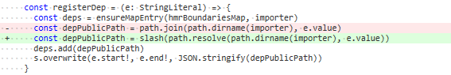

# 101 - d1fe471 新增id映射到请求路径

允许`resolver`拥有`idToRequest`方法。

```typescript
idToRequest: (id: string) => {
      for (const r of resolvers) {
        const request = r.idToRequest && r.idToRequest(id)
        if (request) return request
      }
}
```

## 影响范围？

在`serverPluginModules.ts`中的`rewriteImports`，会利用`idToRequest`作为**模块改写的路径**。

```typescript
if (/^[^\/\.]/.test(id)) { // import lodash from 'lodash'
            const rewritten = resolver.idToRequest(id) || `/@modules/${id}`
            s.overwrite(start, end, rewritten)
            hasReplaced = true
            debugImportRewrite(`    "${id}" --> "${rewritten}"`)
}
```

## 可能引起的BUG？

```typescript
# serverPluginModules
// handle /@modules/:id requests
const moduleRE = /^\/@modules\//
```

无法正确解析模块了。


# 102 - fe1ef5a 修复传入的路径类型

修复`handleJSReload`：
  原本传入的是`filePath`，真正需要的是`publicPath`。


# 103 - ab2610f 使`js`与`vue`的`reload`方法传入的`timeStamp`参数为可选选项

在重载方法中使时间戳成为可选的。

```typescript
export type ViteWatcher = FSWatcher & {
  handleVueReload: (file: string, timestamp?: number, content?: string) => void
  handleJSReload: (file: string, timestamp?: number) => void
}
```


# 104 - 3fce891 @xxx自动转变为/@xxx

顺带整理一下改写`import`语句的代码。

把`resolver.idToRequest.defaultIdToRequest`的@id字符转为'/@id'。

把`vue组件`的`import`语句`/@hmr`改写为`@hmr`。

1. 一个`vue组件`，经过`serverPluginVue.ts`处理，变成`import { updateStyle } from '@hmr'`。
2. 经过`serverPluginServe.ts`中的`resolver.idToRequest.defaultToRequest`处理，变成`import { updateStyle } from '/@hmr'`


# 105 - c4a2d40 因104修改reademe文档

### HMR所做的替换

- `*.vue` files come with HMR out of the box.

- For `*.js` files, a simple HMR API is provided:

  ```js
  import { foo } from './foo.js'
  import { hot } from '@hmr' // 以前是/@hmr
  
  foo()
  
  hot.accept('./foo.js', ({ foo }) => {
    // the callback receives the updated './foo.js' module
    foo()
  })
  ```

## `hmr`对`js`文件无效

原因很简单，`importerMap`的键为`filePath`，而`handleJSReload`使用了`publicPath`来获取`importer`。

> 再次提醒importer为引入文件，importee为被引入文件


# 106 - 4c354ca hot路径修改

```typescript
// 以前：
hot.accept("/fc.js", "\\foo.js", ({ foo }) => {
  // the callback receives the updated './foo.js' module
  foo()
})

// 现在
hot.accept("/fc.js", "E:/foo.js", ({ foo }) => {
  // the callback receives the updated './foo.js' module
  foo()
})
```

`parseAcceptedDeps`:



这里我有些小失误，没有去讲解hot的使用问题，我在51-60commit重新补充了`handleJSReload`相关的。`parseAcceptedDeps`可以把他当作收集依赖与`hot.accept`表达式的改写，例如上面的例子`foo.js`依赖`fc.js`文件。


# 107 - e42d74d `serverPluginsVue`错误提示

添加错误提示（`template script style`）


# 108 - 4ac0801 index.html重写缓存

对于`index.html`文件，`rewriteCache`的`key`变成`ctx.body`。

我个人觉得改不改一样，对于功能上，也许更符合语义吧... 但`rewriteCache`的体积会变得更大，因为没有地方删除以前的内容（除非是超出LRU max）。


# 109 - ea97e3b 修复`build.ts`路径处理bug

由于之前把@xxx弄成自动的，在`build`环境下，就不是自动的了。

所以`vitePlugin`(rollup插件)的`resolveId`需要改写。


# 110 - a22472d `hmr`添加新事件`custom`

整理代码命名。

```typescript
# client.ts
const customUpdateMap = new Map<string, ((customData: any) => void)[]>()

case 'custom':
      const cbs = customUpdateMap.get(id)
      if (cbs) {
        cbs.forEach((cb) => cb(customData))
      }
      break


export const hot = {
  on(event: string, cb: () => void) {
    const exisitng = customUpdateMap.get(event) || []
    exisitng.push(cb)
    customUpdateMap.set(event, exisitng)
  }
}
```

未能分析其作用，将在后续commit解说其作用。

> 看出个大概就是服务端与client端能通过一个事件交流数据`customData`。
