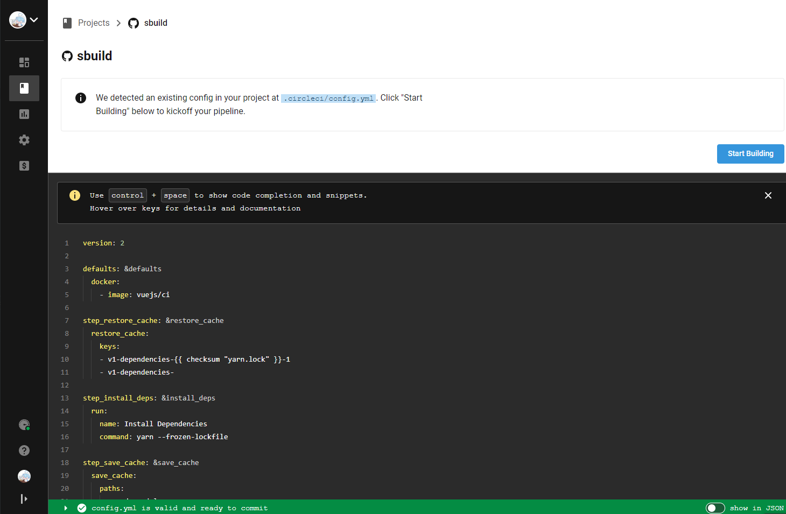
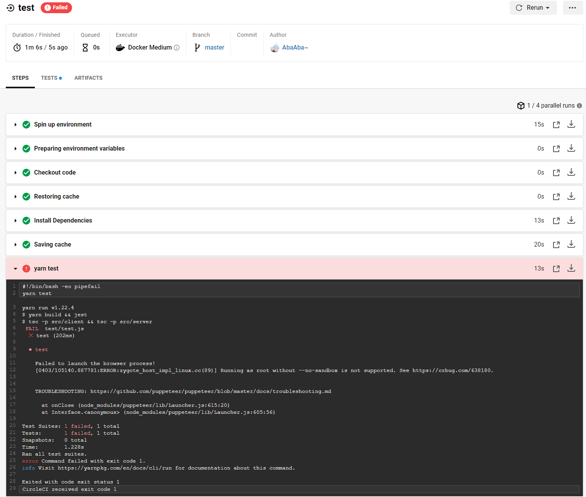
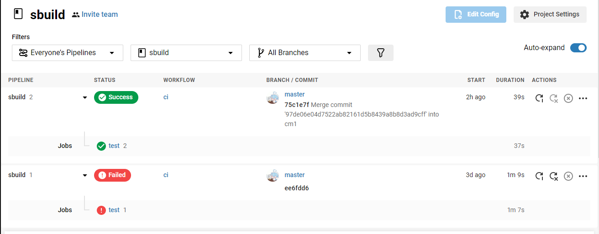

# 11 - 7f207eb annotation

添加测试注释（准备测试style HMR）。


# 12 - 5c0f552 fix propublishOnly

注释。

```json
{
-   prepublishOnly: "tsc"
+   propublishOnly: "yarn build"    
}
```


# 13 - be00e79 v0.1.0发布

修改旧名称 ```vds```为```vite```，包括注释，控制台输出，只是更改名称。


# 14 - a47c406 设置npm上传包含的文件

`files` 字段用于描述我们使用 `npm publish` 命令后推送到 `npm` 服务器的文件列表，如果指定文件夹，则文件夹内的所有内容都会包含进来。我们可以查看下载的 `antd` 的 `package.json` 的`files` 字段，内容如下：

```json
"files": [
  "dist",
+ "bin"
],
```

因为```dist```是```build```的文件，```/bin/vite.js```是启动文件，所以这一部分发布到```npm```，提供用户使用即可。


# 15 - a4f093a v0.1.1发布

```json
{
-   version: "0.1.1"
+   version: "0.1.1" 
}
```


# 16 - d58893b  chore readme

```chore: readme```，修改```readme```。


# 17 - c76ca14 添加ci

```yml
version: 2

defaults: &defaults
  docker:
    - image: vuejs/ci # https://hub.docker.com/r/vuejs/ci

step_restore_cache: &restore_cache
  restore_cache:
    keys:
    - v1-dependencies-{{ checksum "yarn.lock" }}-1
    - v1-dependencies-

step_install_deps: &install_deps
  run:
    name: Install Dependencies
    command: yarn --frozen-lockfile

step_save_cache: &save_cache
  save_cache:
    paths:
      - node_modules
      - ~/.cache/yarn
    key: v1-dependencies-{{ checksum "yarn.lock" }}-1

jobs:
  test:
    <<: *defaults
    steps:
      - checkout
      - *restore_cache
      - *install_deps
      - *save_cache
      - run: yarn test

workflows:
  version: 2
  ci:
    jobs:
      - test

```

setp1: 在自身```Github```上，创建一个```public```仓库，命名为```sbuild```，并把上传这一份代码。

step2: 使用该```github```账号登录```circleci```网站，在目录列表点击```Set Up Project ```。



step3: 点击``Start Building``



（失败可以不用管，这是运行test命令失败，在不同平台有些不一样）


# 18 - 97de06e test: fix pupeteer on ci

修复在```ci```环境下的，```puppeteer```报错问题（如上报错）。




# 19 - bb9baa2 使用本包，如果用户没有vue

### moduleResolver.ts

整理代码，如果用户本地路径没有寻找到```vue.runtime.esm-browser.js```，则从本包中读取```vue.runtime.esm-browser.js```。


# 20 - 0d5a2a4 fix: vue路径 & compile-sfc路径

### moduleResolver.ts

```vue.runtime.esm-browser.js```的寻找方式：从cwd层级查找。

```cwd```目录下的```vue```版本需要和本包中的```vue```版本一致，不然报错，且```compiler-sfc```使用本包中的```vue/compiler-sfc```。

如果用户不存在```vue```包，则```compiler-sfc```与```vue.runtime.esm-browser.js```均使用本包的。

这里主要是在客户端```import vue```的时候，顺带设置好```vueCompiler.ts```中需要的```compiler-sfc```。

### vueCompiler.ts

```typescript
import {
  SFCDescriptor,
  SFCStyleBlock,
  SFCTemplateBlock
} from '@vue/compiler-sfc'
```

SFC三个类型从本包取，编译功能从```moduleResolver.ts```中取```resolveCompiler```。