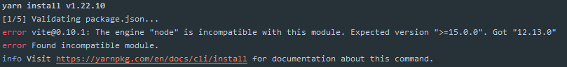

# 201 - b48ae5b [#32](https://github.com/vitejs/vite/issues/32) 兼容node 10

尝试修改`"node": ">=15.0.0"`，然后`yarn`:

> 版本号不对，yarn无法安装依赖

# 202 - 4fa01ca changelog

## [0.10.2](https://github.com/vuejs/vite/compare/v0.10.1...v0.10.2) (2020-05-04)

### Bug Fixes

- 修复构建index资源注入 ([ccce482](https://github.com/vuejs/vite/commit/ccce48228d8220de4312585c716c1c27ea9ef1c2))
- 正确处理绝对url资源 ([5ca0ec4](https://github.com/vuejs/vite/commit/5ca0ec4abc183a3942ef169b39034ff403dd9eae)), closes [#45](https://github.com/vuejs/vite/issues/45)
- **moduleResolve:** 不要重写外部导入 ([dd7af0a](https://github.com/vuejs/vite/commit/dd7af0a9b3e77fcbdec6fe7fcda26443f1e2c8fa)), closes [#42](https://github.com/vuejs/vite/issues/42)

### Features

- 支持 *.module.css 的 CSS 模块 ([1782f83](https://github.com/vuejs/vite/commit/1782f831c62e73d961fcf71de4d1024a1f8acaf7))

# 203 - 95f6ff9 v0.10.2

release v0.10.2

