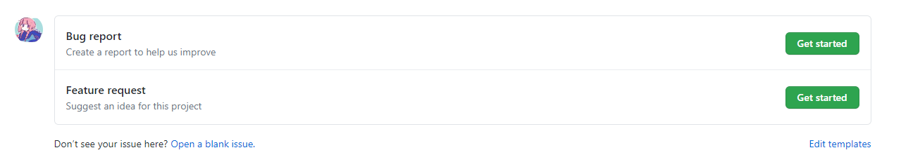
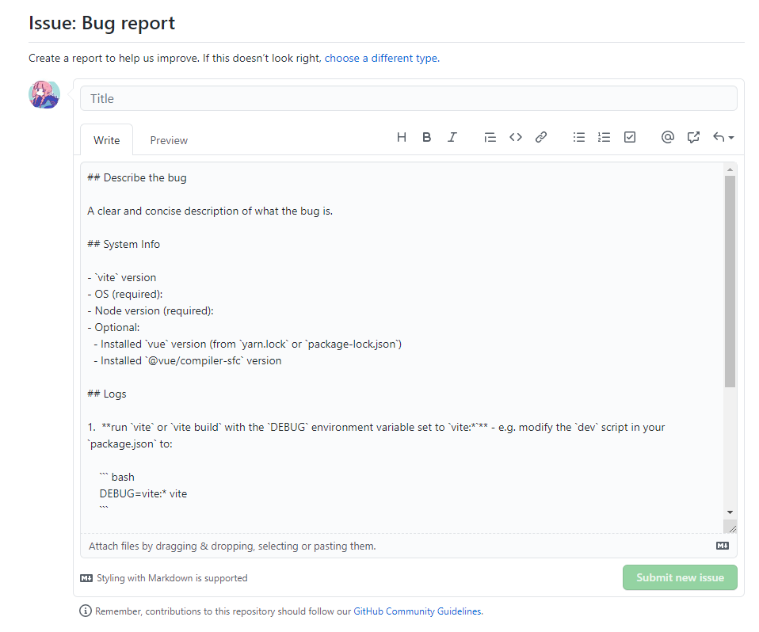

# 231 - e78c9f7 修复外链import路径改写错误

不应该中断改写`import`流程，不然遇到外链后，不返回任何的`code`。

```typescript
if (isExternalUrl(id)) {
  break
}
```


# 232 - redame

### JSX

`.jsx` 和 `.tsx`也同样开箱即用， JSX 也是通过 `esbuild`来编译的。

因为 React 不提供 ES 模块构建，你可以使用 [es-react](https://github.com/lukejacksonn/es-react), 或者使用 Snowpack 将 React 预捆绑到 ES 模块中。 让它运行的最简单方法是:

```js
import { React, ReactDOM } from 'https://unpkg.com/es-react'

ReactDOM.render(<h1>Hello, what!</h1>, document.getElementById("app"));
```


# 233 - fcf709e changelog 

## [0.11.1](https://github.com/vuejs/vite/compare/v0.11.0...v0.11.1) (2020-05-06)

### Bug Fixes

- 修复外链import路径改写错误 ([e78c9f7](https://github.com/vuejs/vite/commit/e78c9f7680c2652b13f4270182c860417e388b2e))


# 234 - a135bfd v0.11.1

release v0.11.1


# 235 - 2048b65 [#59](https://github.com/vitejs/vite/pull/59) readme修改

**Message**：我注意到HMR的代码在构建后没有被删除，这将会导致错误，因为`hot`被编译成一个空对象了。
我不知道你是否可以删除这部分的代码, 虽然使用 `__DEV__`也可以正常运行。

即使用HMR API都需要使用`__DEV__`判断：

```typescript
if (__DEV__) {
  hot.accept(newModule => {
    console.log('updated: count is now ', newModule.count)
  })
}

if (__DEV__) {
  hot.accept('./foo.js', (newFoo) => {
    // the callback receives the updated './foo.js' module
    newFoo.foo()
  })

  // Can also accept an array of dep modules:
  hot.accept(['./foo.js', './bar.js'], ([newFooModule, newBarModule]) => {
    // the callback receives the updated mdoules in an Array
  })
}
```


# 236 - 5ca417e 定义如何提交BUG/功能报告的模板

配置好即可在`issues` -> `new issues`  查看到。





## .github/ISSUE_TEMPLATE/bug_report.md

name: 标题

about: 描述

labels: 标签

title: 内容标题

```markdown
---
name: Bug report
about: Create a report to help us improve
title: ''
labels: bug
assignees: ''

---

## Describe the bug

A clear and concise description of what the bug is.

## System Info

- `vite` version
- OS (required):
- Node version (required):
- Optional:
  - Installed `vue` version (from `yarn.lock` or `package-lock.json`)
  - Installed `@vue/compiler-sfc` version

## Logs

1.  **run `vite` or `vite build` with the `DEBUG` environment variable set to `vite:*`** - e.g. modify the `dev` script in your `package.json` to:

    ``` bash
    DEBUG=vite:* vite
    ```

    On windows, you will need [cross-env](https://www.npmjs.com/package/cross-env):

    ``` bash
    cross-env DEBUG=vite:* vite
    ```

2. Provide the error log here.

## Reproduction

Provide a link to a reproduction repo if applicable.

```

## .github/ISSUE_TEMPLATE/feature_request.md

```markdown
---
name: Feature request
about: Suggest an idea for this project
title: ''
labels: ''
assignees: ''

---

**Is your feature request related to a problem? Please describe.**
A clear and concise description of what the problem is. Ex. I'm always frustrated when [...]

**Describe the solution you'd like**
A clear and concise description of what you want to happen.

**Describe alternatives you've considered**
A clear and concise description of any alternative solutions or features you've considered.

**Additional context**
Add any other context or screenshots about the feature request here.

```

> 我之前以为debug包失效了... 后来去查看了一下文档[debug](https://www.npmjs.com/package/debug)使用方式，发现需要一个`process.env.DEBUG`来开启。


# 237 - 更新bug报告模板

加粗提示`vite`版本 操作系统 node版本的需求。


# 238 - 353bd81 文档英文单词语法修改 [#64](https://github.com/vitejs/vite/pull/64)

文档英文单词语法修改。


# 239 - 906b14c readme todo

## TODOs

- 支持构建配置 (custom import maps and plugins)
- 通过[Sucrase](https://github.com/alangpierce/sucrase) or [esbuild](https://github.com/evanw/esbuild)支持 TypeScript / Flow /(P)React JSX

> 话说不是已经支持了？除了Flow


# 240 - bd58858 避免改变 esbuild 选项

相当于代码整理，让`options.sourcemap`可配置，再也不是`true`来固定。

