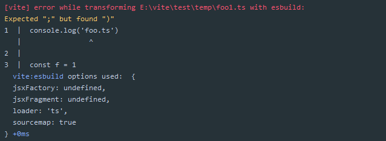

# 251 - db52dd3 v0.11.2

release v0.11.2

> 我在某版本号规范上看到，如果改动了代码功能，都应该第二位增加，第三位是文档类的修改。但是现在似乎让我感觉不对，因为我们每次修改发布`npm`如果是文档，不需要修改小版本号提交上去。
> 功能多了或者修复的多了就第二位增加比较对。

# 252 - c51f335 readme

由于之前整理了文件的位置，所以文档内引用了文件的`url`需要修改。

# 253 - baa020e bump `esbuild` version

`esbuild: "^0.2.0"` -> `esbuild: "^0.2.4"`

> lock也更新了，所以是有必要的

# 254 - ca421cd fix [#61](https://github.com/vuejs/vite/issues/61) 无法拓展类型

他遇到的问题是引入不了`ts`类型的文件，大概是因为路径出错找不到文件类型(`resolver.requestToFile`)，windows下并没有遇到这个问题。

> windows下`esbuild`也无法使用，需要升级`esbuild v0.2.6`。
>
> 修改方法使用`path.posix`，`js`的`hmr`问题会得到解决。

# 255 - c7a5a69 bump `esbuild`

`esbuild`升级，`windows`下可以转换`ts`了

# 256 - b1d6be7 完善错误提示

改动部分：

- 新增`ora ^4.4.4`，优雅的“转圈圈”
- 增加`esbuild`代码位置的错误提示

# 257 - 38b8ada changelog

## [0.11.3](https://github.com/vuejs/vite/compare/v0.11.2...v0.11.3) (2020-05-07)

### Bug Fixes

- 修复模块重写结果 (fix [#61](https://github.com/vuejs/vite/issues/61)) ([ca421cd](https://github.com/vuejs/vite/commit/ca421cdf9348076a53ad1ff1a9e6ee4095776eae))

### Features

- 改进构建错误输出 ([b1d6be7](https://github.com/vuejs/vite/commit/b1d6be7cf3e436fce7b187d2139ee43349ca5f40))

# 258 - 3a81be4 release v0.11.3

release v0.11.3

# 259 - 6b63b34 replace构建支持输出`soucemap`

其他插件钩子，如果本身不带有map生成，需要返回传入的map。

# 260 - 19f8358 在test中删除`spinner`

因为test环境下`process.env.NODE_ENV === ‘test’`，所以可以根据这删除转圈圈。