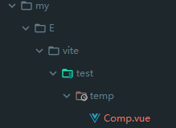
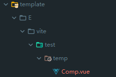
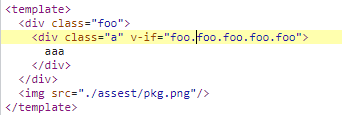
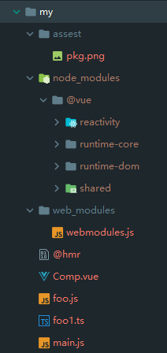

# 251 - db52dd3 v0.11.2

release v0.11.2

> 我在某版本号规范上看到，如果改动了代码功能，都应该第二位增加，第三位是文档类的修改。但是现在似乎让我感觉不对，因为我们每次修改发布`npm`如果是文档，不需要修改小版本号提交上去。
> 功能多了或者修复的多了就第二位增加比较对。


# 252 - c51f335 readme

由于之前整理了文件的位置，所以文档内引用了文件的`url`需要修改。


# 253 - baa020e bump `esbuild` version

`esbuild: "^0.2.0"` -> `esbuild: "^0.2.4"`

> lock也更新了，所以是有必要的


# 254 - ca421cd fix [#61](https://github.com/vuejs/vite/issues/61) 无法拓展类型

他遇到的问题是引入不了`ts`类型的文件，大概是因为路径出错找不到文件类型(`resolver.requestToFile`)，windows下并没有遇到这个问题。

> windows下`esbuild`也无法使用，需要升级`esbuild v0.2.6`。
>
> 修改方法使用`path.posix`，`js`的`hmr`问题会得到解决。


# 255 - c7a5a69 bump `esbuild`

`esbuild`升级，`windows`下可以转换`ts`了


# 256 - b1d6be7 完善错误提示

改动部分：

- 新增`ora ^4.4.4`，优雅的“转圈圈”
- 增加`esbuild`代码位置的错误提示


# 257 - 38b8ada changelog

## [0.11.3](https://github.com/vuejs/vite/compare/v0.11.2...v0.11.3) (2020-05-07)

### Bug Fixes

- 修复模块重写结果 (fix [#61](https://github.com/vuejs/vite/issues/61)) ([ca421cd](https://github.com/vuejs/vite/commit/ca421cdf9348076a53ad1ff1a9e6ee4095776eae))

### Features

- 改进构建错误输出 ([b1d6be7](https://github.com/vuejs/vite/commit/b1d6be7cf3e436fce7b187d2139ee43349ca5f40))


# 258 - 3a81be4 release v0.11.3

release v0.11.3


# 259 - 6b63b34 replace构建支持输出`soucemap`

### 开发环境下一个`Vue组件`被分成3块，那`sourcemap`如何粘合起来的？

第一块为`js`输出组件，第二块`render`，第三块`css`。

```typescript
updateStyle("92a6df80-0", "/Comp.vue?type=style&index=0") // css
__script.__scopeId = "data-v-92a6df80"
import { render as __render } from "/Comp.vue?type=template" // render
__script.render = __render
__script.__hmrId = "/Comp.vue"
__script.__file = "E:\\vite\\test\\temp\\Comp.vue"
export default __script // 自身
```

我们可以拦截`genSourceMapString`方法，输出`sourcemap`，分别创建两个文件作为比较，`my`为**第一块**`js`，`template`为第二块`render`：


使用`reverse-sourcemap`转换：

```shell
reverse-sourcemap -o my -v my.js.map
```

```sh
reverse-sourcemap -o template -v template.js.map
```

查看两者路径比对：





发现文件转换后的内容一致，并没有任何不同(`...`为省略，`sourcemap`是不一样的，不转换查看`sourcesContent`也会发现一样，不一样的是对应位置)：

```typescript
<template>
...
</template>

<script lang="ts">
...
</script>

<style scoped lang="scss">
...
</style>

```

通过打印发现，`template`和`script`的`map`转换内容是一样的，把目标缩短到`const descriptor = await parseSFC(root, filePath, ctx.body)` -> `parseSFC` ->`resolveCompiler`  -> `'@vue/compiler-sfc'包` -> `parse`。

`block.content`为`<script>` `<template>`内容。

```typescript
#compiler-sfc/parse.ts 关键代码

if (sourceMap) {
    const genMap = (block: SFCBlock | null) => {
      if (block && !block.src) {
        block.map = generateSourceMap(
          filename,
          source,
          block.content,
          sourceRoot,
          !pad || block.type === 'template' ? block.loc.start.line - 1 : 0
        )
      }
    }
    genMap(descriptor.template)
    genMap(descriptor.script)
    descriptor.styles.forEach(genMap)
  }

function generateSourceMap(
  filename: string,
  source: string,
  generated: string,
  sourceRoot: string,
  lineOffset: number
): RawSourceMap {
  const map = new SourceMapGenerator({
    file: filename.replace(/\\/g, '/'),
    sourceRoot: sourceRoot.replace(/\\/g, '/')
  })
  map.setSourceContent(filename, source)
  generated.split(splitRE).forEach((line, index) => {
    if (!emptyRE.test(line)) {
      const originalLine = index + 1 + lineOffset
      const generatedLine = index + 1
      for (let i = 0; i < line.length; i++) {
        if (!/\s/.test(line[i])) {
          map.addMapping({
            source: filename,
            original: {
              line: originalLine,
              column: i
            },
            generated: {
              line: generatedLine,
              column: i
            }
          })
        }
      }
    }
  })
  return JSON.parse(map.toString())
}
```

#### `generated.split`做了什么？

组件的起始行偏移值，我们可以把组件第一行空1行，发现`lineOffset`为`1`。

把`js`转换成`ast`，`ast`内记录了行数，利用`addMapping`方法对应行的映射。

> `render`需要调整映射一次，比`js`的要复杂，而`js`仅仅需要偏移`lineOffset`，想了解可以看`compiler-sfc`的`mapLines`

我们还试试`template`报错，会出现什么情况吧，因为会转换为render，我们触发`undefinded`即可。

```html
<div class="a" v-if="foo.foo.foo.foo.foo" />
```


点击`E:\vite\test\temp\Comp.vue:3`:



结论：**`sourcesContent`是一样的，但是映射是不一样的，所以不是所谓的粘合**。

[source-map](https://www.npmjs.com/package/source-map#sourcemapgenerator)

### 那构建的`sourcemap`为什么只有一个文件，不需要合并吗？

我们再使用`reverse-sourcemap`转换我们的文件。



发现连文件夹对应的位置都还原了，100%还原效果（没用的代码`treeshaking`掉了）。

查阅`rollup-plugin-vue`，能发现`<template> <style> <script>`都有自己的`sourcemap`。

`sourcemap`的合并也是很简单的，两个合并起来也相当于代码转换，把偏移的位置给加上即可。

所以说使用rollup转换代码，只要确保返回自己的`sourcemap`即可，rollup自动会帮你合并的，这也是为什么`vue`默认生成`sourcemap`，控制rollup是否开启`sourcemap`操作即可。

 [source-map](https://stackoverflow.com/questions/19330344/how-to-read-base64-vlq-code)

> 注意，mappings的VLQ的值都是**相对值**，不管多少个分号，值都要从第一个分号累加起来。
>
> 我们使用`magic-string`的`generateMap({ hires: true })`生成各自的map就可以了，rollup帮我们自动合并处理（没有则返回null）。


# 260 - 19f8358 在test中删除`spinner`

因为test环境下`process.env.NODE_ENV === ‘test’`，所以可以根据这删除转圈圈。

