# 261 - 44a8250 增强错误输出

改动部分：

- `server/serverPluginVue.ts`，错误详细位置输出。

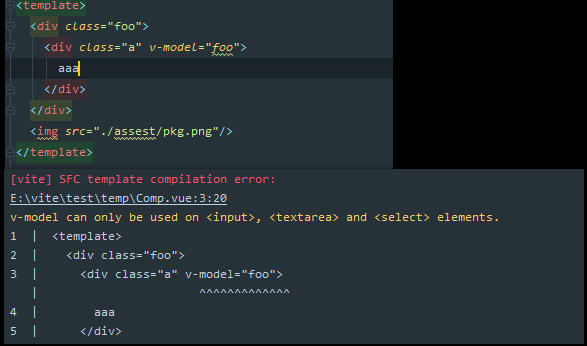

```typescript
if (errors.length) {
    console.error(chalk.red(`\n[vite] SFC template compilation error: `))
    errors.forEach((e) => {
      if (typeof e === 'string') {
        console.error(e)
      } else {
        console.error(
          chalk.underline(
            `${filename}:${e.loc!.start.line}:${e.loc!.start.column}` // 文件位置 包括列行
          )
        )
        console.error(chalk.yellow(e.message)) // 报错提示信息
        const original = template.map!.sourcesContent![0]
        console.error(
          generateCodeFrame(original, e.loc!.start.offset, e.loc!.end.offset) // 输出视图
        )
      }
    })
  }
```

## 能够准确找到错误位置，原理是什么？

往上一步步寻找`require.resolve('@vue/compiler-sfc').compileTemplate`编译会返回这个`errors`。

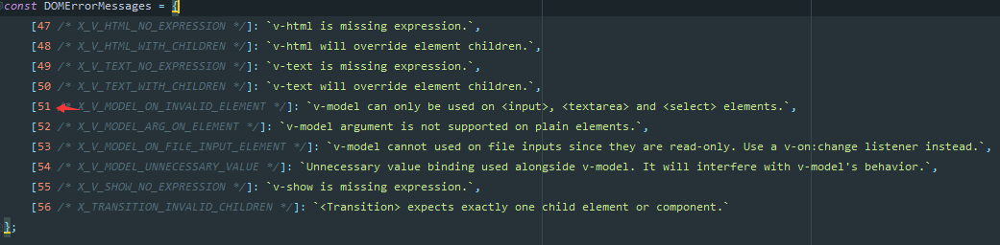

我们逆向寻找，在触发的地方打上断点：

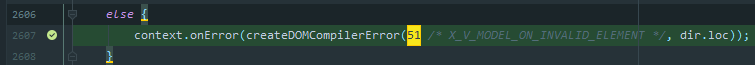

寻找调用栈相关代码：

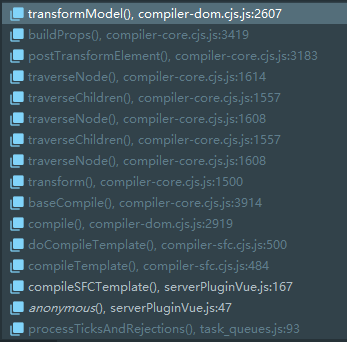

`traverseNode`转换AST树为代码，遇到props需要调用`buildProps`进行参数分析，发现转换的是指令相关代码，获取相对应的转换器`transformModel`。

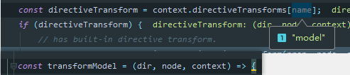

**触发原因为当前AST树节点非`input` `textarea` `select`标签**。

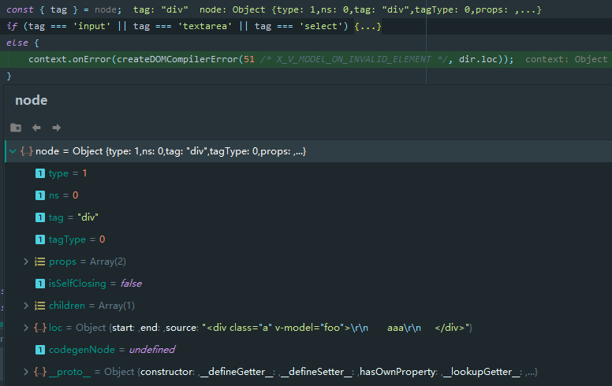

传递当前`loc`：

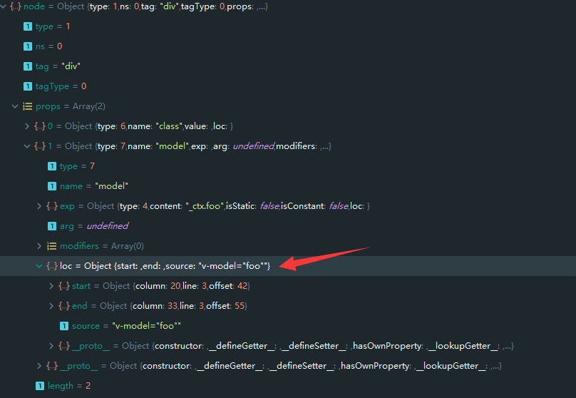

返回`error`:

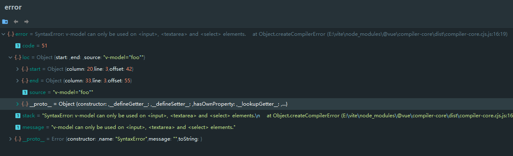

`vite`检测到`errors`：

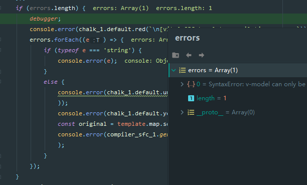

调用本次commit改动的方法，输出到控制台中。

#### `generateCodeFrame`做的事情

通过当前`template`的`sourcemap`获取到源码，与`error`的`loc`偏移量一同传递给`generateCodeFrame`：

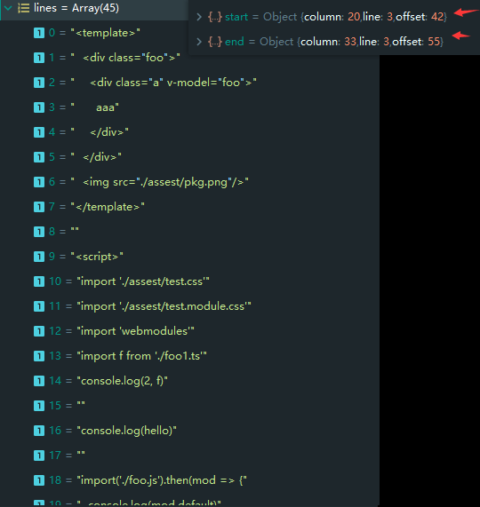

换行符分割计算出行数，遍历行，通过字符累加count，如果  count >=start，即可以判断目标为当前行，`range`被固定为`2`，即输出目标行上下各三行。

`' '.repeat(3 - String(line).length)`: 为了保持排版，行数为双数需要去除掉一个空格，也就是说保持百行的代码排版。

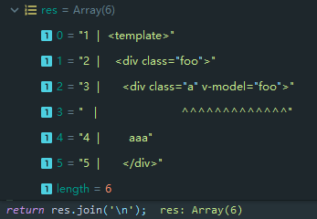

```typescript
function generateCodeFrame(source, start = 0, end = source.length) {
    const lines = source.split(/\r?\n/); // 行
    let count = 0;
    const res = [];
    for (let i = 0; i < lines.length; i++) {
        count += lines[i].length + 1;
        if (count >= start) {
            for (let j = i - range; j <= i + range || end > count; j++) {
                if (j < 0 || j >= lines.length)
                    continue;
                const line = j + 1;
                res.push(`${line}${' '.repeat(3 - String(line).length)}|  ${lines[j]}`);
                const lineLength = lines[j].length;
                if (j === i) { // 如果等于当前行，需要在loc长度的代码加上'^'标记
                    // push underline
                    const pad = start - (count - lineLength) + 1;
                    const length = Math.max(1, end > count ? lineLength - pad : end - start);
                    res.push(`   |  ` + ' '.repeat(pad) + '^'.repeat(length));
                }
                else if (j > i) { // 如果长度覆盖了不止一行
                    if (end > count) {
                        const length = Math.max(Math.min(end - count, lineLength), 1);
                        res.push(`   |  ` + '^'.repeat(length));
                    }
                    count += lineLength + 1;
                }
            }
            break;
        }
    }
    return res.join('\n');
}
```

> 分析template的AST，转换AST为代码过程中检测是否错误，错误返回AST的位置，通过`sourcemap`获取到源码，通过AST错误位置切割源码，打印源码错误位置与信息到控制台


# 262 - 7bfba6c ci 删除`esbuild .install文件`兼容`esbuild`的bug 

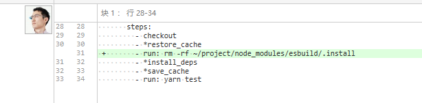

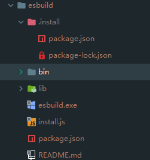

[`esbuild`为什么快？ ](https://juejin.cn/post/6992448851990806558)

`esbuild`如何运行的：`child_process`运行`esbuild.exe`，通过`promise`，`esbuild.exe`结束后，`child_process`触发`close`，`close`回调执行`resolve`返回数据。

[`postinstall`是什么](https://docs.npmjs.com/cli/v7/using-npm/scripts#examples): 在执行`npm install`也会自行`postinstall`脚本。

阅读`esbuild` `install.js`，作用为：

- 根据`process.platform`判断平台，当前为`windows`，执行`installOnWindows`，下载`esbuild-windows-64@0.2.6`，改名为`esbuild.exe`
- 把启动`esbuild.exe`的`js`代码写进`bin/esbuild`（为什么要这样做... 直接bin不行吗？除非是写`esbuild`的时候多个平台用到代码，为了聚合起来，连`install`文件都是自动生成的）

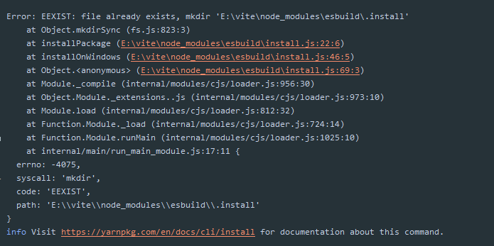

**手动删除原因：**

```typescript
// esbuild 0.2.12 修复了该BUG
// 事实证明，一些包管理器 (例如 yarn) 
// 在我们已经安装之后，有时重新运行这个包的 postinstall 脚本。
// 这意味着这个脚本必须是幂等（指的是同样的方法被执行一次与连续执行多次的效果是一样的）的。 
// 如果发生了这种情况，我们将跳过这次包的安装
if (fs.existsSync(installDir)) {
    return false;
}
```

> 查看了`vite`仓库目前最新的代码，已经删除了该改动


# 263 - df77197 重构简化`esbuild`服务使用

改动部分：

- `node/cli.ts`: 构建完成后调用`process.exit(0)`（目前没有遇到影响，不知道如何触发）
- `node/esbuildService`: 简化代码，新增`  stopService()`（详 **改动二**）
- `node/build/buildPluginEsbuild.ts`: 简化代码，去除`generateBundle`，不使用`stop()`
- `node/build/index.ts`: rollup构建完成后，调用`stopService()`

## 改动二

stop方法为`esbuild`包内方法，即`child_process`的`stop`停止子进程：

```typescript
 // This stops the service, which kills the long-lived child process. Any
  // pending requests will be aborted.
  stop(): void;
  
  stop() {
        child.kill();
      }
```


# 264 - 4df840d bump deps

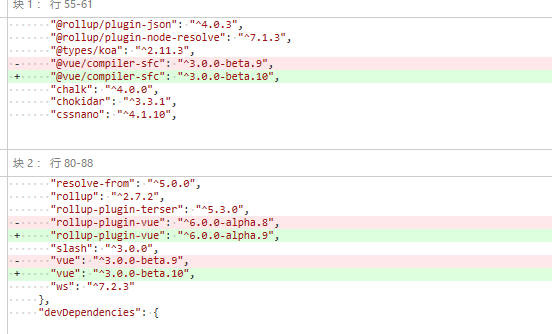


# 265 - ffd1fee 组件支持`src` 引入文件

改动部分：

`node/server/serverPluginCss.ts`:  不处理遇到来自组件`src`的请求，去除`.modules.css`的`hmr`(迁移)

`node/server/serverPluginEsbuild.ts`: 去除`jsx tsx`的`hmr`(迁移)

`node/server/serverPluginHmr.ts`:  非`.css`文件，但是`.module.css`的文件可以触发`hmr`

`node/server/serverPluginJson.ts`: 去除`json` `hmr`（迁移）

`node/server/serverPluginVue.ts`: 新增`resolveSrcImport`方法，新增资源引入的`hmr`，如`style`的`src`触发`vue-style-update`事件（详 改动五）

> 现在有测试用例，比较好看出尤大想解决什么问题

### 改动五

除了设置`koa-ctx、block.content`文件内容和返回文件路径外，其调用`ensureMapEntry`和`serverPluginModulesRewrite.ts`的收集关系链调用的方法是一样的，建立文件关系，为了`hmr`能够准确寻找该触发的更新事件和目标。

```typescript
async function resolveSrcImport(
  block: SFCBlock,
  ctx: Context,
  resolver: InternalResolver
) {
  const importer = ctx.path
  const importee = slash(path.resolve(path.dirname(importer), block.src!))
  const filename = resolver.requestToFile(importee)
  await cachedRead(ctx, filename)
  block.content = ctx.body

  // register HMR import relationship
  debugHmr(`        ${importer} imports ${importee}`)
  ensureMapEntry(importerMap, importee).add(ctx.path)
  return filename
}
```

#### 为什么普通文件都直接触发`handleJSReload`?

可以去查看[洋葱模型](https://github.com/Kingbultsea/vite-analysis/blob/master/221-230/221-230.md#%E6%B4%8B%E8%91%B1%E6%A8%A1%E5%9E%8B%E6%89%A7%E8%A1%8C%E9%A1%BA%E5%BA%8F)，最后执行的是`node/serverPluginModuleRewrite.ts`，注册import importee关系map，只要注册了，就可以根据普通文件路径触发`hmr`。

#### `vue`组件到底怎么处理`src`的呢？

注册import importee关系，`AST`描述树通过读取文件资源内容，手动设置`content`字段。

所以可以和标签里的内容保持一致性的处理。


# 266 - f3265c1 `create-vite-app` 使用规范的`html`作为模板 [#76](https://github.com/vitejs/vite/pull/76)

使用 `create-vite-app` 创建应用程序时，生成的 index.html 并不真正有效。我在现有内容周围添加了基本的 html5 内容。


# 267 - 9f6f0a6 修复windows下，路径改写不正确的问题 [#73](https://github.com/vitejs/vite/pull/76)

使用了`path.posix`的方法兼容好了。

> 但是有没有注意到265的改动五中的importee，一样没修复，导致`src`的`hmr`失效，后续尤大应该会整理代码，合并两者的。


# 268 - 82414b8 整理266的代码，合并两者功能

改动部分：

- `node/utils/pathUtils.ts`: 新增`resolveRelativeRequest`方法（详 **改动一**）
- `node/server/serverPluginModuleRewrite.ts`：去除路径处理，使用`resolveRelativeRequest`，代码迁移
- `node/server/serverPluginVue.ts`：去除路径处理，使用`resolveRelativeRequest`，也是代码迁移

### 改动一

把两个文件的功能整合了在一起。

```typescript
import path from 'path'
import slash from 'slash'

export const queryRE = /\?.*$/
export const hashRE = /\#.*$/

export const cleanUrl = (url: string) =>
  url.replace(hashRE, '').replace(queryRE, '')

export const resolveRelativeRequest = (importer: string, id: string) => {
  const resolved = slash(path.posix.resolve(path.dirname(importer), id))
  const queryMatch = id.match(queryRE)
  return {
    url: resolved,
    pathname: cleanUrl(resolved),
    query: queryMatch ? queryMatch[0] : ''
  }
}
```

> query在`serverPluginModuleRewrite.ts`的作用为恢复原本路径的参数，另一个功能为如果改写前后路径相同就不继续调用改写了。


# 269 - 2053c8a 修复windows报错后无法退出结束测试的问题

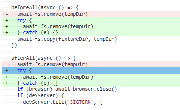

> 需要把`package.json`的`build`，`rm -rf`给删除了，才能跑测试。
>
> 不过还是跑失败，提示文件夹资源被占用，无法`rmdir`去除，尤大肯定注意到了这个问题，我猜的是他目前先快速解决，后续用ci配置windows的测试来发现问题。


# 270 - 946b978 ci 添加`appveyor.yml`进行windows下的自动化测试

[Appveyor](https://www.appveyor.com/docs/)

```typescript
environment:
  nodejs_version: "12" // node版本

install:
  - ps: Install-Product node $env:nodejs_version // 使用PowerShell安装node版本
  - yarn // 安装yarn

test_script:
  - git --version
  - node --version
  - yarn --version
  - yarn test

cache:
  - node_modules -> yarn.lock // yarn.lock变动node_modules的缓存也变动

build: off 
// 关闭MSBuild模式，MSBuild模式会导致AppVeyor寻找Visual Studio项目，并使用它去进行构建
// MSBuild 模式的替代方案是脚本模式。
// 此模式允许你通过运行任意脚本化操作而不是构建 Visual Studio 项目来进行构建。

```

使用过程，进入[Appveyor](https://ci.appveyor.com/projects/new)，点击`Install AppVeyor App`按钮：


选择项目：


点击 项目右边的 `add`：

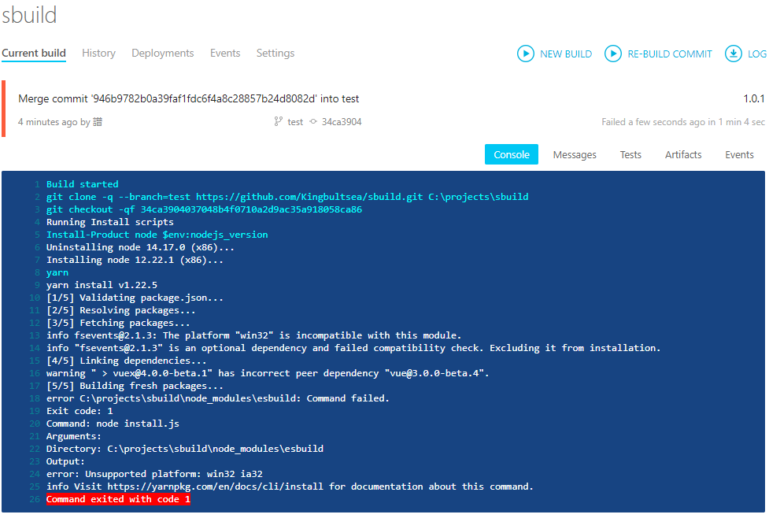

顺带`esbuild`的`install`脚本还发现了安装`esbuild win32`有问题。

