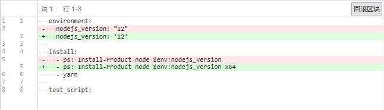
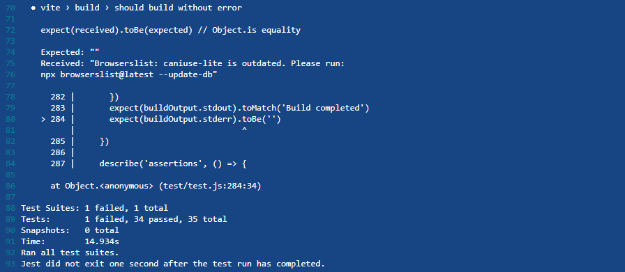
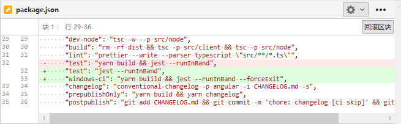
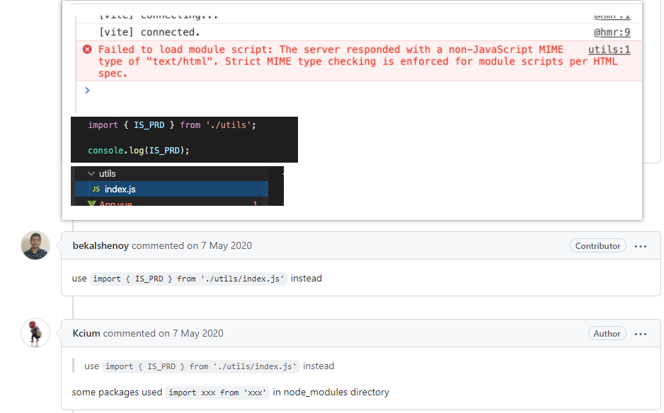
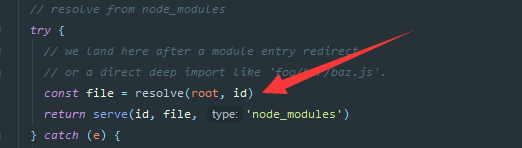
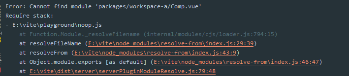

# 271 - 0c3c546 ci windows使用node x64架构

因为`esbuild`不支持在node x86架构中使用，所以切换为x64架构。

[node架构](https://newsn.net/say/node-arch.html)：返回为其编译 Node.js 二进制文件的操作系统 CPU 架构。可能的值为 `'arm'`, `'arm64'`, `'ia32'`, `'mips'`, `'mipsel'`, `'ppc'`, `'ppc64'`, `'s390'`, `'s390x'`, `'x32'`, 和 `'x64'`.

ia32即x86。

```typescript
// esbuild install.js
// Pick a package to install
if (process.platform === 'linux' && os.arch() === 'x64') {
  installOnUnix('esbuild-linux-64');
} else if (process.platform === 'darwin' && os.arch() === 'x64') {
  installOnUnix('esbuild-darwin-64');
} else if (process.platform === 'win32' && os.arch() === 'x64') {
  installOnWindows();
} else {
  console.error(`error: Unsupported platform: ${process.platform} ${os.arch()}`);
  process.exit(1);
}
```






[本次ci运行信息](https://ci.appveyor.com/project/Kingbultsea/sbuild/builds/40544835)

> 64位状态下兼容32位软件，但是有些驱动什么专属的是不兼容的。


# 272 - 0345c36 拆分脚本，为windows ci添加测试`--forceExit`标记



上次`windows ci`运行测试错误后，`jest`并没有停止。

`--forceExit`: 强制Jest在所有测试运行完后退出。 对于一些由测试所生成但无法充分清理的资源来说，这是很有用的。


# 273 - 4f685b3 typo 272脚本拼写错误

`buiild` -> `build`


# 274 - 5741b79 [#71](https://github.com/vitejs/vite/issues/71)

dev与`build`统一使用`vue.runtime.esm-bundler`，为了一些依赖`vue`其他包的第三方库能在同一个地方统一获取。


# 275 - 904266b [#74](https://github.com/vitejs/vite/issues/74) 支持目录index解析

有一些包，会使用`import xxx from 'xxx'`的形式引入脚本，需要支持这种方式。




改动部分：

- `node/resolver.ts`: 方法更名，`ensureExt` ->  `resolveExt` (详 **改动一**)
- `node/serverPluginModuleRewrite.ts` :  `/util/` -> `/util` (详 **改动二**)

### 改动一

支持三种寻找方式。

- `foo/` -> `foo/index.js`
- `foo` -> `foo.js`
- `foo` -> `foo/index.js`

会引起`windows``BUG`？因为不能直接使用`/index`，需要根据系统修改路径分割号。（不会直接引起BUG，因为都是当作`publicPath`使用了，只是不规范，留坑）


```typescript
export const supportedExts = ['.js', '.ts', '.jsx', '.tsx', '.json']

const resolveExt = (id: string) => {
  const cleanId = cleanUrl(id)
  if (!/\.\w+$/.test(cleanId)) {
    const expectsIndex = id[id.length - 1] === '/'
    let inferredExt = ''
    for (const ext of supportedExts) {
      if (expectsIndex) {
        try {
          // foo/ -> foo/index.js
          statSync(id + 'index' + ext)
          inferredExt = 'index' + ext
          break
        } catch (e) {}
      } else {
        try {
          // foo -> foo.js
          statSync(id + ext)
          inferredExt = ext
          break
        } catch (e) {
          try {
            // foo -> foo/index.js
            statSync(id + '/index' + ext)
            inferredExt = '/index' + ext
            break
          } catch (e) {}
        }
      }
    }
    const queryMatch = id.match(/\?.*$/)
    const query = queryMatch ? queryMatch[0] : ''
    return cleanId + inferredExt + query
  }
  return id
}
```

### 改动二

改写`import`路径，如果发现其使用了`resolveExt`自动寻找到`index`，则删除路径的尾符号`/`，方便合并。

也就是支持`import '/util/'` -> `import '/util/index.js'`


# 276 - 7f952c7 重构 简化ext解析逻辑

不需要`foo/` -> `foo/index.js`，因为在`node/serverPluginModuleRewrite.ts` 改写`import`处理了

```typescript
try {
        // foo -> foo.js
        statSync(id + ext)
        inferredExt = ext
        break
      } catch (e) {
        try {
          // foo -> foo/index.js
          statSync(path.join(id, '/index' + ext))
          inferredExt = '/index' + ext
          break
        } catch (e) {}
      }
```


# 277 - 0be5c31 changelog

## [0.11.4](https://github.com/vuejs/vite/compare/v0.11.3...v0.11.4) (2020-05-07)

### Bug Fixes

- tests 去除 spinner ([19f8358](https://github.com/vuejs/vite/commit/19f8358a47251b35557f4c2bdd8a3ac2b7ef96c0))
- 修复windows路径解析 ([#73](https://github.com/vuejs/vite/issues/73)) ([9f6f0a6](https://github.com/vuejs/vite/commit/9f6f0a619af6f7fba22033b9540680862df3dc09))
- 修复windows路径解析 ([82414b8](https://github.com/vuejs/vite/commit/82414b88bb057630f096123fb820105817c4707c)), 关闭[#69](https://github.com/vuejs/vite/issues/69) [#72](https://github.com/vuejs/vite/issues/72)
-  支持目录index解析 (关闭[#74](https://github.com/vuejs/vite/issues/74)) ([904266b](https://github.com/vuejs/vite/commit/904266bc726e672926da3b01a8990dccd16d4e8b))
- vue使用esm-bundler build([5741b79](https://github.com/vuejs/vite/commit/5741b798c1dc535d83154e5c0e9f1c3e7e5f92b7)), 关闭[#71](https://github.com/vuejs/vite/issues/71)


# 278 - bddca2e v0.11.4

release v0.11.4


# 279 - eb0a885 [#56](https://github.com/vitejs/vite/issues/56) 支持`monorepos` `hmr`且修复`menorepos`无法使用`VUE SFC`组件的问题

[`MonoRepo`是什么](https://segmentfault.com/a/1190000038683978)

`workspace`包之间共享`node_modules`：[链接](https://www.jianshu.com/p/990afa30b6fe)

用户使用`yarn link`，引入包内的`SFC`组件，此时被插件改写为`@modules/XXX/XX.vue`，发送到浏览器，请求`@modules/XXX/XX.vue`，经过`serverPluginModuleResolve.ts`处理后没有调用下一个插件，固然vue没有被编译就会被发送到浏览器。

改动部分：

- `node/resolver.ts`: `publicPath`与`fiePath`互转过程中，如果发现路径曾在`serverPluginModuleResolve.ts`中被处理过，则返回被处理过的路径。
- `serverPluginModuleResolve.ts`使用`serve`方法后，需要调用next进行下一个组件，且对文件添加`hmr`。(详 **改动二**)

### 改动二

识别到`@modules`，获取具体文件路径，304跳转，再次识别到`@modules`，调用`serve`，返回文件内容。

现在返回到文件内容后，需要经过`serverPluginVue.ts`处理，所以调用`next`。

软链的路径是这里寻找到的（实际就指向父级，`workspace-a/Comp.vue`不会报错， `packages/workspace-a/Comp.vue`会报错，`vite`并没做任何处理）：



如果像`yarn link packages/workspace-a`套了多一个路径：



> 当前没有测试用例，可以自行通过yarn link来进行测试，修复点为`next()`的调用。


# 280 - 08b6259 changelog

## [0.11.5](https://github.com/vuejs/vite/compare/v0.11.4...v0.11.5) (2020-05-07)

### Bug Fixes

- 支持monorepos (close [#56](https://github.com/vuejs/vite/issues/56)) ([eb0a885](https://github.com/vuejs/vite/commit/eb0a88514df344cbe4be3165cfa1a26af4f9f6ef))

