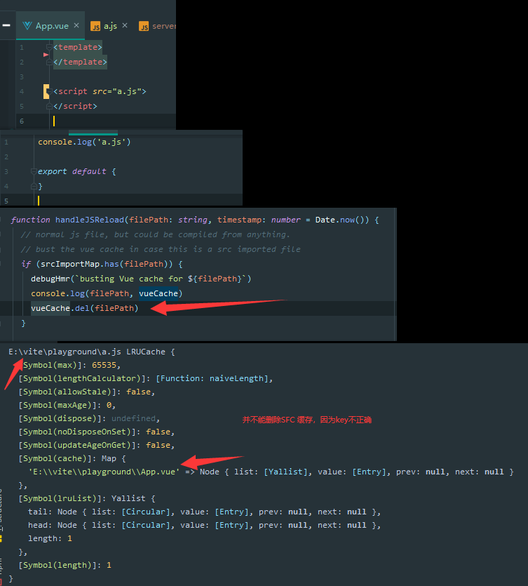
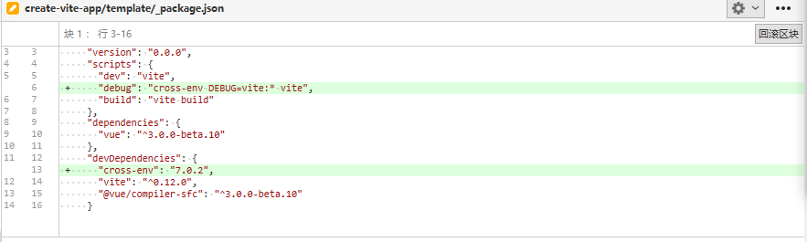

# 281 - c2806d7 v0.11.5

release v0.11.5

# 282 - 29099ae 修复在不进行本地安装的情况下处理vue问题

改动部分：

- `node/build/buildPluginResolve.ts`，去除没必要的srcRoots资源目录；`@vue/`资源将统一从`@vue/runtime-dom/dist/**.esm-bundler.js`中获取，即与vue引入的包统一。
- `node/build/index.ts`，去除调用`node/build/buildPluginResolve.ts createBuildResolvePlugin`的`srcRoots`参数传入，符合改动。
- `node/server/serverPluginModuleResolve.ts`，`@vue/`资源将统一从`@vue/runtime-dom/dist/**.esm-bundler.js`中获取。

在[`commit-5741b79`](https://github.com/vitejs/vite/commit/5741b798c1dc535d83154e5c0e9f1c3e7e5f92b7)中，指向的是`vue/dist/vue.runtime.esm-bundler.js`，现在调整为`@vue/runtime-dom/dist/**.esm-bundler.js`，不需要通过`vue`作为中介去获取其包内方法达到统一。

# 283 - 4c5a31e 修复index解析双附加

改动部分：

- `node/server/serverPluginModulesRewrite.ts`，拓展文件后缀，遇到`lodash/index`应该删除`index`再进行拓展，即`lodash` + `/index.js`；对于自身`import`自身的情况，不再做`importer` `importee`映射处理。
- `node/resolver.ts resolveExt`，拓展后缀需要使用clearnId删除`url hash`（但实际上`url hash`并不会传递给服务器的，浏览器有规定，提交过PR，但后来发现rollup构建会传入`hash`，集成的测试是需要的）

# 284 - cd8794c 如果是src导入，则仅销毁非vue文件上的vue缓存

`node/server/serverPluginHmr.ts `，对于非`vue`文件的hmr，需要删除`VUE SFC`缓存。

并不清楚该改动实际作用：

`.vue`通过`src`引入的`.js`，调用的删除不正确。

> 外部引入资源，只会触发vue-reload。

# 285 - 3ba0104 changelog

# [0.12.0](https://github.com/vuejs/vite/compare/v0.11.5...v0.12.0) (2020-05-07)

### Bug Fixes

- 修复index解析双附加 ([4c5a31e](https://github.com/vuejs/vite/commit/4c5a31e7b32e63ffb219cf75d8c69ce482a5753d))
- 修复在不进行本地安装的情况下处理vue问题 ([29099ae](https://github.com/vuejs/vite/commit/29099ae214d9ad8d8bfe3b930a509087450f3e38))
- 如果是src导入，则仅销毁非`vue`文件上的`vue`缓存 ([cd8794c](https://github.com/vuejs/vite/commit/cd8794c380559aae45908a64708214b2d0778c93))

# 286 - v0.12.0 bdec134

release v0.12.0

# 287 - a4694ba create-vite-app v1.0.4 去除`yarn.lock`

去除`yarn.lock`

# 288 - c2e5044 readme

文档中所有`vite`改为Vite。

# 289 - 8e1e09c create-vite-app 添加debug命令 [#84](https://github.com/vitejs/vite/pull/84)

为了调试起来更方便。

# 290 - e1dd37f readme

### 和 [Snowpack](https://www.snowpack.dev/) 有什么不一样?

// ...

这就是说，因为Vite支持解析`web_modules`，所以您可以在Vite项目中使用Snowpack预绑定依赖项（这可以减少开发期间的网络请求），以加快整个页面的重新加载。
