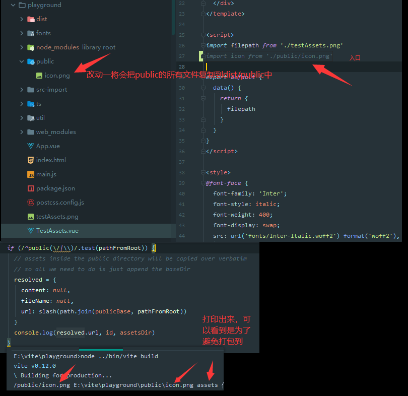
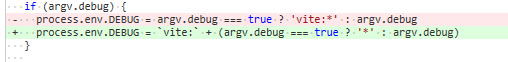
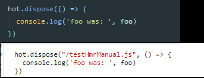
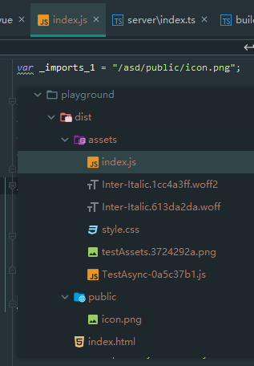
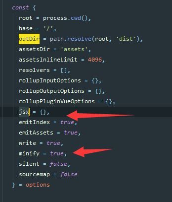
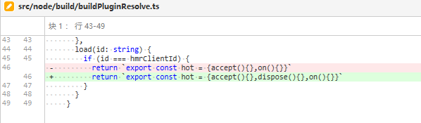

# 291 - 9061e44 支持使用`js`引入静态资源 + 打包`public`资源特殊处理

改动部分：

- `node/build/buildPluginAsset.ts resolveAsset`:  `public`开头的路径，将被打包进以`publicBase`参数的值为文件夹(详 **改动一**)
- `node/build/buildPluginCss.ts`：调用`resolveAsset`没有检测到资源，则不做任何处理，以免空资源被注入`bundle`中(`registerAssets`)
- `node/build/index.ts`：如果`/public`存在，则复制其资源（详 **改动三**）
- 新增`node/server/serverPluginAssets.ts`，静态资源转换为`export default "路径"`（详 **新增四**）

### 改动一

之前的资源统一打包的路径为：`slash(path.join(publicBase, assetsDir, resolvedFileName))`，即现在遇到`/^public(\/|\\)/`，去除`assetsDir`。

```typescript
// 获取相对路径
const pathFromRoot = path.relative(root, id)

// 检测是否public开头的文件路径
  if (/^public(\/|\\)/.test(pathFromRoot)) {
    // assets inside the public directory will be copied over verbatim
    // so all we need to do is just append the baseDir
    resolved = {
      content: null,
      fileName: null,
      // 是则资源会被放到publicBase传入的参数
      url: slash(path.join(publicBase, pathFromRoot))
    }
  }
```

### 改动三

`import icon from './public/icon.png'` -> **改动一**识别到public，则不把其路径改为`assets`，意义就是不要将`public`的资源打包进`assets`中。

```typescript
// vite 写入
if (write) {
    //skpi...
    
    // /public的资源都会被打包到/public中，全部均为复制
    const publicDir = path.resolve(root, 'public')
    if (await fs.pathExists(publicDir)) {
      await fs.copy(publicDir, path.resolve(outDir, 'public'))
    }
}
```



### 新增四

转换为`js`模块语言。

```typescript
import { Plugin } from '.'
import { isImportRequest, isStaticAsset } from '../utils'

export const assetPathPlugin: Plugin = ({ app }) => {
  app.use(async (ctx, next) => {
    if (isStaticAsset(ctx.path) && isImportRequest(ctx)) {
      ctx.type = 'js'
      ctx.body = `export default ${JSON.stringify(ctx.path)}`
      return
    }
    return next()
  })
}

```

> `import { Plugin } from '.'`，自动加载`/index.ts`


# 292 - 12a5d47 支持 --debug 标志 for windows

改动部分

`node/cli.ts`： 参数中传入`debug`，将设置`process.env.DEBUG = true`。

> 本次commit，添加了`crocess-env`，为了windows能够正确设置环境变量(程序变量？)


# 293 - 30c9bea 调整292

需要添加上`vite:`，否则不能触发（DEBUG包，已经有解析），如`require('debug')('vite:build:asset')`。




# 294 - e5cf447 `hmr`功能，支持`hot.dispose`

改动部分

- readme 因为新增了`hot.dispose`用例，需要给大家说一下dispose的使用（详 **改动一**）
- `node/server/serverPluginHmr.ts`
- `client/client.ts`，先进行`disposer()`，再发送请求获取新的js文件，获取完成后调用accept的回调方法，这样dispose触发就可以获取旧变量了，新的js文件将按照原来流程被调用callback
- `node/server/serverPluginHmr.ts`，AST语法树识别`dispose`（详 **改动四**）

### 改动一

使用`hot.dispose`，`callback`调用栈为改动前的值。

```js
function setupSideEffect() {}
function cleanupSideEffect() {}

setupSideEffect()

if (__DEV__) {
  hot.dispose(cleanupSideEffect)
}
```

测试用例(`testHmrManual.js`)：

```typescript
import { hot } from '@hmr'

export const foo = 1

if (__DEV__) {
  hot.accept(({ foo }) => {
    console.log('foo is now: ', foo)
  })

  hot.dispose(() => {
    console.log('foo was: ', foo)
  })
}

// jest
      test('hmr (manual API)', async () => {
        await updateFile('testHmrManual.js', (content) =>
          content.replace('foo = 1', 'foo = 2')
        )
        await expectByPolling(() => logs[logs.length - 1], 'foo is now:  2')
        // there will be a "js module reloaded" message in between because
        // disposers are called before the new module is loaded.
        expect(logs[logs.length - 3]).toMatch('foo was:  1')
      })
```

### 改动四

根据语法树识别到`callee`名称为`dispose`，即在对应位置插入当前调用该`hot.dispose api`的`.js`文件名称。



```typescript
if (node.callee.property.name === 'dispose') {
    // inject the imports's own path to dispose calls as well
    s.appendLeft(node.arguments[0].start!, JSON.stringify(importer) + ', ')
}
```


# 295 - 5d3cc75 重构ci，封装代码

改动部分:

- `node/cli.ts`: 完全重构了，整理了一下代码结构（详 **改动一**）

### 改动一

1. 封装启动serve的服务为`runServe`，`build`构建为`runBuild`
2. 参数处理统一封装为`parseArgs`


# 296 - a882aa4 cli新增 --help 标志

```typescript
function logHelp() {
  console.log(`
Usage: vite [command] [args] [--options]

Commands:
  vite                       Start server in current directory.
  vite serve [root=cwd]      Start server in target directory.
  vite build [root=cwd]      Build target directory.

Options:
  --help, -h                 [boolean] 显示帮助
  --version, -v              [boolean] 显示版本
  --port                     [number]  服务端口
  --open                     [boolean] 自动打开浏览器
  --base                     [string]  构建public位置 (default: /)
  --outDir                   [string]  构建输出位置 (default: dist)
  --assetsDir                [string]  在dist文件下，设置输出资源位置 (默认: assets)
  --assetsInlineLimit        [number]  最大行内式资源大小bytes(默认: 4096 byte)
  --sourcemap                [boolean] 构建生成sourcemap (默认: false)
  --minify                   [boolean | 'terser' | 'esbuild'] 设定压缩服务(默认: 'terser')
  --jsx-factory              [string]  (默认: React.createElement)
  --jsx-fragment             [string]  (默认: React.Fragment)
`)
}
```

#### `vite`直接把`public`的复制到`dist/public`，是一个写死的代码，如果我设置了`--base '/asd'`是不是会报错？

雀氏。




# 297 - 5111d42 调整`BuildOptions`的参数位置

也许更好看。（但是对于我来说，改了和没改一样）

不如把参数也跟着类型的位置调整？更美观了。




# 298 - 3af44fc readme 添加关于TS模块隔离的注释

### TypeScript

从v0.11开始， `Vite`支持 在`*.vue` 中设置`<script lang="ts">` , 也可以引入 `.ts` 文件。 请注意，`Vite`**不**执行类型检查 - 类型检查由IDE和构建过程负责 (你可以在在构建脚本中执行 `tsc --noEmit`). 考虑到这一点, `vite`使用[`esbuild`](https://github.com/evanw/esbuild)将TypeScript转换为JavaScript，速度大约是原生`js` 写的`tsc`的20~30倍，HMR更新可以在不到50毫秒的时间内反映在浏览器中。

> `esbuild`帮你构建`ts`了，所以不会做类型检测(`esbuild`不做这个，对于类型会替换为空格，[劝劝`evanw`?](https://github.com/evanw/esbuild/issues/95))

#### 执行`tsc --noEmit`可以检测`.ts`，也可以检测`.vue`麽？[#749](https://github.com/vitejs/vite/issues/749)

很多人说，自己做一个类型检测并不难，提取`<script>`内容为`.ts`就可以检测了。

尤大说，有一个[工具](https://github.com/vuedx/languagetools)可以做到，然后过了三个月尤大添加上了这个功能了。


# 299 - eab49a4 hmr API更换路径为`vite/hmr` + 添加`hmr`类型

改动部分：

- `package.json`:  `files`包括`hmr.d.ts`（files即上传到`npm`的文件），jest添加 `--clearCache`（详 **改动一**）
- `hmrClientId`更改为`vite/hmr`，即`@hmr`相关的路径，都需要更改为`vite/hmr`。

### 改动一

### `--cache`

是否使用缓存。默认为true。使用 `--no-cache` 禁用缓存。注意：只有在遇到与缓存有关的问题时，才应禁用缓存。平均而言，禁用缓存会使Jest至少慢两倍。

如果要检查缓存，请使用 `--showConfig` 并查看 `cacheDirectory` 值。如果需要清除缓存，请使用 `--clearCache` 。

转换脚本已更改或Babel已更新，Jest无法识别这些更改？

尝试使用 [`--no-cache`](https://jestjs.io/zh-Hans/docs/cli#--cache) 选项。 Jest 会缓存转换的模块文件来加速测试的执行。如果你正在使用自己的自定义转换器，考虑添加`getCacheKey` 方法 [getCacheKey in Relay](https://github.com/facebook/relay/blob/58cf36c73769690f0bbf90562707eadb062b029d/scripts/jest/preprocessor.js#L56-L61)。

> 所以尤大遇到缓存问题了。（这就不再深入探究了，问他本人吧... 蛤蛤蛤 我windows系统也不好测）


# 300 - 393fc52 构建返回的hot需要带`dispose`

之前也有提到过，免得报错，所以加一个空白调用。



