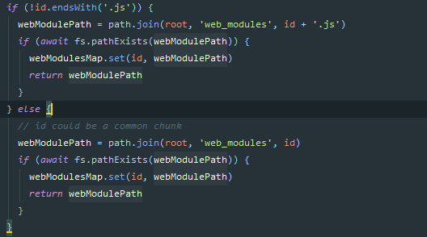
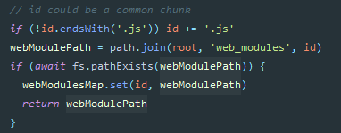
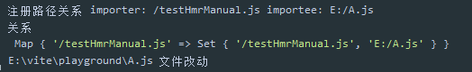
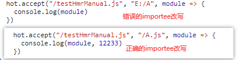
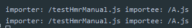

# 301 - 253da59 changelog

### [0.13.0](https://github.com/vuejs/vite/compare/v0.12.0...v0.13.0) (2020-05-08)

#### Features

- **`hmr`:** `hmr`路径更换为 `vite/hmr` + 添加类型 ([eab49a4](https://github.com/vuejs/vite/commit/eab49a4b7dd7e3bb0ff215c7e7937814cd63bb4f)), 关闭[#92](https://github.com/vuejs/vite/issues/92)
- cli添加帮助信息 ([a882aa4](https://github.com/vuejs/vite/commit/a882aa48cb447ec3b84019a2ce838ee75d848555))
- **`hmr`:** 支持`hot.dispose` ([e5cf447](https://github.com/vuejs/vite/commit/e5cf447762c73aafd686a69a8b0d8e24c4e00048))
- cli支持 --debug 标志 ([12a5d47](https://github.com/vuejs/vite/commit/12a5d47b2bf2cb7e1badae2e2ee1129c0ae29fe5))
- 支持`js`引入资源 + 对 `/public`文件夹的特殊处理 ([9061e44](https://github.com/vuejs/vite/commit/9061e442a7de8f94ca2931299450464f78f82148))


# 302 - 04d5561 v0.13.0

release v0.13.0


# 303 - 04d5561 补充301的`changlog`

因为`vite/hmr`的更改，使用`vite` `hmr`的人都需要更改，这是一项破坏性的改动。


# 304 - d85e751 `create-vite-app` v1.0.5

release `create-vite-app` v1.0.5


# 305 - e2185b4 [#90](https://github.com/vitejs/vite/pull/90)文档语法错误

英文老师来了


# 306 - 3653793 `web_modules`后缀处理 + 处理`Import`语句的错误提示

改动部分：

- `node/server/serverPluginModuleResolve.ts`： 处理`web_modules`时，如果请求id非`.js`后缀，则自动添加`.js`后缀。
- `node/server/serverPluginModulerEWRITE.ts`：利用`es-module-lexer`包中的`parse`处理`import`语句，如果报错，则提示 （如果你在使用 ` JSX`, 请确保文件名称为 `.jsx` 后缀.）

> 也不确定是啥错，先提示一下可能是`JSX`没有提前被编译的错。


# 307 - a847621 重构简化`web_modules`处理逻辑

没有改造前，代码重复。



重构后：



> 把重复代码合并


# 308 - b7f5ad2 [#95](https://github.com/vitejs/vite/pull/95) 使用`brotli-size`输出经`brotli`压缩后的文件大小

新增部分：

- 添加[`brotli-size`](https://www.npmjs.com/package/brotli-size)包（详 **改动一**）

### 改动一

HTTP服务器程序Apache和nginx支持Brotli压缩算法，检测站点有没有使用，可以查看**content-encoding**响应头是否为**br**，**accept-encoding**是包括**br**。

`Brotil`是很常用的压缩算法，可以输出`Brotil`压缩后的大小，[Skypack](https://www.skypack.dev/)也使用该压缩算法。经过基准测试，大约增加了3%的构建时间。

[新的开源压缩算法Brotli](https://zhuanlan.zhihu.com/p/33405940)


# 309 - 7ffa9c0 [#97](https://github.com/vitejs/vite/pull/95) windows hmr

这是一个windows路径引发的问题，我之前也提到过windows下，`importer`与`importee`关系路径不正确（`serverPluginModuleRewrite.ts`之前已修复）。



`importee`的路径错误了（重写你的import语句，根据importer获取其importee的publicPath，所以现在这里是publicPath在windows下错误输出，至于为什么平台没有测试出来，是因为尤大没有做`hot.accept`的`hmr`测试，所以这其实是windows下`serverPluginHmr,ts`改写 引用`hmr`的路径的BUG）。



修复位置：

```typescript
# serverPluginHmr.ts rewriteFileWithHMR registerDep
const depPublicPath = slash(path.resolve(path.dirname(importer), e.value))
```

修复后：

```typescript
const depPublicPath = slash(
      path.isAbsolute(e.value) // 如果是绝对路径，则不做处理，因为它就是publicPath
        ? e.value
        : resolveImport({ importer, id: e.value, resolver })
)
```



`resolveImport`：从`serverPluginModuleRewrite`中抽离改写import语句的功能。

> 主要原因，尤大遗忘漏了。


# 310 - e98102a 调整`cli.ts`

调整`logHelp`的位置，放在最外层堆。

变量名称修改：`s`-> `start`

