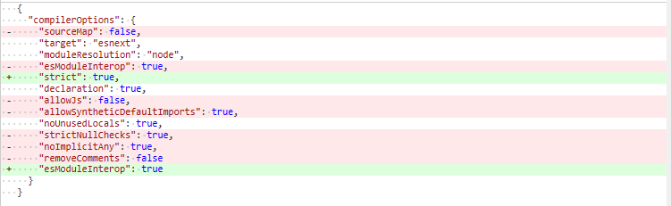
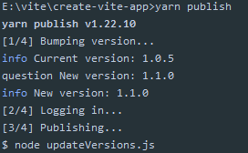
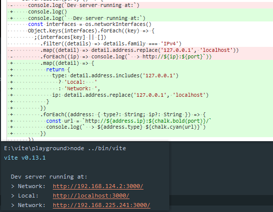

# 311 - c18451d 构建：简化tsconfig

改动部分：

`tsconfig.base.json`：去除默认选项，`esModuleInterop`开启后，`allowSyntheticDefaultImports`会为`true`。



[tsconfig](https://www.tslang.cn/docs/handbook/compiler-options.html)

[esModuleInterop](https://zhuanlan.zhihu.com/p/148081795) [allowSyntheticDefaultImports](https://blog.leodots.me/post/40-think-about-allowSyntheticDefaultImports.html): 兼容esm引入cjs

`noImplicitAny`：在表达式和声明上有隐含的 `any`类型时报错，默认`alse`

`strictNullChecks`: 在严格的 `null`检查模式下， `null`和 `undefined`值不包含在任何类型里，只允许用它们自己和 `any`来赋值（有个例外， `undefined`可以赋值到 `void`），默认`false`。

`strict`: 启用所有严格类型检查选项。

`noUnusedLocals`:  若有未使用的局部变量则抛错。


# 312 - 0708279 重构[#97](https://github.com/vitejs/vite/pull/95)，且全局注册importer与importee关系，即设置`importerMap`

在[309 - 7ffa9c0](https://github.com/Kingbultsea/vite-analysis/blob/master/301-310/301-310.md#309---7ffa9c0-97-windows-hmr)，修复了windows路径改写。

改动部分：

- 因为`resolveImport`方法已经处理过绝对路径，所以现在去除重复的逻辑代码。

- `handleJSReload`会读取`importerMap`作为检测，才会调用`walkImportChain`检测`hmrAcceptanceMap`，才能够触发`js-update`，现在把注册`importerMap`的逻辑放进`serverPluginHmr.ts registerDep`中。

这块有很多坑，`accept`被调用一次以上，新的将会覆盖旧的，`client.ts`处理`hot-accept`用了key value对应关系; importer调用自身作为importee，触发`js-update`，如果其他文件或者组件引入了该文件，将感受不到任何变化（合理？只能在文档中约束不要import使用了HMR API的js文件了）。

> importerMap存放所有文件的importer和importee的关系。
>
> hmrAcceptanceMap存放使用了hot.accept的importer和importee的关系，用于触发`js-update`，提高hmr性能体验。

### 关于function的参数风格

之前查阅`vue-next`也发现很少使用解构（或没有），`Vite`里面是完全没有的。

解构可以使我们打乱参数顺序，但是不能变换名称，而且写类型的时候会有重复字段。

```typescript
export const resolveImport = (
  importer: string,
  id: string,
  resolver: InternalResolver,
  timestamp?: string
): string => {}

export const resolveImport = ({
  importer,
  id,
  resolver,
  timestamp
}: {
  importer: string
  id: string
  resolver: InternalResolver
  timestamp?: string
}): string => {}
```


# 313 - 5ae6278 changelog

## [0.13.1](https://github.com/vuejs/vite/compare/v0.13.0...v0.13.1) (2020-05-09)

### Bug Fixes

- **hmr:** 修复hot.accept() 路径改写（windows下） ([#97](https://github.com/vuejs/vite/issues/97)) ([7ffa9c0](https://github.com/vuejs/vite/commit/7ffa9c0b953f4a78251a8c379a2edf8e31fd368b))
- 修复web_modules后缀添加问题 + 在非`jsx`文件下使用`jsx`将会发出警告（反正`es-module-lexer`包报错了就提示是这个错） ([3653793](https://github.com/vuejs/vite/commit/3653793a2f713b126aaefb01b00878614fc4c63c)), closes [#94](https://github.com/vuejs/vite/issues/94)

### Features

- **build:** 输出`brotli-compressed`压缩下的文件大小 ([#95](https://github.com/vuejs/vite/issues/95)) ([b7f5ad2](https://github.com/vuejs/vite/commit/b7f5ad245f10efac89be0954155639e310c46e00))


# 314 - c057265 v0.13.1

release v0.13.1


# 315 - decbfc2 create-vite-app 可以构建react模板

改动部分：

- package.json: 新增`bin` `cva`，是`create-vite-app`的简写
- 封装方法，现在有两个模板文件夹`template-vue`和`template-preact`，默认`--template vue`

> [`util.promisify`]()是在`node.js 8.x`版本中新增的一个工具，用于将老式的`Error first callback`转换为`Promise`对象，让老项目改造变得更为轻松。


# 316 - 32d6341 create-vite-app v1.1.0

release create-vite-app v1.1.0

> **记住**（之前有提到）启动yarn publich会执行`prepublishOnly` 即 `node updateVersions.js`，自动同步模板里devDependencies的`vite`版本




# 317 - 122851e [#100](https://github.com/vitejs/vite/pull/100) 调整上传到npm的文件包括范围

```json
{
    "files": [
        "index.js",
        "template-*"
    ]
}
```

> [files](https://docs.npmjs.com/cli/v7/configuring-npm/package-json#files)，默认ignored，包括文件、目录或全局模式。


# 318 - e00bf3a  [#98](https://github.com/vitejs/vite/pull/98) 增强服务开启提示，保持与`vue-cli`一致




# 319 - 6d2fabe create-vite-app v1.1.1

release create-vite-app v1.1.1


# 320 - 9336dac [#106](https://github.com/vitejs/vite/pull/106) html标签`<script src=''>`支持单引号

```typescript
const srcRE = /\bsrc=(?:"([^"]+)"|'([^']+)'|([^'"\s]+)\b)/
// 获取src的正则

// 修改后：默认srcAttr[2]
const srcAttr = openTag.match(srcRE)
            if (srcAttr) {
              // register script as a import dep for hmr
              const importee = cleanUrl(
                slash(path.resolve('/', srcAttr[1] || srcAttr[2]))
              )
              debugHmr(`        ${importer} imports ${importee}`)
              ensureMapEntry(importerMap, importee).add(importer)
            }
```

> 发现了一个BUG，当index.html的`<script src="./main.js">拥有代码</script>`，将不会记录index.html与main.js的importer importee关系；我觉得没有任何关系，这里的代码完全去除不用注册也行（如果为了规范那无视），因为`hmr`识别到顶层没有parent，是会进行页面刷新的，即`walkImportChain` 设置`hasDeadEnd`为`true`。

