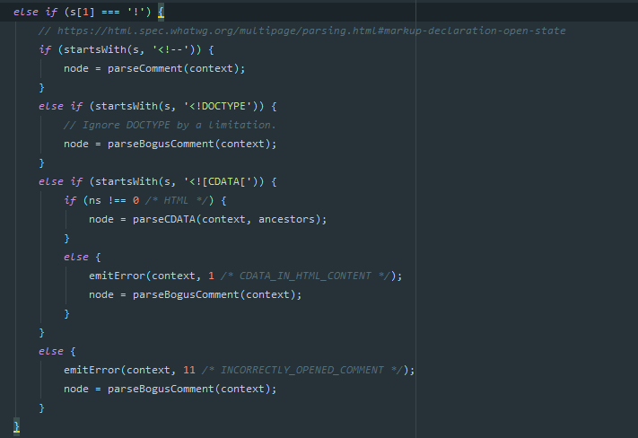
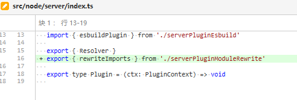

# 321 - 6ee0168 [#105](https://github.com/vitejs/vite/pull/105) 修复浏览器无法打开的问题

主要是因为`ececa`包被放进了`devDependencies`，从而没有找到该包报错。

现在把`execa`包移动进`dependencies `。


# 322 - 32cf37f [#107](https://github.com/vitejs/vite/issues/107) 处理小写的`doctype`

**issues**: `<!doctype html>`会引起`vite build`崩溃。

原因：`@vue/compiler-core`没有处理小写的`doctype`为注释（按照标准）。



改动部分：

- `build/buildPluginHtml.ts`，替换`html`内容，把`doctype`改为大写，即`html.replace(/<!doctype\s/i, '<!DOCTYPE ')`

> 写个框架要注意的事情真的好多...


# 323 - 6776e76 防止jest警告的程序包名称不明确

`template-preact`: `package.json` `name`改为`vite-preact-starter`

`template-vue`: `package.json` `name`改为`vite-starter`

> 在`vite`的测试流没有看到，应该是尤大想知道开发者用了哪个模板


# 324 - 2320d3e changelog

## [0.13.2](https://github.com/vuejs/vite/compare/v0.13.1...v0.13.2) (2020-05-09)

### Bug Fixes

- -修复-open标志引起的错误 ([#105](https://github.com/vuejs/vite/issues/105)) ([6ee0168](https://github.com/vuejs/vite/commit/6ee016892d7b375cc8dd8cbc4dc10c03325d4dc8))
- 处理小写的doctypes (close [#107](https://github.com/vuejs/vite/issues/107)) ([32cf37f](https://github.com/vuejs/vite/commit/32cf37fd5125be7dd3b65de2024e89685d7cbc8e))
- 支持`<script src>`使用单引号  ([#106](https://github.com/vuejs/vite/issues/106)) ([9336dac](https://github.com/vuejs/vite/commit/9336dacaeaae37bd2adf36ab1816c063eddbd4eb))
- cva: package.json files 包括 template-* ([#100](https://github.com/vuejs/vite/issues/100)) ([122851e](https://github.com/vuejs/vite/commit/122851ee802c8e6374be42e704883e6ed91b0b02))

### Features

- 增强cli输出的信息，保持与vue-cli一样 ([#98](https://github.com/vuejs/vite/issues/98)) ([e00bf3a](https://github.com/vuejs/vite/commit/e00bf3a7fb029416c394e2606a3ce4ed8f3079b1))
- **cva:** 支持多种类型的模板 ([decbfc2](https://github.com/vuejs/vite/commit/decbfc2ee9e0c88c9e94a8f4f39032cdf5b5d6c5))


# 325 - b5cf006 v0.13.2

release v0.13.2


# 326 - 49e79e7 支持`build --ssr`

改动部分：

- `build/index.ts`：新增`ssr`选项，调用`ssrBuild`对`options`改造，输出的文件夹名称为`dist-ssr`。

> 不做深入探究`ssr`（因为我不熟悉，也不想深入熟悉┭┮﹏┭┮！！ 知道它是在服务端完成初始`vnode` -> `html`即可）[207](https://github.com/Kingbultsea/vite-analysis/blob/d0e223924b0656785fa14ac073ff78dcdfef818a/201-210/201-210.md#207---4808f41-build%E6%94%AF%E6%8C%81ssr)


# 327 - d6151bf [#104](https://github.com/vitejs/vite/pull/104) 为插件开发者暴露`rewriteImports` 方法

**pikax**: 我在编写一个基于路由的SSR插件，我需要编译SFC文件，并构建像`vite`的脚本。但是`vite`依赖中间件处理SFC文件路径。

**尤大**：为了一致性起见，我认为我们要么公开所有 `compileSFC*` 方法，要么不公开它们。但是，将它们公开意味着我们不能再将它们视为内部结构并自由调整参数。假设它们仅在开发服务器中使用，有时可能需要 `Koa context` - 这将使它们在其他地方无法使用。我认为直到`vite`变得更稳定更安全之前，你可以复制逻辑黏贴到你的插件中。

**pikax**：同意，在我的情况下，我只需要样式，其他的我基本上复制了逻辑。 `rewriteImports` 是否适合公开？

**尤大**：可以，`rewriteImports`可能是安全的，尽管我现在认为它是半内部的。你应该做好它可能会坏了的心理准备;)




# 328 - ab940fd 支持`config`文件配置`vite`

改动部分

- 新增`src/node/config.ts`: 提供`ServerConfig`, `BuildConfig`, `resolveConfig`给`vite`，即用户可以通过`config.ts`导入`vite`类型（详 **新增一**）
- `cli.ts`：**合并来自命令行和config文件的参数**，config文件的优先级高于命令行；一切类型都为可选项，所以可以作为`runServe( options: ServerConfig & {port?: numberopen?: boolean})`和`runBuild(options: BuildConfig)`的**参数**（详 **改动二**）
- `playground`，新增`tsconfig.json`和`vite.config.ts`（详 **改动三**）

> 建议补充一下tree-shaking（"遇到的难题"），webpack4和rollup都在用它 [`sideEffects`](https://zhuanlan.zhihu.com/p/41795312)。

## 新增一

- 利用rollup与`esbuild`编译`ts`类型的`config`，不做`tree-shaking`。
- `UserConfig`暴露了所有`BuildConfig`字段，其中设定`plugins`字段为：`SharedConfig`的`alias`(todo)、`transform`(todo)和`resolvers`（id public file路径映射）；`BuildConfig`的`rollupInputOptions`(`rollup.rollup()`参数，即构建前的配置)、`rollupOutputOptions`(`bundle.generate()`的参数，即生成配置)和`rollupPluginVueOptions`(`rollup-plugin-vue`插件参数)。

**根据定义**`Plugin`，尤大想暴露一个`vite`特性的插件给用户在`config.ts.plugins`调用，插件能帮助用户**配置`rollup`**，设置（开发&构建）**路径映射**、（开发&构建）代码转换、**`rollup-plugin-vue`配置**和（开发）**`koa`中间件**。

用户能做的事(`UserConfig`)：

- 一切构建选项
- 插拔式配置`vite`插件

```typescript
# src/node/config.ts

import { ServerPlugin } from './server'
import { Resolver } from './resolver'
import {
  InputOptions as RollupInputOptions,
  OutputOptions as RollupOutputOptions
} from 'rollup'
import { Options as RollupPluginVueOptions } from 'rollup-plugin-vue'

/**
 * server与build的共享选项.
 */
export interface SharedConfig {
  /**
   * 项目根目录. 可以是绝对路径（从盘开始的路径）,
   * 或者相对于config所在目录的相对路径
   * @default process.cwd()
   */
  root?: string
  /**
   * TODO
   */
  alias?: Record<string, string>
  /**
   * TODO
   */
  transforms?: Transform[]
  /**
   * 路径映射
   */
  resolvers?: Resolver[]
  /**
   * 为jsx 设置 factory 和 fragment.
   * @default
   * {
   *   factory: 'React.createElement',
   *   fragment: 'React.Fragment'
   * }
   */
  jsx?: {
    factory?: string
    fragment?: string
  }
}

// koa 中间件
export interface ServerConfig extends SharedConfig {
  plugins?: ServerPlugin[]
}

export interface BuildConfig extends SharedConfig {
  /**
   * https://github.com/Kingbultsea/vite-analysis/blob/8358749dc960a93262458eced9868d593c58af8d/211-220/211-220.md#212---c82a597-%E6%89%93%E5%8C%85%E5%90%8E%E7%9A%84%E5%BC%95%E5%85%A5%E8%B7%AF%E5%BE%84%E5%8F%AF%E9%85%8D%E7%BD%AE%E5%8C%96
   * Base public path when served in production.
   * @default '/'
   */
  base?: string
  /**
   * vite打包后的路径，如果存在该路径则会删除整个文件夹
   * @default 'dist'
   */
  outDir?: string
  /**
   * 相对于outDir的js/css/image存放路径
   * @default 'assets'
   */
  assetsDir?: string
  /**
   * 小于该设置大小的文件，将被设置为行内资源，单位byte
   * @default 4096 (4kb)
   */
  assetsInlineLimit?: number
  /**
   * 是否生成sourcemap
   * @default false
   */
  sourcemap?: boolean
  /**
   * 指定js压缩方式
   * 可选项'terser' 或 'esbuild' 'false'
   * @default 'terser'
   */
  minify?: boolean | 'terser' | 'esbuild'
  /**
   * 用于服务器端渲染的构建
   * @default false
   */
  ssr?: boolean

  // 以下仅为API，未记录在CLI中. -----------------
  /**
   * rollup.rollup()
   * https://rollupjs.org/guide/en/#big-list-of-options
   */
  rollupInputOptions?: RollupInputOptions
  /**
   * bundle.generate()
   * https://rollupjs.org/guide/en/#big-list-of-options
   */
  rollupOutputOptions?: RollupOutputOptions
  /**
   * rollup-plugin-vue
   * https://github.com/vuejs/rollup-plugin-vue/blob/next/src/index.ts
   */
  rollupPluginVueOptions?: Partial<RollupPluginVueOptions>
  /**
   * 是否输出资源生成信息
   * @default false
   */
  silent?: boolean
  /**
   * 是否将文件写入磁盘
   * @default true
   */
  write?: boolean
  /**
   * 是否写入index.html到磁盘中&注入
   * @default true
   */
  emitIndex?: boolean
  /**
   * 是否写入资源到磁盘（不包括js文件）
   * @default true
   */
  emitAssets?: boolean
}

// 暴露给用户使用的配置
export interface UserConfig extends BuildConfig {
  plugins?: Plugin[]
}

export type Condition = RegExp | RegExp[] | (() => boolean)

export interface Transform {
  include?: Condition
  exclude?: Condition
  query?: Condition
  /**
   * @default 'js'
   */
  as?: 'js' | 'css'
  transform?: (code: string) => string | Promise<string>
}

export interface Plugin
  extends Pick<SharedConfig, 'alias' | 'transforms' | 'resolvers'>,
    Pick<
      BuildConfig,
      'rollupInputOptions' | 'rollupOutputOptions' | 'rollupPluginVueOptions'
    > {
  configureServer?: ServerPlugin
}

import path from 'path'
import fs from 'fs-extra'
import chalk from 'chalk'
import type Rollup from 'rollup'
import { createEsbuildPlugin } from './build/buildPluginEsbuild'

// 处理config
export async function resolveConfig(
  configPath: string | undefined
): Promise<UserConfig | undefined> {
  const start = Date.now()
  const resolvedPath = path.resolve(
    process.cwd(),
    configPath || 'vite.config.js'
  )
  try {
    if (await fs.pathExists(resolvedPath)) {
      const isTs = path.extname(resolvedPath) === '.ts'
      // 1. 尝试加载非config.ts文件
      if (!isTs) {
        try {
          return require(resolvedPath)
        } catch (e) {
          if (
            !/Cannot use import statement|Unexpected token 'export'/.test(
              e.message
            )
          ) {
            throw e
          }
        }
      }

      // 2. ts文件有可能使用import语法
      // 使用rollup转译es import语法为require语法
      const rollup = require('rollup') as typeof Rollup
      const esbuilPlugin = await createEsbuildPlugin(false, {})
      const bundle = await rollup.rollup({
        // .json与非. 且非绝对路径 设置为外部引入
        // 意思就是不处理网络请求和json文件
        external: (id: string) =>
          (id[0] !== '.' && !path.isAbsolute(id)) ||
          id.slice(-5, id.length) === '.json',
        input: resolvedPath,
        treeshake: false,
        plugins: [esbuilPlugin]
      })

      const {
        output: [{ code }]
      } = await bundle.generate({
        exports: 'named',  // esm使用named 可以解构 https://rollupjs.org/guide/en/#outputexports
        format: 'cjs'
      })

      const config = await loadConfigFromBundledFile(resolvedPath, code)
      // config.root规范为绝对路径 https://blog.csdn.net/kikyou_csdn/article/details/83150538
      if (config.root && !path.isAbsolute(config.root)) {
        config.root = path.resolve(path.dirname(resolvedPath), config.root)
      }

      require('debug')('vite:config')(
        `config resolved in ${Date.now() - start}ms`
      )
      console.log(config)
      return config
    }
  } catch (e) {
    console.error(
      chalk.red(`[vite] failed to load config from ${resolvedPath}:`)
    )
    console.error(e)
    process.exit(1)
  }
}

interface NodeModuleWithCompile extends NodeModule {
  _compile(code: string, filename: string): any
}

async function loadConfigFromBundledFile(
  fileName: string,
  bundledCode: string
) {
  const extension = path.extname(fileName)
  const defaultLoader = require.extensions[extension]!
  require.extensions[extension] = (module: NodeModule, filename: string) => {
    if (filename === fileName) {
      ;(module as NodeModuleWithCompile)._compile(bundledCode, filename)
    } else {
      defaultLoader(module, filename)
    }
  }
  delete require.cache[fileName]
  const raw = require(fileName)
  const config = raw.__esModule ? raw.default : raw
  require.extensions[extension] = defaultLoader
  return config
}
```

> [import type](https://segmentfault.com/a/1190000039800522)，仅仅导入类型，避免导入类型且导出该类型时，babel报错。以前通过开启`isolatedModules`提醒禁止这种用法，要使用显示类型导出&显示类型导入。

## 改动二

现在可以直接通过`--debug`标志来打开`debug`信息了，当然你也可以`--debug resolve `只查看路径映射信息。

```typescript
// make sure to set debug flag before requiring anything
if (argv.debug) {
  process.env.DEBUG = `vite:` + (argv.debug === true ? '*' : argv.debug)
}
```

## 改动三

```json
{
  "compilerOptions": {
    "baseUrl": "../", // 基本路径
    "paths": {
      "vite": ["dist/index.d.ts"] // vite类型路径 即 ../dist/index.d.ts
    }
  }
}
```

```typescript
import type { UserConfig } from 'vite' // baseUrl + paths.vite[0]

const config: UserConfig = {
  jsx: {
    factory: 'h',
    fragment: 'Fragment'
  },
  minify: false
}

export default config
```


# 329 - 7cdaa0b 构建时支持配置`rollup-plugin-vue`&`serverPluginVue` 的`compilerOptions`选项

改动部分：

- `serverPluginVue.ts`&`build/index.ts.rollup-plugin-vue`:  用户可以配置`compilerOptions`来影响`vue`对`<template>`标签的`vnode render`转换（**改动一**）
- 插件处理`jsx`，直接获取通过用户的`config.jsx.factory` & `config.jsx.fragment`获取
- `node/config.ts`: 用户配置新增`configureServer: ServerPlugin`，即用户可以配置`koa`中间件；Plugin插件新增`vueCompilerOptions`（即**改动一**）能力；Plugin处理器，即合并用户config（详 **改动三**）;修复return BUG。

## 改动三

每个插件的功能将会被合并到config中，倒序优先（alias除外，config配置文件优先），**`Plugin`插件后者覆盖前者重复字段**。

```typescript
function resolvePlugin(config: UserConfig, plugin: Plugin): UserConfig {
  return {
    alias: {
      ...plugin.alias,
      ...config.alias
    },
    transforms: [...(config.transforms || []), ...(plugin.transforms || [])],
    resolvers: [...(config.resolvers || []), ...(plugin.resolvers || [])],
    configureServer: (ctx) => {
      if (config.configureServer) {
        config.configureServer(ctx)
      }
      if (plugin.configureServer) {
        plugin.configureServer(ctx)
      }
    },
    vueCompilerOptions: {
      ...config.vueCompilerOptions,
      ...plugin.vueCompilerOptions
    },
    rollupInputOptions: {
      ...config.rollupInputOptions,
      ...plugin.rollupInputOptions
    },
    rollupOutputOptions: {
      ...config.rollupOutputOptions,
      ...plugin.rollupOutputOptions
    }
  }
}
```

> 输出空白的console.log()可以达到换行效果。
>
> 用户可以配置config文件的额外字段，作为服务插件的参数传递（非koa上下文）。


# 330 - a66ac5b 更新 issue模板

328 - ab940fd 中，改动二配置了`--debug`，现在需要更新issue模板，告诉反馈者使用`--debug`打开调试信息。

