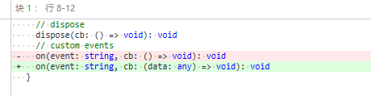
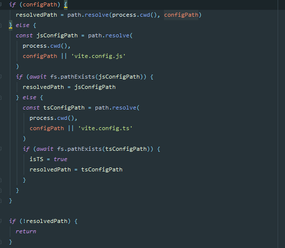
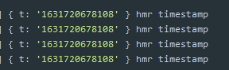
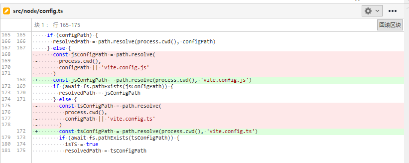
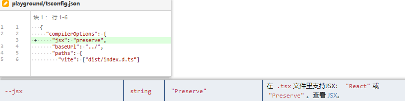
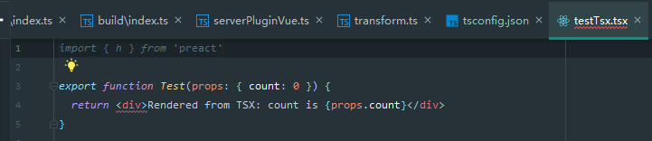

# 331 - 6cf1e31 issue 模板

## Before you continue...

如果你升级`Vite`后，出现了问题，尝试使用浏览器删除缓存，勾选“Disable cache"


# 332 - a4524b4 修复`hmr hot.on`回调参数类型

`on`可以绑定事件名称和回调的关系，`hmr` `custom`事件可以根据server端传入的`id`事件名称，触发回调。




# 333 - 86d550a 支持`config` `alias`

改动部分：

- `node/resolver.ts`：去除`idToRequest`，新增`alias`（详 **改动一**）
- `node/server/index.ts`加入`alias`
- `node/build/index.ts`加入`alias`
- `node/config.ts`输出`export { Resolver }`类型（详 **改动四**）

## 改动一

1. **废弃**`idToRequest`，该功能可以帮助我们id转换为request路径（开发和构建都用到），即import a from 'id' -> import a from '/@modules/id'，我们可以操控其转换为'/@modules/id' -> '/@modules/aid'。简单来说就是`vite`需要改写你的路径，你使用`idToRequest`拦截了该行为。

> 别问为什么要改写路径，不改写浏览器请求到时候重新传入`vite`分析不了你的模块类型，`import 'a'` 和 `import '/a'`，给到浏览器请求回来都是`localhost:8080/a`，然鹅前者是模块，后者是绝对路径的a文件。不信你自己试试🤨，反正我没试，蛤蛤蛤。

2. 新增`alias`，顶替`idToRequest`作用，传入的参数是对象，即映射id -> 用户想要的id，。

```typescript
export function createResolver(
  root: string,
  resolvers: Resolver[],
  alias: Record<string, string> // 新增参数
): InternalResolver {
  return {
    // ...  
    alias: (id: string) => {
      let aliased: string | undefined = alias[id]
      if (aliased) {
        return aliased
      }
      for (const r of resolvers) {
        aliased = r.alias && r.alias(id)
        if (aliased) {
          return aliased
        }
      }
    }
  }
}
```

#### `idToRequest`不就可以了？为什么要alias?

`idToRequest`需要映射后的路径符合`vite`的改写，开发者使用起来**不方便**（开发者不一定会看源码，需要提醒添加`@modules/`），比如我想要改写`a`为`b`模块，我需要返回`@modules/b`。（构建模式下，`@/modules`会被`requestToFile`去除）

`alias`，利用对象做映射关系，且改版后（不是alias），开发者不需要添加`@modules`了。

## 改动四

输出Resolver类型，提供用户定义Resolver。

```typescript
export interface Resolver {
  requestToFile(publicPath: string, root: string): string | undefined
  fileToRequest(filePath: string, root: string): string | undefined
  alias?(id: string): string | undefined
}
```


# 334 - b85de93 修复加载ts类型的config

由于先前判断用户没有设置`configPath`，默认为`vite.config.js`，然后利用`await fs.pathExists(resolvedPath)`寻找是否有该文件，没有则不做任何事情。

现在判断有没有`js`再判断有没有`ts`就好。




# 335 - b7b9d85 添加alias测试

注意哈，该测试写了映射为`/aliased`，所以不是模块，不要误会认为`alias`不会被当作模块。

```typescript
# vite.config.ts
alias: {
    alias: '/aliased'
}

# TestAlias.vue
import { msg } from 'alias'

# aliased
export const msg = 'alias works.'
```


# 336 - 87ee998 支持transform config / vite插件

支持通过**Vite特色的plugins**改变代码，先看实现功能目标测试例子：

```typescript
# vite.config,ts
import type { UserConfig } from 'vite'
import { sassPlugin } from './plugins/sassPlugin'
import { jsPlugin } from './plugins/jsPlugin'

const config: UserConfig = {
  alias: {
    alias: '/aliased'
  },
  jsx: {
    factory: 'h',
    fragment: 'Fragment'
  },
  minify: false,
  plugins: [sassPlugin, jsPlugin]
}

export default config

# jsPlugin.js vite特色插件
export const jsPlugin = {
  transforms: [
    {
      test(id) {
        return id.endsWith('testTransform.js')
      },
      transform(code) {
        return code.replace(/__TEST_TRANSFORM__ = (\d)/, (matched, n) => {
          return `__TEST_TRANSFORM__ = ${Number(n) + 1}`
        })
      }
    }
  ]
}

# sassPlugin.js vite特色插件
import sass from 'sass'

export const sassPlugin = {
  transforms: [
    {
      as: 'css',
      test(id) {
        return id.endsWith('.scss')
      },
      transform(code) {
        return sass
          .renderSync({
            data: code
          })
          .css.toString()
      }
    }
  ]
}

# TestTransform.vue
<template>
  <h2>Transforms</h2>
  <div class="transform-scss">This should be cyan</div>
  <div class="transform-js">{{ transformed }}</div>
</template>

<script>
import './testTransform.scss'
import { __TEST_TRANSFORM__ } from './testTransform.js'

export default {
  data() {
    return {
      transformed: __TEST_TRANSFORM__
    }
  }
}
</script>
```

> 该示例配置了两个vite的插件，想通过`sass`转换`.scss`文件代码，转换特定变量。

改动部分：

- `node/cli.ts`:  build & dev 统一使用`UserConfig`选项类型（`BuildConfig`没有`ServerConfig`的`plugins`，即没有vite特色的koa插件），合并没有任何影响，全是可选项，字段没没有冲突，不管是build还是dev，只负责自己的字段就好了。
- `node/build/buildPluginCss.ts`:  识别新参数`transforms: Transform[]`传入，筛选出符合`Transform.as === ‘css’`的`Transform`，再次符合筛选`Transform.test(路径)`；符合`as`和`test`方法的Transform，即可调用`Transform.transform`改变css文件。
- `node/build/index.ts`：新增选项`transform`（`SharedConfig`已经有了，所以现在只要取就可以了，前几个commit讲解过），该选项交给`buildPluginCss.ts`插件使用，即提供给css资源构建处理器使用，也就是rollup插件， ` transform`生命周期钩子; **除此之外还帮助用户封装**带有`transform`的`rollup。`
- `node/server/index.ts`: 同build一样，新增`transform`选项，**帮助用户封装仅带有koa洋葱模型插件功能的vite特色插件**（详 主要补充一下洋葱模型的执行顺序 **改动四**）。
- `node/server/serverPluginCss.ts`: `config.trnasforms`转换`css`，和`buildPluginCss.ts`行为一致。对`config.transforms.test`匹配到的文件进行监听。
- `node/server/serverPluginHmr.ts`:  `config.transform` `test`字段匹配到的`.XXX`文件，不会触发`handleJSReload`，仅`.module.css`变动需要触发`handleJSReload`（因为是`js`，注册关系在`moduleRewritePlugin`完成，该插件在第三层外层，目前来说是最后执行，交给`cssPlugin`设置`ctx.type = 'js'`）------> **反正意思就是`.modules.css`才触发，经过转换的`.XXX`视为普通`.css`文件。** 看新增七，有说明为什么要这么做。
- 新增`node/transform.ts`，封装用户传入的config.transforms，转换为`dev`和`build`插件。（详 **新增七**）

> rollup插件是串行执行的，即使是async，也会等待上一个transform的执行完毕再执行下一个transform，文档上有点不清晰（毕竟中华文化博大精深~~~）[transform resolveId](https://github.com/Kingbultsea/vite-analysis/blob/842e5ef132fa68d5e4fa8dcf480cd444b4b0c8f3/111-120/commit-111-120.md#112---1b0b4ba-%E9%85%8D%E7%BD%AE%E5%8C%96%E6%9E%84%E5%BB%BA)

### 改动四

#### 洋葱模型执行顺序（更新-1）

hmrPlugin被提高到内置插件的第一层，[eab49a4](https://github.com/Kingbultsea/vite-analysis/blob/ea4fb552986c95f4da44839e03a00192ce424139/291-300/291-300.md)。注意，文件名称命名与插件名称不一样。

```typescript
import { serveStaticPlugin } from './serverPluginServeStatic'
import { assetPathPlugin } from './serverPluginAssets'
import { cssPlugin } from './serverPluginCss'
import { jsonPlugin } from './serverPluginJson'
import { esbuildPlugin } from './serverPluginEsbuild'
import { vuePlugin } from './serverPluginVue'
import { moduleRewritePlugin } from './serverPluginModuleRewrite'
import { moduleResolvePlugin } from './serverPluginModuleResolve'
import { hmrPlugin, HMRWatcher } from './serverPluginHmr'

# node/server.ts
const internalPlugins: Plugin[] = [
  ...config.plugins,     // 洋葱模型的第一层  （自定）
  hmrPlugin,             // 洋葱模型的第二层  （里层）  
  moduleRewritePlugin,   // 洋葱模型的第三层  （外层） --
  moduleResolvePlugin,   // 洋葱模型的第四层  （里层）
  vuePlugin,             // 洋葱模型的第五层  （内层）
  esbuildPlugin,         // 洋葱模型的第六层  （外层） --
  jsonPlugin,            // 洋葱模型的第七层  （外层） --
  cssPlugin,             // 洋葱模型的第八层  （外层） --
  assetPathPlugin        // 洋葱模型的第九层  （里层） 
  ServerTransformPlugin, // 洋葱模型的第十层  （外层） -- 
  serveStaticPlugin      // 洋葱模型的第十一层（里层）
]
```

`hmrPlugin`: 初始化ws；**洋葱模型**中，仅发送`path.resolve(__dirname, '../client.js')`文件

`moduleRewritePlugin`:  **洋葱模型**中，改写`import`语句、发送被改造后的`index.html`

`moduleResolvePlugin`: **洋葱模型**中，处理`vue`、 `web_modules` 和 `node_modules`与跳转

`vuePlugin`: **洋葱模型**中，处理SFC组件，ts调用`esbuild`做处理（**sourcemap失效，没有合并**）

`esbuildPlugin`: **洋葱模型**中，转换`.ts`文件，且调用了`genSourceMapString`，有效的`sourcemap`

`jsonPlugin`: **洋葱模型**中转换`json`为`esm`语法的对象

`cssPlugin`:  监听css文件变动（非SFC的src，这在`vuePlugin`中处理变动，即捆绑css与SFC文件关系，css文件变动，获取SFC路径后设置id，触发`vue-style-update`，更新`<link href="XXX">`的`href`链接），监听`config.transforms`变动；**洋葱模型**中处理import类`.modules.css`esm化、css预处理器

`assetPathPlugin`: **洋葱模型**中，识别到是`import`静态资源类型的请求，将数据esm化

`ServerTransformPlugin`：根据`config.transform`动态创建，一个代码转换器，**vite特性插件**，凡是经过该插件处理的，`koa.ctx`上下文会带有`_transformed = true`属性;**洋葱模型**中担当用户自定义转换代码的职责。

> 这里指的里层是比外层先执行

#### 补充[eab49a4](https://github.com/Kingbultsea/vite-analysis/blob/ea4fb552986c95f4da44839e03a00192ce424139/291-300/291-300.md)，提升`hmrPlugin`到内置插件第一层的动机

`WebSocket`初始化，`watcher`参数初始化。

为什么用户的plugins是第一层？覆盖用户对`watcher`的定义（是的，我想不出其他影响了）。

```typescript
// start a websocket server to send hmr notifications to the client
  const wss = new WebSocket.Server({ server })
  const sockets = new Set<WebSocket>()

  wss.on('connection', (socket) => {
    debugHmr('ws client connected')
    sockets.add(socket)
    socket.send(JSON.stringify({ type: 'connected' }))
    socket.on('close', () => {
      sockets.delete(socket)
    })
  })

  wss.on('error', (e: Error & { code: string }) => {
    if (e.code !== 'EADDRINUSE') {
      console.error(chalk.red(`[vite] WebSocket server error:`))
      console.error(e)
    }
  })

  watcher.handleVueReload = handleVueReload
  watcher.handleJSReload = handleJSReload
  watcher.send = send
```

> 我个人认为这个提升没什么实际作用，提前建立WebSocket罢了。

### 新增七

**规范**vite特色插件，这两个插件都会被丢进插件组中。

dev: `...(transforms.length ? [createServerTransformPlugin(transforms)] : [])`

build: `...(transforms.length ? [createBuildJsTransformPlugin(transforms)] : [])`

> as?: 'js' | 'css' // 类型，如是css 将会与sPlugin buildPluginCss一同处理，serverPluginHmr仅仅是过滤掉这些实际是css的文件，就怕其他文件也引入了触发了handleJSReload（**尤大防了一手**~）。
>
> test.query 在dev中会携带时间参数t

```typescript
import { ServerPlugin } from './server'
import { Plugin as RollupPlugin } from 'rollup'
import { parseWithQuery, readBody, isImportRequest } from './utils'

export interface Transform {
  /**
   * @default 'js'
   */
  as?: 'js' | 'css' // 类型，如是css 将会与sPlugin buildPluginCss一同处理
  test: (
    path: string,
    query: Record<string, string | string[] | undefined> // 路径参数 import a from 'a.css?a=2' 在dev中会携带时间参数t
  ) => boolean
  transform: (code: string, isImport: boolean) => string | Promise<string>
}

export function normalizeTransforms(transforms: Transform[]) {}

// vite特性的koa插件
export function createServerTransformPlugin(
  transforms: Transform[]
): ServerPlugin {
  return ({ app }) => {
    app.use(async (ctx, next) => {
      await next()
      for (const t of transforms) {
        if (t.test(ctx.path, ctx.query)) {
          ctx.type = t.as || 'js'
          if (ctx.body) {
            const code = await readBody(ctx.body)
            if (code) {
              ctx.body = await t.transform(code, isImportRequest(ctx))
              ctx._transformed = true
            }
          }
        }
      }
    })
  }
}

// rollup的插件
export function createBuildJsTransformPlugin(
  transforms: Transform[]
): RollupPlugin {
  transforms = transforms.filter((t) => t.as === 'js' || !t.as)

  return {
    name: 'vite:transforms',
    async transform(code, id) {
      const { path, query } = parseWithQuery(id)
      for (const t of transforms) {
        if (t.test(path, query)) {
          return t.transform(code, true)
        }
      }
    }
  }
}
```



### 总结

添加transform为了开发者更加便捷，用rollup插件和vite特色的koa插件也可以“完成”，但是难度巨大，比如as: css取消hmr是做不到的，跨插件是不可能完成的。

顺带一提，vite特色插件文件是不会被添加进hmr的，每次修改需要重新打开服务（可能有点难以小改动做到，把这些插件的路径保存起来，hmr新增一个handleVitePlugin，需要更新已经调用的`app.use`）。


# 337 - bf4d394 [#110](https://github.com/vitejs/vite/pull/110) 代码整理




# 338 - [#113](https://github.com/vitejs/vite/pull/110) fix: transform应该调用所有的插件

算是个小失误。

```typescript
# node/transform.ts  createBuildJsTransformPlugin
for (const t of transforms) {
    if (t.test(path, query)) {
      return t.transform(code, true)
    }
}

// 修改后：
let result: string | Promise<string> = code
  for (const t of transforms) {
    if (t.test(path, query)) {
      result = await t.transform(result, true)
    }
}
return result
```


# 339 - 9adbfdb 修复测试环境下的tsconfig



解决编辑器提示报错：




# 340 - d6dd2f0

改动部分：

- `node/server/serverPluginVue.ts`: `generateCodeFrame`统一在`resolveCompiler`方法中获取。
- `node/esbuildService.ts`: 懒加载`generateCodeFrame`（直接包内获取）。
