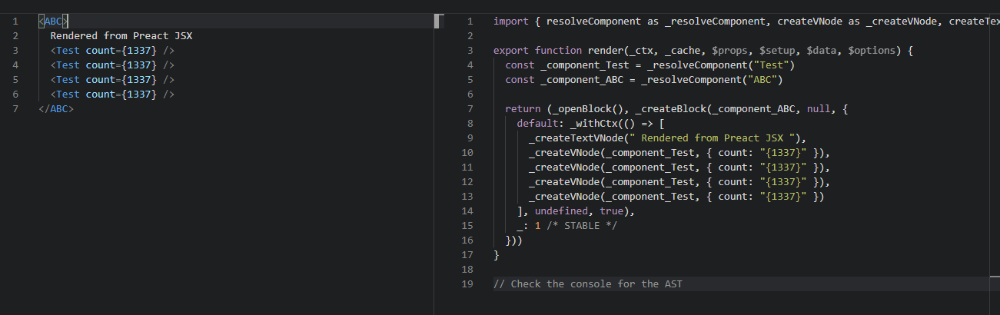

# 341 - efc853f 对于jsx|tsx自动引入`jsxFactory `&`Fragment`，新增VUE版JSX处理器

改动部分：

- `node/config.ts`：jsx选项新增`'vue' | 'preact' | 'react'`（详 **改动一**）
- `node/esbuildService.ts`：自动添加`h ` & `Fragment`，新增`resolveJsxOptions`方法（详 **改动二**）
- `client/vueJsxCompat.ts`（client端，首次新增新脚本）：为了能vue也能享受到(j|t)sx，vue的虚拟dom转换，和preact的dom转换做一些传递的改动，即可适配（详 **新增三**）

### 改动一

```typescript
export interface SharedConfig {
  /**
   * Configure what to use for jsx factory and fragment.
   * @default
   * {
   *   factory: 'React.createElement',
   *   fragment: 'React.Fragment'
   * }
   */
  jsx?:
    | 'vue'
    | 'preact'
    | 'react'
    | {
        factory?: string
        fragment?: string
      }
}
```

### 改动二

不论有没有引入，总是添加`import`语句；`resolveJsxOptions`被用于处理用户传入的`config.jsx`字段，转换为`{ jsxFactory: 'XXXXX', jsxFragment: 'XXXXX' }`，和之前处理jsx的配置不变，**好处就是方便用户使用**`preact` | `react`可以自动配置`jsxFactory`、`jsxFragment`。

```typescript
const JsxPresets: Record<
  string,
  Pick<TransformOptions, 'jsxFactory' | 'jsxFragment'>
> = {
  vue: { jsxFactory: 'jsx', jsxFragment: 'Fragment' },
  preact: { jsxFactory: 'h', jsxFragment: 'Fragment' },
  react: {} // use esbuild default
}

export function reoslveJsxOptions(options: SharedConfig['jsx'] = 'vue') {
  if (typeof options === 'string') {
    if (!(options in JsxPresets)) {
      console.error(`[vite] unknown jsx preset: '${options}'.`)
    }
    return JsxPresets[options] || {}
  } else if (options) {
    return {
      jsxFactory: options.factory,
      jsxFragment: options.fragment
    }
  }
}


export const transform = async (
  src: string,
  file: string,
  options: TransformOptions = {},
  jsxOption?: SharedConfig['jsx']
) => {
    let code = (result.js || '').replace(sourceMapRE, '')

    // if transpiling (j|t)sx file, inject the imports for the jsx helper and
    // Fragment.
    if (file.endsWith('x')) {
      if (!jsxOption || jsxOption === 'vue') {
        code +=
          `\nimport { jsx } from '${vueJsxPublicPath}'` + // /vite/jsx createVnode处理器
          `\nimport { Fragment } from 'vue'`
      }
      if (jsxOption === 'preact') {
        code += `\nimport { h, Fragment } from 'preact'`
      }
    }

    return {
      code,
      map: result.jsSourceMap
    }
  } catch (e) {
  }
}
```

### 新增三

preact: `h("div", null, "Rendered from Preact JSX", h(Test, {
    count: 1337
}))`

jsx：`jsx("div", null, "Rendered from Preact JSX", jsx(Test, {
    count: 1337
}))`

createVNode: `createVNode("div", null, ["Rendered from Preact JSX", 
    createVNode(Test, {  count: 1337 }
)])`

> tag为字符串，转换为数组参数传入createVNode。
>
> tag为组件（就是个对象）转换为FunctionalComponent，返回数组vnode。

#### 挖一下preact的h:

3个参数外的参数，都是children，那就是说**转换为vue的只需要把包括参数3与大于参数3外的参数统一为数组**。

```typescript
export function createElement(type, props, children) {
	let normalizedProps = {},
		i;
	for (i in props) {
		if (i !== 'key' && i !== 'ref') normalizedProps[i] = props[i];
	}

    // 超出的参数 会组合成数组children中
	if (arguments.length > 3) {
		children = [children];
		// https://github.com/preactjs/preact/issues/1916
		for (i = 3; i < arguments.length; i++) {
			children.push(arguments[i]);
		}
	}
	if (children != null) {
		normalizedProps.children = children;
	}

	// If a Component VNode, check for and apply defaultProps
	// Note: type may be undefined in development, must never error here.
	if (typeof type == 'function' && type.defaultProps != null) {
		for (i in type.defaultProps) {
			if (normalizedProps[i] === undefined) {
				normalizedProps[i] = type.defaultProps[i];
			}
		}
	}

	return createVNode(
		type,
		normalizedProps,
		props && props.key,
		props && props.ref,
		null
	);
}
```

#### 什么是FunctionalComponent呀？

现在type为`function`，所以渲染标记为`0`，`FunctionalComponent`。

```typescript
# runtime-core vnode.ts
const shapeFlag = isString(type)
    ? ShapeFlags.ELEMENT
    : __FEATURE_SUSPENSE__ && isSuspense(type)
      ? ShapeFlags.SUSPENSE
      : isTeleport(type)
        ? ShapeFlags.TELEPORT
        : isObject(type) // 只要type是Obj 那么就是statefull_component
          ? ShapeFlags.STATEFUL_COMPONENT
          : isFunction(type)
            ? ShapeFlags.FUNCTIONAL_COMPONENT
            : 0
```

#### 为什么要转换呢？

因为那是插槽，截取一段`vnode.ts`的`normalizeChildren`（影响用什么方式去渲染element）代码：

```typescript
# vnode.ts -> normalizeChildren
if (isFunction(children)) {
    children = { default: children, _ctx: currentRenderingInstance }
    type = ShapeFlags.SLOTS_CHILDREN
}
```

再看一下createVNode例子：



#### 本次新增的vueJsxCompat.ts代码

```typescript
# client/vueJsxCompat.ts

import { createVNode } from 'vue'

declare const __DEV__: boolean

if (__DEV__) {
  console.log(
    `[vue tip] You are using an non-optimized version of Vue 3 JSX, ` +
      `which does not take advantage of Vue 3's runtime fast paths. An improved ` +
      `JSX transform will be provided at a later stage.`
  )
}

// 转换为插槽，(props.count) => "Rendered from Preact TSX: count is " + props.count
export function jsx(tag: any, props = null) {
  const c =
    arguments.length > 2 ? Array.prototype.slice.call(arguments, 2) : null // 去除前两位
  return createVNode(tag, props, typeof tag === 'string' ? c : () => c)
}
```


# 342 - b0713fe 在服务端也输出hmr log

客户端会输出hmr信息，但是在服务端没有，现在新增一个。

```typescript
# node/server/serverPluginHmr.ts

if (needReload || needRerender || didUpdateStyle) {
      let updateType = needReload ? `reload` : needRerender ? `template` : ``
      if (didUpdateStyle) {
        updateType += ` & style`
      }
      console.log(
        chalk.green(`[vite:hmr] `) +
          `${path.relative(root, file)} updated. (${updateType})`
      )
    }
```


# 343 - 2ac7469

