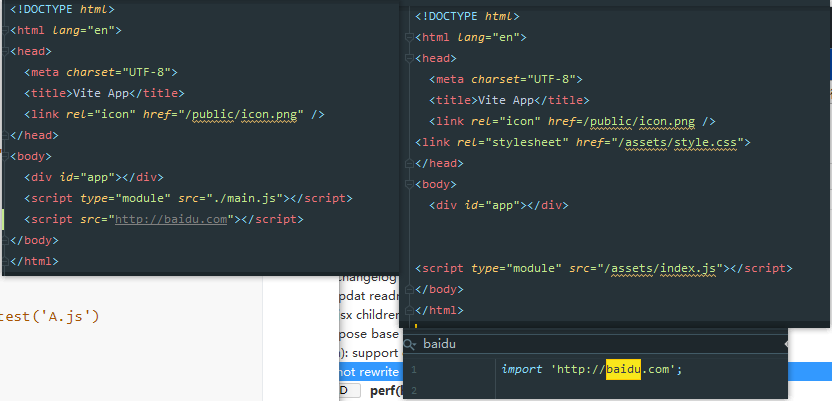
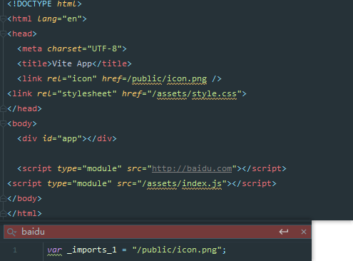
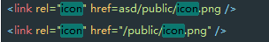
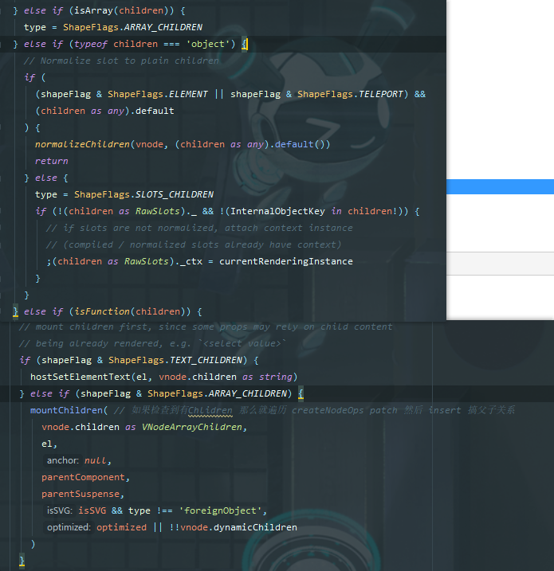

# 341 - efc853f 对于jsx|tsx自动引入`jsxFactory `&`Fragment`，新增VUE版JSX处理器

改动部分：

- `node/config.ts`：jsx选项新增`'vue' | 'preact' | 'react'`（详 **改动一**）
- `node/esbuildService.ts`：自动添加`h ` & `Fragment`，新增`resolveJsxOptions`方法（详 **改动二**）
- `client/vueJsxCompat.ts`（client端，首次新增新脚本）：为了能vue也能享受到(j|t)sx，vue的虚拟dom转换，和preact的dom转换做一些传递的改动，即可适配（详 **新增三**）

### 改动一

```typescript
export interface SharedConfig {
  /**
   * Configure what to use for jsx factory and fragment.
   * @default
   * {
   *   factory: 'React.createElement',
   *   fragment: 'React.Fragment'
   * }
   */
  jsx?:
    | 'vue'
    | 'preact'
    | 'react'
    | {
        factory?: string
        fragment?: string
      }
}
```

### 改动二

不论有没有引入，总是添加`import`语句；`resolveJsxOptions`被用于处理用户传入的`config.jsx`字段，转换为`{ jsxFactory: 'XXXXX', jsxFragment: 'XXXXX' }`，和之前处理jsx的配置不变，**好处就是方便用户使用**`preact` | `react`可以自动配置`jsxFactory`、`jsxFragment`。

```typescript
const JsxPresets: Record<
  string,
  Pick<TransformOptions, 'jsxFactory' | 'jsxFragment'>
> = {
  vue: { jsxFactory: 'jsx', jsxFragment: 'Fragment' },
  preact: { jsxFactory: 'h', jsxFragment: 'Fragment' },
  react: {} // use esbuild default
}

export function reoslveJsxOptions(options: SharedConfig['jsx'] = 'vue') {
  if (typeof options === 'string') {
    if (!(options in JsxPresets)) {
      console.error(`[vite] unknown jsx preset: '${options}'.`)
    }
    return JsxPresets[options] || {}
  } else if (options) {
    return {
      jsxFactory: options.factory,
      jsxFragment: options.fragment
    }
  }
}


export const transform = async (
  src: string,
  file: string,
  options: TransformOptions = {},
  jsxOption?: SharedConfig['jsx']
) => {
    let code = (result.js || '').replace(sourceMapRE, '')

    // if transpiling (j|t)sx file, inject the imports for the jsx helper and
    // Fragment.
    if (file.endsWith('x')) {
      if (!jsxOption || jsxOption === 'vue') {
        code +=
          `\nimport { jsx } from '${vueJsxPublicPath}'` + // /vite/jsx createVnode处理器
          `\nimport { Fragment } from 'vue'`
      }
      if (jsxOption === 'preact') {
        code += `\nimport { h, Fragment } from 'preact'`
      }
    }

    return {
      code,
      map: result.jsSourceMap
    }
  } catch (e) {
  }
}
```

### 新增三

preact: `h("div", null, "Rendered from Preact JSX", h(Test, {
    count: 1337
}))`

jsx：`jsx("div", null, "Rendered from Preact JSX", jsx(Test, {
    count: 1337
}))`

createVNode: `createVNode("div", null, ["Rendered from Preact JSX", 
    createVNode(Test, {  count: 1337 }
)])`

> tag为字符串，转换为数组参数传入createVNode。
>
> tag为组件（就是个对象）转换为FunctionalComponent，返回数组vnode。

#### 挖一下preact的h:

3个参数外的参数，都是children，那就是说**转换为vue的只需要把包括参数3与大于参数3外的参数统一为数组**。

```typescript
export function createElement(type, props, children) {
	let normalizedProps = {},
		i;
	for (i in props) {
		if (i !== 'key' && i !== 'ref') normalizedProps[i] = props[i];
	}

    // 超出的参数 会组合成数组children中
	if (arguments.length > 3) {
		children = [children];
		// https://github.com/preactjs/preact/issues/1916
		for (i = 3; i < arguments.length; i++) {
			children.push(arguments[i]);
		}
	}
	if (children != null) {
		normalizedProps.children = children;
	}

	// If a Component VNode, check for and apply defaultProps
	// Note: type may be undefined in development, must never error here.
	if (typeof type == 'function' && type.defaultProps != null) {
		for (i in type.defaultProps) {
			if (normalizedProps[i] === undefined) {
				normalizedProps[i] = type.defaultProps[i];
			}
		}
	}

	return createVNode(
		type,
		normalizedProps,
		props && props.key,
		props && props.ref,
		null
	);
}
```

#### 什么是FunctionalComponent呀？

现在type为`function`，所以渲染标记为`0`，`FunctionalComponent`。

```typescript
# runtime-core vnode.ts
const shapeFlag = isString(type)
    ? ShapeFlags.ELEMENT
    : __FEATURE_SUSPENSE__ && isSuspense(type)
      ? ShapeFlags.SUSPENSE
      : isTeleport(type)
        ? ShapeFlags.TELEPORT
        : isObject(type) // 只要type是Obj 那么就是statefull_component
          ? ShapeFlags.STATEFUL_COMPONENT
          : isFunction(type)
            ? ShapeFlags.FUNCTIONAL_COMPONENT
            : 0
```

#### 为什么要转换呢？

因为那是插槽，截取一段`vnode.ts`的`normalizeChildren`（影响用什么方式去渲染element）代码：

```typescript
# vnode.ts -> normalizeChildren
if (isFunction(children)) {
    children = { default: children, _ctx: currentRenderingInstance }
    type = ShapeFlags.SLOTS_CHILDREN
}
```

再看一下createVNode例子：


#### 本次新增的vueJsxCompat.ts代码

```typescript
# client/vueJsxCompat.ts

import { createVNode } from 'vue'

declare const __DEV__: boolean

if (__DEV__) {
  console.log(
    `[vue tip] You are using an non-optimized version of Vue 3 JSX, ` +
      `which does not take advantage of Vue 3's runtime fast paths. An improved ` +
      `JSX transform will be provided at a later stage.`
  )
}

// 转换为插槽，(props.count) => "Rendered from Preact TSX: count is " + props.count
export function jsx(tag: any, props = null) {
  const c =
    arguments.length > 2 ? Array.prototype.slice.call(arguments, 2) : null // 去除前两位
  return createVNode(tag, props, typeof tag === 'string' ? c : () => c)
}
```


# 342 - b0713fe 在服务端也输出hmr log

客户端会输出hmr信息，但是在服务端没有，现在新增一个。

```typescript
# node/server/serverPluginHmr.ts

if (needReload || needRerender || didUpdateStyle) {
      let updateType = needReload ? `reload` : needRerender ? `template` : ``
      if (didUpdateStyle) {
        updateType += ` & style`
      }
      console.log(
        chalk.green(`[vite:hmr] `) +
          `${path.relative(root, file)} updated. (${updateType})`
      )
    }
```


# 343 - 2ac7469 importChain链将准确更新文件

改动部分：

`server/serverPluginHmr.ts`: 名称更换，加入`hmrDirtyFilesMap`，**记录文件改动时间戳需要更新哪些文件**（详 **改动一**）

`server/serverPluginModulesRewrite.ts`: 从`node/utils/pathUtils.ts`迁移过来 `resolveImport`(id转换为publicPath)方法，并且通过`hmrDirtyFilesMap`传入`timestamp`获取`dirtyFiles`，被处理的`import`语句需要存在于`dirtyFiles`才可以添加`timestamp`。**不需要的再次载入的文件不会被载入，importChain得到强大的优化**。（详 **改动二**）

### 改动一

#### handleJSReload

`vueImports` -> `vueBoundaries`（需要更新的SFC路径，就是谁引入了该文件）

`jsImporters` -> `jsBoundaries`（需要更新的JS文件路径，使用了`hmr api`的文件或其`hmr.accept`的文件）

`hmrDirtyFilesMap`: key: 文件更新的时间戳 <---> value: 改动文件的`publicPath` & 引入了`hmr api`的文件publicPath & 引入了该改动文件的**SFC文件publicPath**

**`hmrDirtyFilesMap`在`server/serverPluginModulesRewrite.ts resolveImport`使用。**

#### walkImportChain

寻找import链的方法`walkImportChain`新增了`dirtyFiles`与`currentChain`参数，`currentChain`识别到`importer`类型为hot.accept(importee) | SFC，都会被添加进 `dirtyFiles.add(importer)`。

**`currentChain`只定义，但未被使用。**

> 再说亿遍，假如A.file引入了B.file，那么A.file叫importer，B.file叫importee。
>
> 引入过`hmr api`的文件（不要在SFC使用，无效果的，import被改写的时候就过滤了），他accept的文件都会被丢进一个key set对应关系。
>
> 还不懂请来微信dd我~

### 改动二

我们要知道参数`timestamp`相同的`get`请求，会自动使用缓存（浏览器）。

```typescript
# A.js
import C.js
console.log(1)

# B.vue
import A.js

// 当A.js改变
# A.js timestamp变更t=1
import C.js
console.log(2)

// dirtyFiles:['/A.js', '/B.vue']
// hmrDirtyFilesMap:{ key: '1', value: dirtyFiles:['/A.js', '/B.vue'] }
// 触发vue-reload 使得B.file被重新加载
# 触发的语句，不是文件
import B.vue?t=1

// resolveImport将要处理import语句
// hmrDirtyFilesMap.get(1)
// (dirtyFiles && dirtyFiles.has('/A.js')) || /\.vue\?type/.test('A.js')
// (true && true) || false
// 符合条件，添加timestamp
# B.vue 被改写后
import A.js?t=1

// resolveImport将要处理A.js?t=1的import语句
// hmrDirtyFilesMap.get(1)
// (dirtyFiles && dirtyFiles.has('/C.js')) || /\.vue\?type/.test('C.js')
// (true && false) || false
# A.js 被改写后
import C.js // 此时此刻C.js将会使用浏览器缓存
console.log(2)
```


# 344 - 06e51cc build不要在index.html中重写外部引入的脚本 [#116](https://github.com/vitejs/vite/issues/166)

改动部分：

- `build/buildPluginHtml`: 编译html文件时，如果识别到src为外链，将不做处理。

#### 改动前的行为



#### 改动后




# 345 - 02491a4(cva) fix [#111](https://github.com/vitejs/vite/issues/111) [#112](https://github.com/vitejs/vite/issues/122)

可以使用`cva .`创建模板到当前文件中。

如果创建文件夹失败，检测当前文件是否为空，非空则报错提示，空则在当前文件夹创建模板。


# 346 - 97ae7c3 `__BASE__`值输出publicBasePath

`publicBasePath`: 你的资源位置，如传入`/asd`，你的资源路径将全部加上`/asd`。



> 开发环境下的`__BASE__` 将被固定为`/`，构建环境下为`publicBasePath`

> 是不是可以支持一下index.html的输出位置呢？因为资源和index.html经常不会在同一个位置。


# 347 - 5346037 fix `client/vueJsxCompat.ts`

如果传入的children是一个VNode，则转换为[VNode]，否则也被当slot。



> 要么是字符串，要么是数组，否则都不能走mountChildren


# 348 - 185a9cd readme

Vite 是一个固执的 web 开发构建工具，它在开发过程中通过原生 ES 模块导入为您的代码提供服务，并将其与 [Rollup](https://rollupjs.org/)捆绑在一起用于生产。

Vite支持引入 `.ts` 文件 ，可在Vue SFC（开箱即用）中使用`<script lang="ts">`。

Vite 只对`.ts` 文件执行转译，而**不** 执行类型检查。它假定类型检查由你的IDE 和构建过程负责（你可以在构建脚本中运行` tsc --noEmit`） 

Vite 使用 [esbuild](https://github.com/evanw/esbuild) 将 TypeScript 转换为 JavaScript，这比通过使用原生js的`tsc` 快约 20 ~ 30 倍，并且 HMR 更新可以在 50 毫秒内反映在浏览器中。

所有**静态**路径引用，包括绝对路径和以`/public`开头的路径，都应该基于你的工作目录结构。如果你在嵌套的公共路径下部署你的项目，只需指定`--base = /你的定义的路径/public/path/` ，所有资源路径都将会相应地重写。

对于动态路径引用，有两种方式：

- 你可以通过从 JavaScript 导入静态资源文件来获取解析的公共路径。例如，`import path from'./foo.png'` 会将其解析的公共路径作为字符串提供。
- 如果你需要动态连接路径，你可以使用全局注入的 `__BASE__` 变量作为公共基本路径。

### JSX

还支持`.jsx` 和`.tsx` 文件。JSX 转译也通过`esbuild` 处理。请注意，目前没有对任何基于JSX 的自动HMR（只会刷新页面） 支持。

默认的 JSX 配置在 Vue 3 中开箱即用：

```jsx
import { createApp } from 'vue'

function App() {
  return <Child>{() => 'bar'}</Child>
}

function Child(_, { slots }) {
  return <div onClick={console.log('hello')}>{slots.default()}</div>
}

createApp(App).mount('#app')
```

Currently this is auto-importing a `jsx` compatible function that converts esbuild-produced JSX calls into Vue 3 compatible vnode calls, which is sub-optimal. Vue 3 will eventually provide a custom JSX transform that can take advantage of Vue 3's runtime fast paths.

目前这是自动导入一个 `jsx` 兼容函数，该函数将 esbuild 生成的 JSX 调用转换为 Vue 3 兼容的 vnode，这是次优的。Vue 3 最终将提供一个自定义 JSX 转换，可以快速利用 Vue 3 的运行时路径。

#### 关于 React / Preact 的 JSX

There are two other presets provided: `react` and `preact`. You can specify the preset by running Vite with `--jsx react` or `--jsx preact`. For the Preact preset, `h` is also auto injected so you don't need to manually import it.

提供了两个预设：`react` 和`preact`。你可以通过使用`--jsx react` 或`--jsx preact` 运行Vite 来指定预设。对于Preact 预设，`h` 也是自动注入的，所以你不需要手动导入它。

由于 React 不提供esm版，因此需要使用 [es-react](https://github.com/lukejacksonn/es-react)，或者使用 Snowpack 将 React 预先捆绑到 ES 模块中。最简单的方法让它运行是：

```js
import { React, ReactDOM } from 'https://unpkg.com/es-react'

ReactDOM.render(<h1>Hello, what!</h1>, document.getElementById('app'))
```

如果你需要自定义JSX，也可以通过 CLI 中的 `--jsx-factory` 和 `--jsx-fragment` 标志或通过使用 API 中的 `jsx: {factory, fragment}` 来自定义 JSX。例如，你可以运行 `vite --jsx-factory = h` 来使用 `h` 进行 JSX 元素创建调用。

## Config File

You can create a `vite.config.js` or `vite.config.ts` file in your project. Vite will automatically use it if one is found in the current working directory. You can also explicitly specify a config file via `vite --config my-config.js`.

In addition to options mapped from CLI flags, it also supports `alias`, `transforms`, and plugins (which is a subset of the config interface). For now, see [config.ts](https://github.com/vuejs/vite/blob/master/src/node/config.ts) for full details before more thorough documentation is available.

你可以在你的项目中创建一个 `vite.config.js` 或 `vite.config.ts` 文件。如果能在当前工作目录中找到，Vite 会自动使用它。你也可以显式指定一个配置文件`--config my-config.js`。

除了从 CLI 标志的选项之外，它还支持 `alias`、`transforms` 和插件（vite特色插件）。现在，请参阅 [config.ts](https://github.com/vuejs/vite/blob/master/src/node/config.ts)) 在更详尽的文档可用之前获取完整详细信息。

> 可以使用alias定义`@`这些简化路径哦


# 349 - fb95a11 changelog

# [0.14.0](https://github.com/vuejs/vite/compare/v0.13.2...v0.14.0) (2020-05-10)

### Bug Fixes

- 不要在 index.html 中重写外部脚本(fix [#116](https://github.com/vuejs/vite/issues/116)) ([06e51cc](https://github.com/vuejs/vite/commit/06e51cc3ce2fbaeec3150394dac0b630b7601b78))
- 修复加载 ts 配置 ([b85de93](https://github.com/Kingbultsea/vite-analysis/blob/352208e9ba4ea9555c19cc33f3af3921526df7e7/331-340/331-340.md#334---b85de93-%E4%BF%AE%E5%A4%8D%E5%8A%A0%E8%BD%BDts%E7%B1%BB%E5%9E%8B%E7%9A%84config))
- 应该调用所有的插件transform ([#113](https://github.com/vuejs/vite/issues/113)) ([ed5b9e7](https://github.com/vuejs/vite/commit/ed5b9e7f51e906d3a42d056571c0d5091ed5cd4c))
- **types:**修复`hmr hot.on`回调参数类型 ([a4524b4](https://github.com/vuejs/vite/commit/a4524b443ba6bfb53b78c053c27ac7ccb9f66749))


# 350 - faf7dfc v0.14.0

release v0.14.0
