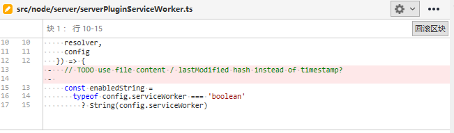

# 381 - e8e4a4b remove todo

去除todo: 是否使用文件内容hash 或者 lastModified来代替timestamp?



`sw`缓存有两种类型：

1. `const USER_CACHE_NAME = vite-cache-${__PROJECT_ROOT__}-${__SERVER_ID__}`，模块的缓存，即匹配`@modules`

2. `const DEPS_CACHE_NAME = vite-cache-${__PROJECT_ROOT__}-${__LOCKFILE_HASH__}`，用户文件缓存，即匹配`/(&|\?)t=\d+/`，参数t

每次服务启动，sw更新，都会删除用户缓存。

而模块缓存，根据`lockfile`的hash变动来决定（如你的`yarn.lock` | `package-lock.json`）。


# 382 - b5871eb fix 改写import id同样也需要改写为webmodules

改动部分：

- `server/serverPluginModuleRewrite.ts`: 改写为`@modules/`的`resolveImport`，需要添加对`webmodules`的路径改写支持（详 修复一）

### 修复一

优先判断`webmodules`。

```typescript
return `/@modules/${
      resolveWebModule(root, id) || resolveNodeModuleEntry(root, id) || id
}`
```


# 383 - 0e7ea5a 选项错误提示 `deps-only`的小修改

改动部分：

- `server/serverPluginServiceWorker.ts`: 用户输入的选项`enabled`如果为字符串，但是不为`deps-only`，则输出错误警告，此时将改为`true`；`config.serviceWorker === true`才会把`__SERVER_ID__`设置为服务启动时间。

```typescript
`const __SERVER_ID__ = ${
        // only inject if caching user files. When caching deps only, only
        // the lockfile change invalidates the cache.
        config.serviceWorker === true ? Date.now() : '0'
      }`
```

> deps-only是来缓存模块的，`__SERVER_ID__`不应该去改动它（虽然没什么大碍，服务重启一个tip reload）。


# 384 - 82098a8 sw去除deps-only

改动部分：

- `client/client.ts`: `__SW_ENABLED__`为真值 或 已经存在sw服务 才注册sw服务（存在也要注册一遍，可以删除旧的cache）；新增`env.d.ts`（详 **改动一**）
- `-sw`去除`deps-only`，现在从默认为`true`更改为默认`false`
- `server/serverPluginModuleRewrite.ts`: `window.__SW_ENABLED__ = ${!!config.serviceWorker}`现在被设置为全局字段
- `server/serverPluginServeStatic.ts`: `-sw`为`false`，即使用`koa-conditional-get`（实际没改动，原来为`!==true`）
- `server/serverPluginServiceWorker.ts` & `serviceWorker.ts`：去除`deps-only`逻辑

> 完全去除`deps-only`，不区分什么用户缓存|模块缓存了。
>
> `sw`缓存以`hashlocak` & `timestamp`为准。

### 改动一

命名全局变量类型。

```typescript
# env.d.ts

declare const __DEV__: boolean
declare const __BASE__: string
declare const __SW_ENABLED__: boolean
```


# 385 - 617f9f0 测试 async组件显示`performance.now()`

[performance.now()](https://developer.mozilla.org/zh-CN/docs/Web/API/Performance/now)

返回值表示为从[time origin](https://developer.mozilla.org/en-US/docs/Web/API/DOMHighResTimeStamp#the_time_origin)之后到当前调用时经过的时间


# 386 - fccc261 -sw测试

添加`appveyor.yml` & `circleci`的serviceWorker测试。


# 387 - 893ae7b windows ci

区分windows测试，设置`crocess-env`。


# 388 - ce41994

不知道有何用...  BUG依旧

```typescript
const isWebModule = !!resolveWebModule(root, id)
return `/@modules/${
    isWebModule ? id : resolveNodeModuleEntry(root, id) || id
}`
```


# 389 - 2efe9b3 serviceWorker可用才注册sw

检测`navigator.serviceWorker`是否存在


# 390 - a44bd76 简化ci的脚本

可能尤大觉得crocess-env只能在windows用吧，又恢复回去了，现在ci测试脚本统一使用`test` `test-sw`

```json
"test": "jest --clearCache && jest --runInBand --forceExit",
"test-sw": "cross-env USE_SW=1 yarn test",
```

