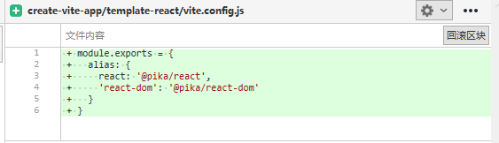

# 391 - f9b267f cva 使用@pika/react & alias




# 392 - c8a1ffd 服务启动后的每个首次请求不返回304

改动部分：

- `node/server/serverPluginServeStatic.ts`: 去除`koa-conditional-get`，使用`ctx.fresh`（详 **改动一**）
- `node/server/serverPluginVue.ts`: `seenUrls`检测是否首个请求，是则返回200
- `node/utils/fsUtils.ts`: `seenUrls`检测是否首个请求，是则返回200

**为什么不要第一个缓存呢？**

因为`moduleRewritePlugin.ts`检测到304，就不做改写了，比如SFC文件返回304，就不能够改写`import`，也就没有importChain。

> 虽然`serverPluginVue.ts`没有调用next()，但是记住`serverPluginRewrite.ts`先被use的，是他调用了`await next()`，让SFC处理后，再回头改写`import`

### 改动一

seenUrls用户储存ctx.url，用来判断该请求是否为新的请求。

```typescript
if (!config.serviceWorker) {
  app.use(async (ctx, next) => {
    await next()
    // the first request to the server should never 304
    if (seenUrls.has(ctx.url) && ctx.fresh) {
      ctx.status = 304
    }
    seenUrls.add(ctx.url)
  })
}
app.use(require('koa-etag')())
```

### request.fresh

检查请求缓存是否“新鲜”，也就是内容没有改变。此方法用于 `If-None-Match` / `ETag`, 和 `If-Modified-Since` 和 `Last-Modified` 之间的缓存协商。 在设置一个或多个这些响应头后应该引用它。

```js
// 新鲜度检查需要状态20x或304
ctx.status = 200;
ctx.set('ETag', '123');

// 缓存是好的
if (ctx.fresh) {
  ctx.status = 304;
  return;
}

// 缓存是陈旧的
// 获取新数据
ctx.body = await db.find('something');
```


# 393 - f3a45f3 changelog

## [0.14.3](https://github.com/vuejs/vite/compare/v0.14.2...v0.14.3) (2020-05-12)

### Bug Fixes

- 服务器启动时的第一个请求不应为304 ([c8a1ffd](https://github.com/vuejs/vite/commit/c8a1ffd71db0916cd6386130e3eb170fa09c31d2))
- web modules resolve，返回id即可，因为`serverPluginModuleResolve.ts`会进行resolve处理 ([ce41994](https://github.com/vuejs/vite/commit/ce41994ee4e395bb304191b5d9a26f0f32d3b47a))
- 让`isImportRequest`也能在Safari中检测（后面改写为直接检测`ctx.query.import`参数，在`serverPluginModuleRewrite.ts`中会加入`import`参数） ([b2377bf](https://github.com/vuejs/vite/commit/b2377bf3b6b14ed972327930644fe6937fa814dd))
- sw 可用才进行注册 ([2efe9b3](https://github.com/vuejs/vite/commit/2efe9b3215f04e751d19cd50169bddf4250d114d))
- 对于改写import路径，也需要处理web_modules ([b5871eb](https://github.com/vuejs/vite/commit/b5871eba505e5a109b8b8ae07d6f8a70c6d970eb))

### Features

- **cva:** @pika/react + alias ([f9b267f](https://github.com/vuejs/vite/commit/f9b267fbe3f6e8cc11a3e6855f7775aeb863b0f8))
- **sw:** lockfile hash ([3bb1324](https://github.com/vuejs/vite/commit/3bb13240d9d6c3ef84020cd69b2e60835f206f8f))
- service worker 缓存([ee6a03d](https://github.com/vuejs/vite/commit/ee6a03d3497433150c13fc9370b17daaa43e1e1d))


# 394 - 120cd78 v0.14.3

release v0.14.3


# 395 - 8a1fbfe cva v1.4.0

release create-vite-app v1.4.0


# 396 - f558a88 [#133](https://github.com/vitejs/vite/pull/133) cleanUrl 使用ctx.path

将`cleanUrl`替换为 `ctx.path`


# 397 - 140751f wip 新增optimize命令

改动部分：

- 新增`@rollup/plugin-commonjs: ^11.1.0`，用来寻找包入口。
- 新增`src/node/optimizer.ts`（详 **新增二**）

### 新增二

`dependencies`的包，转换为es5。（目前有BUG，留~）

```typescript
import fs from 'fs-extra'
import path from 'path'
import { createHash } from 'crypto'
import { ResolvedConfig } from './config'
import type Rollup from 'rollup'
import { supportedExts } from './resolver'

export interface OptimizeOptions extends ResolvedConfig {
  force?: boolean
}

export async function optimize(config: OptimizeOptions) {
  // scan lockfile
  const root = config.root || process.cwd()
  const cacheDir = path.join(root, `node_modules`, `.vite`)
  console.log(cacheDir)
  const hashPath = path.join(cacheDir, 'hash')
  const depHash = getDepHash(root, config.__path)

  if (!config.force) {
    let prevhash
    try {
      prevhash = await fs.readFile(hashPath, 'utf-8')
    } catch (e) {}
    // hash is consistent, no need to re-bundle
    if (prevhash === depHash) {
      console.log('hash is consistent. skipping.')
      return
    }
  }

  await fs.ensureDir(cacheDir)
  await fs.writeFile(hashPath, depHash)

  const pkg = lookupFile(root, [`package.json`])
  if (!pkg) {
    console.log(`package.json not found. skipping.`)
    return
  }

  const deps = JSON.parse(pkg).dependencies || {}
  const depKeys = Object.keys(deps)
  if (!depKeys.length) {
    console.log(`no dependencies listed in package.json. skipping.`)
    return
  }

  console.log(`optimizing dependencies...`)
  const rollup = require('rollup') as typeof Rollup

  console.log(depKeys)

  await rollup.rollup({
    input: depKeys,
    plugins: [
      require('@rollup/plugin-node-resolve')({
        rootDir: root,
        extensions: supportedExts
      }),
      require('@rollup/plugin-commonjs')({
        sourceMap: false
      })
    ]
  })
}

const lockfileFormats = [
  'package-lock.json',
  'yarn.lock',
  'pnpm-lock.yaml',
  'package.json'
]

let cachedHash: string | undefined

export function getDepHash(
  root: string,
  configPath: string | undefined
): string {
  if (cachedHash) {
    return cachedHash
  }
  let content = lookupFile(root, lockfileFormats) || ''
  // also take config into account
  if (configPath) {
    content += fs.readFileSync(configPath, 'utf-8')
  }
  return createHash('sha1').update(content).digest('base64')
}

function lookupFile(dir: string, formats: string[]): string | undefined {
  for (const format of formats) {
    const fullPath = path.join(dir, format)
    if (fs.existsSync(fullPath)) {
      return fs.readFileSync(fullPath, 'utf-8')
    }
  }
  const parentDir = path.dirname(dir)
  if (parentDir !== dir) {
    return lookupFile(parentDir, formats)
  }
}
```


# 398 - fa52279 wip vite optimize

改动部分：

`server/serverPluginModuleResolve.ts`: 新增`resolveOptimizedModule` & `resolveBareModule`方法，处理`vite optimized modules`（详 **新增一**）

### 新增一

虽然397不能使用，但是可以看出: `vite optimized`转换`dependcies`的所有包为`es5`，vite检测到这类模块，则优先利用。

`resolveBareModule`提供给`serverPluginRewrite.ts`判断模块类型使用。

> 把所有文件给打进一个文件，可以减少网络请求。

```typescript
export function resolveBareModule(root: string, id: string) {
  const optimized = resolveOptimizedModule(root, id)
  if (optimized) {
    return id + '.js'
  }
  const web = resolveWebModule(root, id)
  if (web) {
    return id + '.js'
  }
  const nodeEntry = resolveNodeModuleEntry(root, id)
  if (nodeEntry) {
    return nodeEntry
  }
  return id
}


const viteOptimizedMap = new Map()

export function resolveOptimizedModule(
  root: string,
  id: string
): string | undefined {
  const cached = viteOptimizedMap.get(id)
  if (cached) {
    return cached
  }

  if (!id.endsWith('.js')) id += '.js'
  const file = path.join(root, `node_modules`, `.vite`, id)
  if (fs.existsSync(file)) {
    viteOptimizedMap.set(id, file)
    return file
  }
}
```


# 399 - 405f685 代码整理

改动部分：

- `serverPluginModuleResolve.ts`:  封装`index.html`代码改写逻辑
- `serverPluginModuleRewrite.ts`: 整理代码，名称更改，增强错误输出（详 **改动二**）

### 改动二

如果模块无法处理，则输出`referer`的路径（引入了这个模块的文件路径）。

```typescript
const importer = new URL(ctx.get('referer')).pathname
    console.error(
      chalk.red(
        `[vite] Failed to resolve module import "${id}". ` +
          `(imported by ${importer})`
      )
    )
```


# 400 - e62473a 获取文件后缀使用`path.extname`

把正则`/\.\w+$/`更改为`path.extname`

