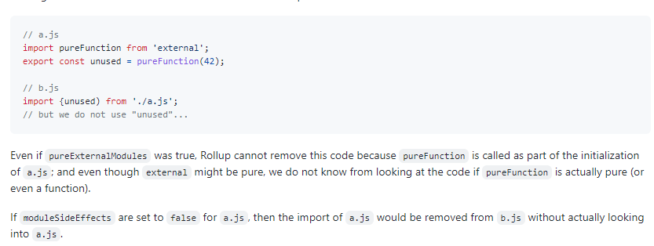
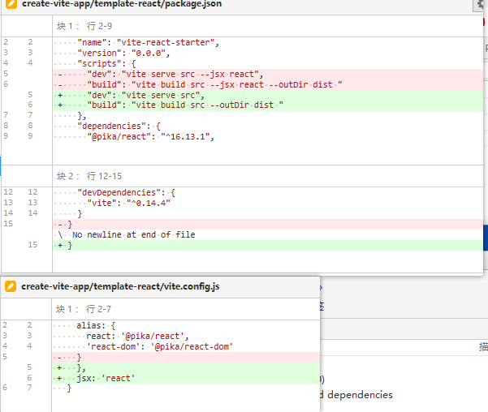
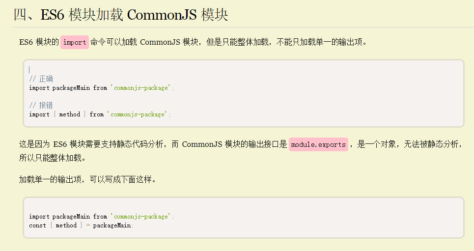

# 401 - 7f5e459 代码整理

 代码整理


# 402 - 02753b7 添加`.mjs`拓展

引入模块尝试，在寻找不了`package.json`的情况下，拓展文件后缀。

如`import lodash from 'lodash-es/lodash'` -> `'@modules/lodash-es/lodash.js'`


# 403 - 4f2953e 修复windows下模块的入口路径处理

`path.join(id, '/', pkg.module || pkg.main || 'index.js')`

更改为：`id + '/' + (pkg.module || pkg.main || 'index.js')`

以前返回：`lodash-es\lodash.js`

现在返回：`lodash-es/lodash.js`

改写到浏览器，为windows路径，传递到服务器寻找资源就错误了。

```js
path.join('/foo', 'bar', 'baz/asdf', 'quux', '..');
// Returns: '/foo/bar/baz/asdf'

path.join('foo', {}, 'bar');
// Throws 'TypeError: Path must be a string. Received {}'
```

> id就是import from 'id'，pkg.module为package.json module pkg.main 为package.json main


# 404 - c243d09 cva & 构建下alias可以在其他plugins中使用

改动部分：

- `cva`命令行：`build: "vite build src --jsx react --outDir dist"`
- `build/buildPluginResolve.ts`: 在resolveId钩子使用resolve（详 **改动二**）

[rollup this.resolve](https://rollup.docschina.org/guide/en/#thisresolvesource-string-importer-string-options-skipself-boolean--promiseid-string-external-boolean--null): 重新运行钩子，但是跳过当前。

tips: 你可以不把skip关掉，你就知道这个有什么用。

### 改动二

`resolveId`内调用resolve，等于重新走一次流程了，加`skipSelf`跳过自身钩子。

为了让`id = resolver.alias(id) || id`起作用，所以调用`resolve`重新执行流程（`skpiSelf`跳过自身，不然无限循环），如果别的钩子进行处理（不存在，这里添加await也可以），就默返回被`alias`处理过的结果。

```typescript
async resolveId(id, importer) {
   // fallback to node-resolve
   const resolved = this.resolve(id, importer, { skipSelf: true })
   return resolved || { id }
}
```

https://github.com/rollup/rollup/pull/2844

> 对应模块设置moduleSideEffects后，其他引入者只关注你的模块变量是否被引入的部分，副作用不管。



> 之前我对tree-shaking有误解，以为require也可以做到很好的tree-shaking（反正流程是可以知道引入了什么），实际是忘了动态引入，根本分析不了。esm就可以很好知道谁引入了，谁没引入了，sideEffect false可以完全保证tree-shaking（要遵守没有副作用的代码原则）


# 405 - b05808d changlog

## [0.14.4](https://github.com/vuejs/vite/compare/v0.14.3...v0.14.4) (2020-05-13)

### Bug Fixes

- cva对react构建命令更改 + 构建下alias可以在其他plugins中使用 ([c243d09](https://github.com/vuejs/vite/commit/c243d09dbb7cbc7aaf5c79e2e2ea3be899d37933))
- 修复windows下模块改写错误 ([4f2953e](https://github.com/vuejs/vite/commit/4f2953e429718c28ec4f1a8e6559d7c75630e70b))
- 支持.mjs拓展 &模块路径寻找中尝试添加拓展名 ([02753b7](https://github.com/vuejs/vite/commit/02753b7fda300bd15b7fa61d5e9ed2cce1a6ac4f)), closes [#127](https://github.com/vuejs/vite/issues/127)
- **history-fallback:** 添加`.`正确重定向网址 ([7f5e459](https://github.com/vuejs/vite/commit/7f5e4596a4e7254cc5f173fbf5261f3f47c926a9)), closes [#130](https://github.com/vuejs/vite/issues/130)
- 使用ctx.path代替cleanUrl ([#133](https://github.com/vuejs/vite/issues/133)) ([f558a88](https://github.com/vuejs/vite/commit/f558a880a3aa04f6024ff05f25924568a94a9b54))

### Features

- 改进模块解析([405f685](https://github.com/vuejs/vite/commit/405f685f7b0772881f5bd296b136296e94e35085))


# 406 - 816f3e5 v0.14.4

release v0.14.4


# 407 - c0c1991 cva v1.4.1

release cva v1.4.1


# 408 - 976b8a2 自动卸载sw

改动部分：

- `client/client.ts`: 在sw被禁止的情况下，如果发现有sw，则把它卸载掉
- `serverPluginHmr.ts`: `__SW_ENABLED__ = !!config.serviceWorker`，提供给`client.ts`使用
- `sw/serviceWorker.ts`: 对`client.ts`不进行缓存


# 409 - e6bfd20 cva 原本在命令行的flag现移动在config中配置jsx




# 410 - 49a44b6 服务启动即调用`optimizeDeps` & 去除`web_modules` & 支持命名导入cjs & 去除`windows.__SW_ENABLED__`

改动部分：

- `node/resolver.ts`: 新增`resolveBareModule` & `resolveOptimizedModule` ；迁移 `resolveNodeModule`到这里（详 **改动一**）
- `build/buildPluginResolve.ts`: `resolveId`中去除对`webModulePath`的路径处理
- `build/index.ts`: 封装部分plugin为`createBaseRollupPlugins`，提供`optimizeDeps` rollup构建使用；使用`@rollup/plugin-commonjs`支持命名导入cjs（详 **改动三**）
- `node/depOptimizer.ts`: 把`node/optimizer.ts`重新命名为`/node/depOptimizer.ts`
- `node/server/serverPluginModuleRewrite.ts`: `__SW_ENABLED__`在`clint.ts`替换即可，不需要暴露到`windows`

### 改动一

#### resolveOptimizedModule

比如现在有A包，经过路径处理会变成`/@modules/depOptimizer/A.js`

> 我比较好奇的是为什么不直接使用resolveEx拓展后缀？而且在这里拓展成A.js是错误吧。
>
> 目前windwos有BUG，这里反向推理可以知道optimizeDeps把dependencies的包给打成一个文件入口了。

```typescript
import { OPTIMIZE_CACHE_DIR } from './depOptimizer'
// `node_modules/.vite_opt_cache`

const viteOptimizedMap = new Map()

export function resolveOptimizedModule(
  root: string,
  id: string
): string | undefined {
  // 返回缓存 
  const cached = viteOptimizedMap.get(id)
  if (cached) {
    return cached
  }

  if (!id.endsWith('.js')) id += '.js' // 尝试添加.js后缀
  const file = path.join(root, OPTIMIZE_CACHE_DIR, id) // 合并路径
  if (fs.existsSync(file)) { // 存在则设置文件路径
    viteOptimizedMap.set(id, file)
    return file
  }
}
```

#### resolveNodeModule

寻找包入口功能，从`src/node/server/serverPluginModuleResolve.ts`迁移过来。

```typescript
export function resolveNodeModule(
  root: string,
  id: string
): string | undefined {
  const cached = nodeModulesMap.get(id)
  if (cached) {
    return cached
  }

  let pkgPath
  try {
    // see if the id is a valid package name
    pkgPath = resolveFrom(root, `${id}/package.json`)
  } catch (e) {}

  if (pkgPath) {
    // if yes, this is a entry import. resolve entry file
    const pkg = require(pkgPath)
    const entryPoint = id + '/' + (pkg.module || pkg.main || 'index.js')
    debug(`(node_module entry) ${id} -> ${entryPoint}`)
    nodeModulesMap.set(id, entryPoint)
    return entryPoint
  } else {
    // 可能是完整import路径
    try {
      return resolveFrom(root, id)
    } catch (e) {}

    // 尝试所有拓展名
    if (!path.extname(id)) {
      for (const ext of supportedExts) {
        try {
          return resolveFrom(root, id + ext)
        } catch (e) {}
      }
    }
  }
}
```

### 改动三

`createBaseRollupPlugins`包括的插件有：

1. user plugins 用户定义的插件
2. vite:resolve 处理vite Id的插件（`resolver.alias` | `vue or @vue/包路径`  | `optimizedModule`  ）
3. vite:esbuild （转换ts + 代码压缩）
4. rollup-plugin-vue 转换SFC
5. @rollup/plugin-json 转换JSON
6. user transforms （本质rollup transform 转换代码）
7. @rollup/plugin-commonjs 把cjs模块转换为esm

##### @rollup/plugin-commonjs

```typescript
require('@rollup/plugin-commonjs')({
    extensions: ['.js', '.cjs'], // 对于无扩展import,按指定的顺序搜索 .js 以外的扩展名。需要先确保非 JavaScript 文件由另一个插件先转译处理
    namedExports: knownNamedExports
})
```

##### 自定义命名导出

插件尝试创建named exports

```typescript
// importer.js
import { named } from './exporter.js';

// exporter.js
module.exports = { named: 42 }; // or `exports.named = 42;`
```

但是遇到这种情况，就解析不出来了: 

```typescript
// importer.js
import { named } from 'my-lib';

// my-lib.js
var myLib = exports;
myLib.named = 'you can\'t see me';
```

在这些情况下，你可以指定自定义命名导出：

```typescript
commonjs({
  namedExports: {
    // 左边可以是绝对路径（相对于当前工作目录），也可以node_modules模块
    'my-lib': [ 'named' ]
  }
})
```

自动检测出口的包：

```typescript
const PACKAGES_TO_AUTO_DETECT_EXPORTS = [
  path.join('react', 'index.js'),
  path.join('react-dom', 'index.js'),
  'react-is',
  'prop-types',
  'scheduler',
  'rxjs',
  'exenv',
  'body-scroll-lock'
]

// 获取导出名称
function detectExports(root: string, id: string): string[] | undefined {
  try {
    const fileLoc = resolveFrom(root, id)
    if (fs.existsSync(fileLoc)) {
      return Object.keys(require(fileLoc)).filter((e) => e[0] !== '_')
    }
  } catch (err) {
    // ignore
  }
}
```

> ES6 模块的import命令可以加载 CommonJS 模块，但是只能整体加载，不能只加载单一的输出项。
>
> 配置namedExports，才可以使用命名导入。


