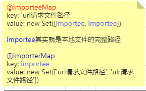
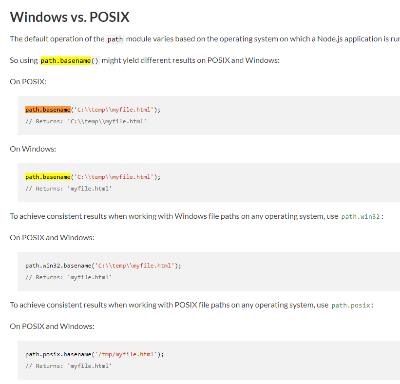

# commit-41 修改特殊路径名称

处理特殊路径```__```改为```@```

### hmr.ts

```typescript
- if(ctx.path !== '/__hmrClient')
+ if(ctx.path !== '/@hmr')
```

#### 关于js/vue文件的重加载



在commit-39的时候，分析不出其行为，现在根据修改后的代码得出(vue文件调用的```handleVueSFCReload```就不说了，标题上是为了说明文件改动的范围仅影响```js```|```vue```)：

1. ```importerMap```查看是否有该```url请求文件路径```的值。

2. 有，则取出其完整路径```importee```。

3. 调用```walkImportChain```：还没写完，目前支持的是把Vue和普通js文件分类(然而，vue文件不会进入到上图的①|②)。

4. ```importee```路径下的文件，每一个都调用方法(还没写)

   

#### 回顾一下流程

1.index.html请求main.js

2.服务器收到main.js请求，经过洋葱模型的插件(因为是js文件，所以只匹配这部分的代码)：```koa-static```返回文件(可能是流的读取方式，所以需要一个方法，加载完毕再交给```modules(自定义插件)```去处理)，```modules(自定义插件)```匹配到```js```文件，改写```import```。

```typescript
// we are doing the js rewrite after all other middlewares have finished;
    // this allows us to post-process javascript produced by user middlewares
    // regardless of the extension of the original files.
    if (
      ctx.response.is('js') && // 文件类型
      // skip special requests (internal scripts & module redirects)
      !ctx.path.startsWith(`/@`) && // 特殊请求
      // only need to rewrite for <script> part in vue files
      !(ctx.path.endsWith('.vue') && ctx.query.type != null)
    ) {
      await initLexer
      ctx.body = rewriteImports( // 改写Import句柄
        await readBody(ctx.body),
        ctx.url.replace(/(&|\?)t=\d+/, ''), // 更改参数t（防止get缓存）
        ctx.query.t // 更改参数t（防止get缓存）
      )
    }
```

看不懂吗？那就一句简单的👇。

**所有js文件的完整路径与url请求路径的映射**。

#### 小知识

```typescript
/^[^\/\.]/.test(id)

// ./asd false
// .git false
// /asd false
```

在```modules(自定义插件中)```，利用该正则，判断是不是请求```node_modules```的文件，是则把请求路径改写成为```/@modules/${id}```。

#### 坑点

如果安装的模块不是```esm```类型的，那么无法使用，因为```vite```就是基于```esm```进行的。

#### 总结

建立了js映射的关系，在文件改动的时候，触发js文件的```reload```（为完善）。这里可以回顾一下已经完善了的```vue```改动：

1.script的不同，通知```reload```

2.template的不同，通知```rerender```

4.style中的scoped不同，通知```reload```

5.style有不同（顺序的方式，意味着没有优化），通知```style-update```

6.删除多余的style，通知```style-remove```

```typescript
async function handleVueSFCReload(file: string, servedPath: string) {
    const cacheEntry = vueCache.get(file)
    vueCache.del(file)

    const descriptor = await parseSFC(root, file)
    if (!descriptor) {
      // read failed
      return
    }

    const prevDescriptor = cacheEntry && cacheEntry.descriptor
    if (!prevDescriptor) {
      // the file has never been accessed yet
      return
    }

    // check which part of the file changed
    if (!isEqual(descriptor.script, prevDescriptor.script)) {
      notify({
        type: 'reload',
        path: servedPath
      })
      return
    }

    if (!isEqual(descriptor.template, prevDescriptor.template)) {
      notify({
        type: 'rerender',
        path: servedPath
      })
      return
    }

    const prevStyles = prevDescriptor.styles || []
    const nextStyles = descriptor.styles || []
    if (prevStyles.some((s) => s.scoped) !== nextStyles.some((s) => s.scoped)) {
      notify({
        type: 'reload',
        path: servedPath
      })
    }
    const styleId = hash_sum(servedPath)
    nextStyles.forEach((_, i) => {
      if (!prevStyles[i] || !isEqual(prevStyles[i], nextStyles[i])) {
        notify({
          type: 'style-update',
          path: servedPath,
          index: i,
          id: `${styleId}-${i}`
        })
      }
    })
    prevStyles.slice(nextStyles.length).forEach((_, i) => {
      notify({
        type: 'style-remove',
        path: servedPath,
        id: `${styleId}-${i + nextStyles.length}`
      })
    })
  }
```


# commit-42

## 小知识点

https://zh.javascript.info/regexp-multiline-mode

多行匹配

```typescript
let str = `1st place: Winnie
2nd place: Piglet
33rd place: Eeyore`;

alert( str.match(/^\d+/gm) ); // 1, 2, 33
```

## package.json

增加@babel/parser。

## client.ts

之前请求文件，参数t为客户端的时间戳，现在更改为服务器给的时间戳（统一交给服务器处理）：

```typescript
- const { type, path, id, index } = JSON.parse(data)
+ const { type, path, id, index, timestamp } = JSON.parse(data)

// 例
- import(`${path}?type=template&t=${Date.now()}`)
+ import(`${path}?type=template&t=${timestamp}`)

```


更改事件名称：

```reload``` -> ```vue-reload```

```rerender``` -> ```vue-rerender```

```style-update``` -> ```vue-style-update```

新增事件：

```js-update```

### ```js-update```

还没完善，可以看到```hot```，对于js文件的hmr仅仅是重新拉取再运行一次（如果是有状态的，状态还是会继续保留，且出现重复，期待后续修复）

## ```hmr.ts```

更换事件名称，补上```isHotBoundary```方法，并更改名称为```isHMRBoundary```。


## 总结

为了```js```文件的```hmr```做准备

# commit-43 优化寻找包的方式

之前使用```require()```，现在读取```package.json```文件，识别```module```、```main```字段，如果没有则直接寻找```index.js```文件。

# commit-44 优化sourcemap获取名

在```sourcemap```功能，使用```path.basename```，获取路径的名称。



# commit-45 修复css bug

```
+ await resolveCompiler
```

为```style lang="x"``` 做准备

# commit-46 修改README

chore: 更新reademe。把vue改成vue3。（莫非尤大想兼容v2?）

# commit-47

## package.json

v4.0.0发布，这里讨论到发布，看不大懂尤大的ci。

https://hub.docker.com/r/vuejs/ci

# commit-48 代码整理

## 重构监听文件的方式

把```server/plugins/hmr.ts```的监听文件变化的代码，移动到```server/index.ts```，通过传递参数```FSWatcher```给```hmr.ts```的方式使用。

其次可以暴露给各种```plugins```使用，比如commit-49中，监听文件变动后删除缓存。

# commit-49  modules使用缓存

## ```server/plugins/modules.ts```

利用watch，监听文件变动，变动的文件，删除缓存。因为变动的文件，需要更新。

缓存的文件有：

1. ```/index.html```
2. 普通``` .js```文件

除此之外，还有一些补丁，比如在重写普通```js文件```的```import```句柄时，要排除```.map``` 文件。

比如在``` rewriteImports```出现报错的时候，捕获该错误，输出```e```。

# commit-50 添加debug包

## package.json

添加```debug@4.1.1```，去除```console.log```，增强提示。

从尤大写的提示语句，可以发现是为了方便调试，因为目前还测试覆盖还很低，需要一些提示去调试。

涉及：

1. ```server/plugins/hmr.ts```
2. ```server/plugins/modules.ts```
3. ```serve.ts```

这块也是方便了我们去查看vite到底做了些啥，可以有一个反馈。


添加```chalk```，增强提示，用在```node/build.ts```

https://www.npmjs.com/package/chalk
