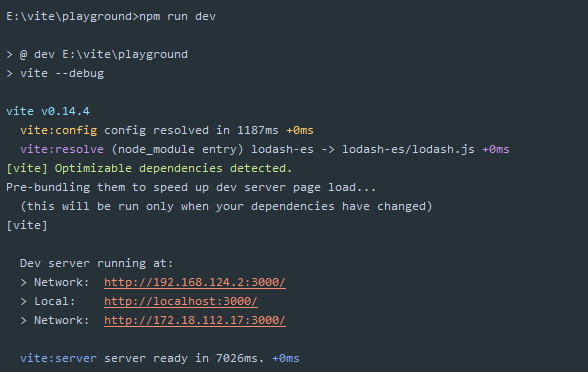
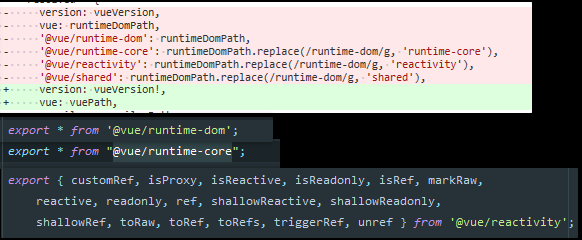

# 411 - 47bfc41 build resolve去除`optimizedModule`

插件去除对`optimizedModule`的处理，即构建模式不会使用被`optimizedModule`处理过的包。

> 什么原因？该功能未稳定，先撤销掉不使用。（至少我完全使用不了，是不是应该server也去除... 手动命令行触发）


# 412 - 79a55b5 改善`optimizer`输出

通过命令行方式运行`optimizeDeps`，才会将错误输出。

利用`ora`包，loading构建状态。

现在翻译一下尤大的目的（我不喜欢依赖这个词，其实就是`package.json`的` dependencies`）：

```
// 要优化的依赖。目标是预捆绑以下类型的依赖:
// 1. 是CommonJS模块
// 2. 拥有引入相对路径文件的import (e.g. lodash-es, lit-html)
//    如 export { default as add } from './add.js';
// 3. Has imports to bare modules that are not in the project's own deps
//    (i.e. esm that imports its own dependencies, e.g. styled-components)
```

### `npm`是如何处理包的不同版本呢？


假如我的依赖里有3个不同版本的`lodash-es`，`.package_versions.json`会记录哪个包才是我们使用的依赖，比如现在是`4.17.13`，就会建立`lodash-es`与`_lodash-es@4.13@lodash-es`的软链（看到了蓝色的符号了吗？`lodash-es`文件前面的那个标记）。

https://toutiao.io/posts/freqyei/preview

```json
// .package_versions.json
{
  "lodash-es": [
    "4.17.13" // 当前依赖的版本
  ]
}
```

#### 如何在`vite`项目内的`playground`，运行本地`vite`?

**step1**: 在`node_modules/.bin`创建如下文件：


**step2**: 在`vite`项目运行`yarn link`，再在`vite/playground`项目使用`yarn link vite`:


**step3**: 利用`node_modules .bin`特性，在`vite/plaground/package.json`添加`vite`命令。

**step4**: 在`vite/playgrond`项目，`npm run dev`：



#### 我只想通过一步直接运行命令敲入`vite`运行，如何处理？

**需要达成的效果**：所有项目都可以直接使用`vite-local`（自定义名称，我为了区分本地和`npm`服务器上的）调用本地，**不**需要任何配置。


查看`npm`的环境变量，在所在位置`yarn link vite`，在里面创建`vite-local.cmd`(windows系统)，然后我们就**可以在任何项目中使用`vite-local`调用本地了~**，省去了所有步骤，而且又不用新增命令行，多香。

```powershell
# vite-local.cmd

@ECHO off
SETLOCAL
CALL :find_dp0

SET _maybeQuote="
IF EXIST "%dp0%\node.exe" (
  SET "_prog=%dp0%\node.exe"
) ELSE (
  SET _maybeQuote=
  SET "_prog=node"
  SET PATHEXT=%PATHEXT:;.JS;=;%
)

%_maybeQuote%%_prog%%_maybeQuote%  "%dp0%\node_modules\vite\bin\vite.js" %*
ENDLOCAL
EXIT /b %errorlevel%
:find_dp0
SET dp0=%~dp0
EXIT /b
```


# 413 - b1726d8 fix [#137](https://github.com/vitejs/vite/issues/137)，`esbuild sourcemap`文件名称不正确

升级`esbuild`，使用`sourcefile`指定`sources`名称。


# 414 - e533966 更新bug报告模板

 Triage 这个单词的意思，“根据紧迫性和救活的可能性等在战场上决定那些人优先治疗的方法”

所以Pending Triage 是什么意思... 我也不知道


# 415 - 9a31646 workflow 调试模式下使用`sourcemap`

假如现在`vite`报错了，不使用`sourcemap`，错误会指向被`ts`编译后的`js`文件。

为了更清晰知道哪里报错，引入[`source-map-support`包](https://www.npmjs.com/package/source-map-support)，在`tsconfig.base.json`设置`sourceMap: true`。

**原理**：`ts`生成`xxx.map`，node通过`source-map-support`包，内部利用V8引擎的stack trace API，转换错误信息。


# 416 - 9b55701 避免source maps文件被加入发布

指定`package.json` files:

```typescript
"files": [
    "bin",
    "dist/**/*.js",
    "dist/**/*.d.ts",
    "hmr.d.ts"
  ]
```

> `dist/**/*.js`包括0~n+级，如`dist/cli.js` `dist/server/index.js` `dist/XXX/XXX/XXX/XXX/XXX/index.js`

两个连续的星号`**`在匹配全路径名的时候可能有特殊含义：

- 规则以两个星号`**`开头，后接一个斜杠，这样的规则会在所有路径或子路径中尝试进行匹配。比如，`**/foo`会匹配到文件`foo`或者目录`foo`，无论它在哪个目录；`foo`这条规则同样会尝试匹配所有路径中的文件`foo`或者目录`foo`。`**/foo/bar`规则会匹配任意文件或目录`foo`下直接跟的文件`bar`或目录`bar`
- 如果规则中间有连续的两个星号`**`，那这条规则会匹配下面的所有东西。比如`abc/**`会匹配目录`abc`下的所有文件或目录，当然，这里的目录`abc`是相对于`.gitignore`文件位置而言的，无限递归
- 如果规则是`斜杠/`后跟两个星号，然后再跟一个斜杠的形式，这里的两个星号就会匹配`0+`个目录，这里的`0+`是指可以没有，也可以是多个。再举个例子，比如`a/**/b`会匹配`a/b`、`a/x/b`、`a/x/y/b`这些
- 其他形式的连续星号都认为是非法的

files field: https://docs.npmjs.com/cli/v7/configuring-npm/package-json#files


# 417 - 88284f1 只需要对运行在node端的代码进行sourcemap

去除`tsconfig.base.json` `sourceMap`，在`src/node/tsconfig.json`添加`sourceMap`

> `client.ts` 也没有任何`inline sourcemap`


# 418 - a73754c 修复`depOptimization hash`

`depOptimization hash`，应该只包括`package.json`的`dependencies`而并非整个`package.json`。

> 就是只监听依赖变动，决定是否调用optimization，属于BUG

`@vue/*`包，不再与`vue`进行绑定，我们只要在`vue`获取即可。

**反正安装`vue`也会帮我们安装相同版本号的依赖**。


#### 关于`vue`包导出的内容



> 如果用户拥有本地`vue`包，如果`@vue/*`包的版本与`vue`包不一致，将会抛出错误。
>
> 什么时候才会不一样？看412，`npm`如何帮你区分版本号。
>
> `vue`是通过脚本修改包的版本&发布，达到统一。

[webpack4 对`package.json`的`sideEffects`支持](https://stackoverflow.com/questions/49160752/what-does-webpack-4-expect-from-a-package-with-sideeffects-false) （400那一文章也有写）

`rollup`通过使用`rollup-plugin-node-resolve`支持`sideEffects`转换为`moduleSideEffects`

[issues-2593](https://github.com/rollup/rollup/issues/2593)

`vite`会读取`package.json`:


# 419 - f7c434c cva ignore node_modules

`cva`不应该在发布的时候包括`node_modules`


> `npm`默认读取`.gitignore`，所以`vite`不用添加`.npmignore`


# 420 - eb15db3 fix optimized module id拓展名应去除

- 处理` optimized module`的`resolveBareModule`方法去掉`js`的拓展名称（[410](https://github.com/Kingbultsea/vite-analysis/blob/master/401-410/401-410.md#%E6%94%B9%E5%8A%A8%E4%B8%80)有提及看不懂这个`js`的添加，是个BUG），这个BUG修正后，`optimize`命令有效了!（详 **改动一**）
- `node/utils/fsUtils.ts`新增`lookupFile`，由`node/depOptimizer.ts`给迁移过去（详 **改动二**）

### 改动一 optimize是什么？

```typescript
export type ResolvedConfig = UserConfig & { __path?: string }
// __path为vite.config.ts的路径 resolveOptions会添加

export interface OptimizeOptions extends ResolvedConfig {
  force?: boolean
}
// --force 可以无视hash
```

`optimize`会根据`vite.config.ts` & `package.json dependencies字段` & (`package-lock.json`|`yarn.lock`|`pnpm-lock.yaml`)的内容生成`hash`，每次调用`optimize`都会根据这个`hash`的变动(可以添加`--force`强制无视`hash`进行`optimize`)而决定是否运行`optimize`（模块打包）。

接着创建`node_modules/.vite_opt_cache`文件夹，检测`package.json`，如果没有则**终止任务**。

获取`package.json dependencies` 指引名称`deps`，检测是否存在，如果不存在则把`hash`写入`node_modules/.vite_opt_cache`中，**任务终止**。

No dependencies listed in package.json. Skipping.


创建`resolver`，`const resolver = createResolver(root, config.resolvers, config.alias)`。

筛选`deps`(依赖)，调用`resolveNodeModule`寻找每个`dep`的入口(默认`module`，没有则`main`)，读取入口内容，把内容编译成AST树后，分析AST树的`imports` `exports`语句，**如果没有`exports`语句**(表示这个包是`cjs`类型的模块)|**`imports`语句所引入的模块id**(会被`resolver.alias(id)`所控制，保持与开发或者构建的行为一致性)**在deps不存在或以`.`为开头**(如`import './abc.js'`)，筛选到`qualifiedDeps`(被筛选后的依赖)中。

- `cjs`模块 

-  包括相对路径的模块(如`lodash-es` `export { default as add } from './add.js'`) 
- 引入了不包含在本地（不存在于用户在开发的项目的`package.json dependencies`）的依赖

符合以上三点，都会被筛选进`qualifiedDeps`中。

如果`qualifiedDeps`长度为0，则把`hash`写入`node_modules/.vite_opt_cache`中，**任务终止**。

No listed dependency requires optimization. Skipping.

`const preservedDeps = deps.filter((id) => !qualifiedDeps.includes(id))`，不存在于`qualifiedDeps`的`deps`，会被筛选进`preservedDeps `，`preservedDeps`会被标记为`external`，不会被打包进`rollup`中。

`qualifiedDeps`被转换为`{name: name}`的形式，用于`rollup`的`input`入口中，如`{'lodash-es': 'lodash-es'}`，`chunk.fileName`会为`lodash-es`，即`key`，不能使用数组，会被配置为`module`入口，如`lodash`， [rollup.input](https://rollup.docschina.org/guide/en/#input)。


rollup插件为`createBaseRollupPlugins`，[410-包含的插件](https://github.com/Kingbultsea/vite-analysis/blob/4adcbd8e64a7636ed310e186b57aa628d49c64a4/401-410/401-410.md#%E6%94%B9%E5%8A%A8%E4%B8%89)（SFC组件库也支持，JSON这些都可以，一切转换为`cjs`）。

```typescript
const rollup = require('rollup') as typeof Rollup
    const bundle = await rollup.rollup({
      input,
      external: preservedDeps,
      treeshake: { moduleSideEffects: 'no-external' }, // 不读取包的sideEffect，在构建的时候才会读取，no-external表示external字段下的sideEffect为false，也就是cjs 相对路径这些会被完整打包，lodash-es就全部都被打包进去了，反正我们后面真正构建的时候还不是会tree-shaking掉嘛
      onwarn(warning, warn) {
        if (warning.code !== 'CIRCULAR_DEPENDENCY') {
          warn(warning)
        }
      },
      ...config.rollupInputOptions,
      plugins: await createBaseRollupPlugins(root, resolver, config)
    })

    const { output } = await bundle.generate({
      ...config.rollupOutputOptions,
      format: 'es',
      exports: 'named',
      chunkFileNames: 'common/[name]-[hash].js'
    })
```

最后遍历`output`，写进`node_modules/.vite_opt_cache`中。

```typescript
const optimized = []
for (const chunk of output) {
  if (chunk.type === 'chunk') {
    const fileName = chunk.fileName
    const filePath = path.join(cacheDir, fileName)
    await fs.ensureDir(path.dirname(filePath))
    await fs.writeFile(filePath, chunk.code)
    if (!fileName.startsWith('common/')) {
      optimized.push(fileName.replace(/\.js$/, ''))
    }
  }
}
```


#### 为什么不符合那三个条件的包都要被external?

比如你现在有依赖`A`和`lodash-es`，A包只有一句`export default console.log`（我愿意称呼这种包为**中介包**，如`vue`），那他不符合那三个条件，也不会被优化打包进`node_modules/.vite_opt_cache`，但是万一`lodash-es`包引入了`A`包呢？所以要标记起来，让rollup知道`A`包是`external`不用引入，同时也可以`tree-shaking`掉。

```typescript
// vue就是中介包
import { warn } from '@vue/runtime-dom';
export * from '@vue/runtime-dom';

// This entry exports the runtime only, and is built as
const compile = () => {
    if ((process.env.NODE_ENV !== 'production')) {
        warn(`Runtime compilation is not supported in this build of Vue.` +
            ( ` Configure your bundler to alias "vue" to "vue/dist/vue.esm-bundler.js".`
                ) /* should not happen */);
    }
};

export { compile };
```

以上完毕~

> lock文件包括`devDependencies`的版本信息，尤大不希望监听`package.json devDependencies字段`，也就是说，我们在开发的时候对于dev想要小版本的更新而不添加进lock锁定版本的情况下，`vite`优化打包的缓存可以继续存在（算了... 我觉得是`lock file`已经包括了`dev`的，尤大没有去除罢了... 以上情况只能说是想多了）。
>
> [什么时候我们不应该使用锁文件](https://blog.csdn.net/weixin_34174105/article/details/91443977)，`package-lock.json`默认不发布`npm`，[`package json files`](https://docs.npmjs.com/cli/v7/configuring-npm/package-json#files)。
>
> `npm --dry-run`可以查看哪些文件会被发布到`npm`上。

#### 发布的cli不锁定版本好处是什么？

用户可以进行更新，很多情况下，比如babel这些依赖会有关键补丁。而且可以减少node_modules的体积大小（如A包依赖`vite ^0.14.1`和B包依赖了`vite ^0.14.2` 都会被更新到`vite 0.15.0`**以下**）

### 改动二 `lookupFile`方法

```typescript
export function lookupFile(dir: string, formats: string[]): string | undefined {
  for (const format of formats) {
    const fullPath = path.join(dir, format)
    if (fs.existsSync(fullPath)) {
      return fs.readFileSync(fullPath, 'utf-8')
    }
  }
  const parentDir = path.dirname(dir)
  if (parentDir !== dir) {
    return lookupFile(parentDir, formats)
  }
}
```

寻找在**参数一****路径中存在的参数二数组下的文件**，如果数组中的文件都没有被找到，则递归寻找**参数一**的父路径。

迁移后还将被用于`node/utils/resolveVue.ts`寻找vue包

[path.dirname示例](https://vimsky.com/examples/usage/node-js-path-dirname-method.html)

