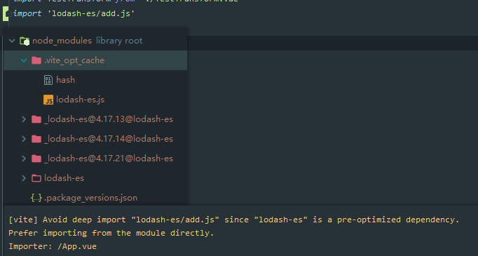

# 421 - d7fb6a9 optimize功能中不支持的拓展不应打包 & 修复无法引入如`css`的包问题

英文msg: fix support for `non-js` module imports，即修复无法引入非`js`模块包的问题

改动部分：

- `depOptimizer.ts` 不在拓展名单内的包不应该被打包
- `server/serverPluginModuleRewrite.ts`，对于入口文件不为`/\.(?:(?:j|t)sx?|vue)$/`的包，要添加import参数，从而可以import引入`css`包
- `mode/resolver.ts`: 拆分`resolveNodeModule`为：处理包入口(`resolveNodeModuleEntry`) 和 处理文件拓展名`resolveNodeModule`(原名)，拆分出来处理文件拓展名功能给`depOptimizer.ts`

### `depOptimizer.ts` 不在拓展名单内的包不应该被打包

支持预打包优化的**包入口文件**格式`['.mjs', '.js', '.ts', '.jsx', '.tsx', '.json']`。

`vite`会寻找依赖的id的main入口，检测其是否能够通过`require.resolve`处理返回入口路径(默认main入口)，若无，遍历`['.mjs', '.js', '.ts', '.jsx', '.tsx', '.json']`添加上后缀后再重新调用`require.resolve`寻找。

#### 话说是不是不应该使用`require.resolve`呢？毕竟会返回包的`main`入口

雀氏... 留坑，serve的时候用的也是module，应该保持一致才对（不是人人写包都遵循规则的）。

#### 所以optimize的作用到底是什么？

`vite`预打包的是`cjs`、引入了相对路径、包内引入了不在用户依赖的包。

这里有一个场景：

你引入了ant-pro的一个组件，ant-pro的import 样式链有30多个，而浏览器只支持并行6个请求，你如何优化？

`optimize`就是为此而生，把所有东西打包到一个`cjs`模块中（支持具名import [410-改动三](https://github.com/Kingbultsea/vite-analysis/blob/4adcbd8e64a7636ed310e186b57aa628d49c64a4/401-410/401-410.md#%E6%94%B9%E5%8A%A8%E4%B8%89)），可以一次性把包内所有请求合并成一个。

### `server/serverPluginModuleRewrite.ts`

对于入口文件不为`/\.(?:(?:j|t)sx?|vue)$/`的包，添加`?import`参数。

因为`css`要区分是不是import的方式引入(这只是例子，`json`或者其他静态资源也是需要区分)，从而返回js内容还是文件原本本身内容，`isImportRequest`就是检测`import`参数是否存在而判断是不是import的方式引入。

> 也就是可以引入入口为`.css`的包了

### 该给`optimizer`起个中文名称了！

**依赖瀑布流优化**，简称**依赖优化**（我没看过`vite`的文档... 见谅 后续都以这个名称来说）


# 422 - 2dd45af 对于有拓展名的才加入`?import`参数

421中`server/serverPluginModuleRewrite.ts`，对没有拓展名称的文件也加入了`?import`，现在没有拓展名称的包入口，将不再添加`?import`。

即返回原内容。


# 423 - e49742e 依赖优化应该检测`module`入口 & 新增检测包入口的`exports` `package.json`字段

421中提到的坑，现在修复了。现在使用`resolveNodeModuleEntry`寻找`module`入口，检测`module`入口文件的拓展名称是否符合`['.mjs', '.js', '.ts', '.jsx', '.tsx', '.json']`，符合则打包，不符合则作为`external`。

### `node/resolver.ts`

`resolveNodeModuleEntry`: **新增**，检测包`package.json`的`exports`字段作为入口，没有则从原本的`module` | `main`字段获取。

[package-exports](https://webpack.js.org/guides/package-exports/)


# 424 - f7a419c `deepImport`无法用于依赖优化中，给出错误提示

因为依赖优化是打包成一个文件的，使用如`import 'lodash/add.js'`将会触发提示(前提该依赖在**依赖优化**中)。



```powershell
[vite] Avoid deep import "lodash-es/add.js" since "lodash-es" is a pre-optimized dependency.
Prefer importing from the module directly.
Importer: /App.vue
```

> 所以说明了开源真不是一件容易的事情，错误提醒这些一定要有，不是每个人都能很好地去阅读了解文档的。


# 425 - 0819bcb 加载`postcss config`出现错误后的提醒 [#140](https://github.com/vitejs/vite/issues/140)

如`postcss.config`加载失败或异常，增加详细的错误提示。

```typescript
export async function loadPostcssConfig(root: string): Promise<Result | null> {
  if (cachedPostcssConfig !== undefined) {
    return cachedPostcssConfig
  }
  try {
    const load = require('postcss-load-config') as typeof postcssrc
    return (cachedPostcssConfig = await load({}, root))
  } catch (e) {
    console.error(chalk.red(`[vite] Error loading postcss config:`))
    console.error(e)
    return (cachedPostcssConfig = null)
  }
}
```


# 426 - a6a76a7 `index.html`支持`hmr`，调用触发`full-reload`

通过检测`request`是否为`/index.html`，而进行`full-reload`。

```typescript
watcher.on('change', async (file) => {
  const timestamp = Date.now()
  if (resolver.fileToRequest(file) === '/index.html') {
    send({
      type: 'full-reload',
      path: '/index.html',
      timestamp
    })
    console.log(chalk.green(`[vite] `) + `page reloaded.`)
  }
    // ...
})
```

> `serveStaticPlugin`，会在开始通过`url`查看页面时（就是首个服务请求），把request调整为`/index.html`;入口文件并不可配置，默认为工作目录下的index.html文件·。


# 427 - 3504b29 changelog

# [0.15.0](https://github.com/vuejs/vite/compare/v0.14.4...v0.15.0) (2020-05-14)

### Bug Fixes

- 修复无法引入非`js`模块包的问题（没有添加import参数） ([d7fb6a9](https://github.com/vuejs/vite/commit/d7fb6a9e8a6caf4041a2a602564583e4c34346e0)), closes [#132](https://github.com/vuejs/vite/issues/132)
- 跟进esbuild source文件路径不正常的问题 ([#141](https://github.com/vuejs/vite/issues/141)) ([b1726d8](https://github.com/vuejs/vite/commit/b1726d84e1bf694797f30c62ca509644577ef583)), closes [#137](https://github.com/vuejs/vite/issues/137)
- 输出postcss config错误信息 (close [#140](https://github.com/vuejs/vite/issues/140)) ([0819bcb](https://github.com/vuejs/vite/commit/0819bcb597673c329e5699b91295b22dd07c4dc7))
- 对于有拓展名的包入口才加入`?import`参数 ([2dd45af](https://github.com/vuejs/vite/commit/2dd45affef2ece21821b208910fc00c23775c331))
- 遵守`package.json`的`exports`字段意义 ([e49742e](https://github.com/vuejs/vite/commit/e49742e40dcc385c03c1e16a3a0a3fad60fcb417))

### Features

- 服务开启自动进行依赖优化 ([49a44b6](https://github.com/vuejs/vite/commit/49a44b648f263ff058f730913ea1ee6c62e3cd2d))
- 编辑`index.html`将触发页面重新加载 ([a6a76a7](https://github.com/vuejs/vite/commit/a6a76a7946bd4d4c68edd22eb0295f758ea48990))


# 428 - 43b51ba v0.15.0

release `vite` v0.15.0


# 429 - c1dc3ce `cva` v1.5.0

release `cva` v1.5.0


# 430 - b03d1c3 寻找不到`postcss.config`的情况下不应该输出警告，因为用户可能不配置

检测报错信息。

```typescript
export async function loadPostcssConfig(root: string): Promise<Result | null> {
  if (cachedPostcssConfig !== undefined) {
    return cachedPostcssConfig
  }
  try {
    const load = require('postcss-load-config') as typeof postcssrc
    return (cachedPostcssConfig = await load({}, root))
  } catch (e) {
    if (!/No PostCSS Config found/.test(e.message)) {
      console.error(chalk.red(`[vite] Error loading postcss config:`))
      console.error(e)
    }
    return (cachedPostcssConfig = null)
  }
}
```

> 报错信息来源于`postcss-load-config`包，`vite`并不检测你的文件是否存在`postcss.config`，这表明不管什么情况下都会执行`loadPostcssConfig`。

