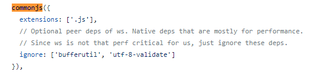
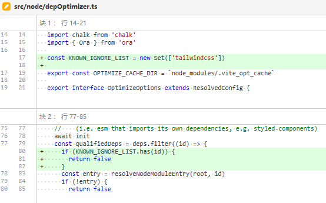

# 431 - 0bfd283 changelog

 [0.15.1](https://github.com/vuejs/vite/compare/v0.15.0...v0.15.1) (2020-05-14)

### Bug Fixes

- 当 `postcss` 配置不存在时不发出警告 ([b03d1c3](https://github.com/vuejs/vite/commit/b03d1c3091ac870ad6b86c796ee584417393fb6e))


# 432 - e958975 v0.15.1

release `vite` v0.15.1


# 433 - 39a7640 重新指定`@vue/`下的包路径

`import '@vue/runtime-dom'` -> `import '@vue/runtime-dom/dist/runtime-dom.esm-bundler.js'`

`import '@vue/runtime-core'` -> `import '@vue/runtime-core/dist/runtime-core.esm-bundler.js'`

`import '@vue/reactivity'` -> `import '@vue/reactivity/dist/reactivity.esm-bundler.js'`

`import '@vue/shared'` -> `import '@vue/shared/dist/shared.esm-bundler.js'`

`vue`为`runtime-dom`。

> `serverPluginModuleResolve`下的`serve`，是因为watch默认监听root下的文件变动。
>
> 如果使用了`vite`依赖下的`vue`，将会调用`serve`（一般来说`vite`是全局安装的，所以依赖不会在开发者的项目目录下）。


# 434 - ead7c93 changelog

## [0.15.2](https://github.com/vuejs/vite/compare/v0.15.1...v0.15.2) (2020-05-14)

### Bug Fixes

- 修复非本地vue解析 ([39a7640](https://github.com/vuejs/vite/commit/39a76408c8722a7eaa3f371d2e08114eea25c82a))


# 435 - ecf6daa v0.15.2

release `vite` v0.15.2


# 436 - 75fcb8e snowpack MIT License

```typescript
/**
 * Named exports detection logic from Snowpack
 * MIT License
 * https://github.com/pikapkg/snowpack/blob/master/LICENSE
 */
const PACKAGES_TO_AUTO_DETECT_EXPORTS = [
  path.join('react', 'index.js'),
  path.join('react-dom', 'index.js'),
  'react-is',
  'prop-types',
  'scheduler',
  'rxjs',
  'exenv',
  'body-scroll-lock'
]
```

### 再详细谈谈需要明确表示导出命名的例子

以rxjs为例，查看rxjs源码，不是`@rollup/plugin-commonjs`[盲点](https://github.com/Kingbultsea/vite-analysis/blob/4adcbd8e64a7636ed310e186b57aa628d49c64a4/401-410/401-410.md#%E8%87%AA%E5%AE%9A%E4%B9%89%E5%91%BD%E5%90%8D%E5%AF%BC%E5%87%BA)。

竟然不是了，又为什么需要设置`namedExports`？**这个我也没搞懂...** 

然后我去翻该插件的changlog，namedExports的相关信息。

`namedExports` (types) were deprecated and removed at [v13.0.0](https://github.com/rollup/plugins/blob/3ec3ceff0d49ac143a4af5ac54fb6be5425942ac/packages/commonjs/CHANGELOG.md#v1300) in 2020-06-00. 

也就是说尤大后续会抛弃这个设定(现在对应的是2020年5月)。

看看`Vitev^2.5.0`的代码:



那么`@rollup/plugin-commonjs`的盲点是不是被支持修复了？**是**

> It is a breaking change because we are removing the `namedExports` option, and require at least rollup v2.3.4 or higher. Instead of manually defining named exports, rollup now handles this automatically for you.
>
> 这是一个重大更改，因为我们正在删除 `namedExports` 选项，并且至少需要 rollup v2.3.4 或更高版本。与手动定义命名导出不同，rollup 现在会自动为你处理。
>
> https://github.com/rollup/plugins/blob/master/packages/commonjs/test/test.js#L618

```typescript
"use strict";
Object.defineProperty(exports, "__esModule", { value: true });
var Observable_1 = require("./internal/Observable");
exports.Observable = Observable_1.Observable;
var ConnectableObservable_1 = require("./internal/observable/ConnectableObservable");
exports.ConnectableObservable = ConnectableObservable_1.ConnectableObservable;
var groupBy_1 = require("./internal/operators/groupBy");
exports.GroupedObservable = groupBy_1.GroupedObservable;
var observable_1 = require("./internal/symbol/observable");
exports.observable = observable_1.observable;
var Subject_1 = require("./internal/Subject");
exports.Subject = Subject_1.Subject;
var BehaviorSubject_1 = require("./internal/BehaviorSubject");
exports.BehaviorSubject = BehaviorSubject_1.BehaviorSubject;
var ReplaySubject_1 = require("./internal/ReplaySubject");
exports.ReplaySubject = ReplaySubject_1.ReplaySubject;
var AsyncSubject_1 = require("./internal/AsyncSubject");
exports.AsyncSubject = AsyncSubject_1.AsyncSubject;
var asap_1 = require("./internal/scheduler/asap");
exports.asapScheduler = asap_1.asap;
var async_1 = require("./internal/scheduler/async");
exports.asyncScheduler = async_1.async;
var queue_1 = require("./internal/scheduler/queue");
exports.queueScheduler = queue_1.queue;
var animationFrame_1 = require("./internal/scheduler/animationFrame");
exports.animationFrameScheduler = animationFrame_1.animationFrame;
var VirtualTimeScheduler_1 = require("./internal/scheduler/VirtualTimeScheduler");
exports.VirtualTimeScheduler = VirtualTimeScheduler_1.VirtualTimeScheduler;
exports.VirtualAction = VirtualTimeScheduler_1.VirtualAction;
var Scheduler_1 = require("./internal/Scheduler");
exports.Scheduler = Scheduler_1.Scheduler;
var Subscription_1 = require("./internal/Subscription");
exports.Subscription = Subscription_1.Subscription;
var Subscriber_1 = require("./internal/Subscriber");
exports.Subscriber = Subscriber_1.Subscriber;
var Notification_1 = require("./internal/Notification");
exports.Notification = Notification_1.Notification;
exports.NotificationKind = Notification_1.NotificationKind;
var pipe_1 = require("./internal/util/pipe");
exports.pipe = pipe_1.pipe;
var noop_1 = require("./internal/util/noop");
exports.noop = noop_1.noop;
var identity_1 = require("./internal/util/identity");
exports.identity = identity_1.identity;
var isObservable_1 = require("./internal/util/isObservable");
exports.isObservable = isObservable_1.isObservable;
var ArgumentOutOfRangeError_1 = require("./internal/util/ArgumentOutOfRangeError");
exports.ArgumentOutOfRangeError = ArgumentOutOfRangeError_1.ArgumentOutOfRangeError;
var EmptyError_1 = require("./internal/util/EmptyError");
exports.EmptyError = EmptyError_1.EmptyError;
var ObjectUnsubscribedError_1 = require("./internal/util/ObjectUnsubscribedError");
exports.ObjectUnsubscribedError = ObjectUnsubscribedError_1.ObjectUnsubscribedError;
var UnsubscriptionError_1 = require("./internal/util/UnsubscriptionError");
exports.UnsubscriptionError = UnsubscriptionError_1.UnsubscriptionError;
var TimeoutError_1 = require("./internal/util/TimeoutError");
exports.TimeoutError = TimeoutError_1.TimeoutError;
var bindCallback_1 = require("./internal/observable/bindCallback");
exports.bindCallback = bindCallback_1.bindCallback;
var bindNodeCallback_1 = require("./internal/observable/bindNodeCallback");
exports.bindNodeCallback = bindNodeCallback_1.bindNodeCallback;
var combineLatest_1 = require("./internal/observable/combineLatest");
exports.combineLatest = combineLatest_1.combineLatest;
var concat_1 = require("./internal/observable/concat");
exports.concat = concat_1.concat;
var defer_1 = require("./internal/observable/defer");
exports.defer = defer_1.defer;
var empty_1 = require("./internal/observable/empty");
exports.empty = empty_1.empty;
var forkJoin_1 = require("./internal/observable/forkJoin");
exports.forkJoin = forkJoin_1.forkJoin;
var from_1 = require("./internal/observable/from");
exports.from = from_1.from;
var fromEvent_1 = require("./internal/observable/fromEvent");
exports.fromEvent = fromEvent_1.fromEvent;
var fromEventPattern_1 = require("./internal/observable/fromEventPattern");
exports.fromEventPattern = fromEventPattern_1.fromEventPattern;
var generate_1 = require("./internal/observable/generate");
exports.generate = generate_1.generate;
var iif_1 = require("./internal/observable/iif");
exports.iif = iif_1.iif;
var interval_1 = require("./internal/observable/interval");
exports.interval = interval_1.interval;
var merge_1 = require("./internal/observable/merge");
exports.merge = merge_1.merge;
var never_1 = require("./internal/observable/never");
exports.never = never_1.never;
var of_1 = require("./internal/observable/of");
exports.of = of_1.of;
var onErrorResumeNext_1 = require("./internal/observable/onErrorResumeNext");
exports.onErrorResumeNext = onErrorResumeNext_1.onErrorResumeNext;
var pairs_1 = require("./internal/observable/pairs");
exports.pairs = pairs_1.pairs;
var partition_1 = require("./internal/observable/partition");
exports.partition = partition_1.partition;
var race_1 = require("./internal/observable/race");
exports.race = race_1.race;
var range_1 = require("./internal/observable/range");
exports.range = range_1.range;
var throwError_1 = require("./internal/observable/throwError");
exports.throwError = throwError_1.throwError;
var timer_1 = require("./internal/observable/timer");
exports.timer = timer_1.timer;
var using_1 = require("./internal/observable/using");
exports.using = using_1.using;
var zip_1 = require("./internal/observable/zip");
exports.zip = zip_1.zip;
var scheduled_1 = require("./internal/scheduled/scheduled");
exports.scheduled = scheduled_1.scheduled;
var empty_2 = require("./internal/observable/empty");
exports.EMPTY = empty_2.EMPTY;
var never_2 = require("./internal/observable/never");
exports.NEVER = never_2.NEVER;
var config_1 = require("./internal/config");
exports.config = config_1.config;
//# sourceMappingURL=index.js.map
```

```typescript
function detectExports(root: string, id: string): string[] | undefined {
  try {
    const fileLoc = resolveFrom(root, id)
    if (fs.existsSync(fileLoc)) {
      // 输出所有非私有（符号 _ ）的变量  
      return Object.keys(require(fileLoc)).filter((e) => e[0] !== '_')
    }
  } catch (err) {
    // ignore
  }
}
```


# 437 - 36a24aa docs 去除web_modules的文档信息

### How is This Different from [Snowpack](https://www.snowpack.dev/)?

Snowpack 2 is closer to Vite in scope - both offer bundle-free dev servers and can bundle the app for production. Some notable differences are:

Snowpack 2在范围上更接近于Vite-两者都提供捆绑的开发服务器，并且可以捆绑应用程序进行生产。一些显著的区别是：

- 特别是对于Vue，Vite提供内置HMR，而Snowpack只需在任何文件编辑时重新加载页面。由于这两种解决方案都依赖于本地ES导入，因此整个页面重新加载的网络瀑布实际上可能成为编辑到反馈速度的瓶颈。HMR允许你在相当长的开发时间内避免重新加载页面。
- Vite有点固执己见，旨在最大限度地减少所需的配置量。上面列出的所有功能，如TypeScript、CSS导入和PostCSS支持，都是现成的。
- 虽然Vite在技术上可以用于开发具有任何框架的应用程序，但其主要重点是尽可能提供最佳的Vue开发体验。支持第三方框架，但不是最优先考虑的。

> 回头查看了一下web_modules 这个功能和vite的**依赖优化**，是一样的，减少网络瀑布。


# 438 - fc7b978 避免tailwindcss被作用于依赖优化 [#146](https://github.com/vitejs/vite/issues/146)

146并没有反馈什么有用的信息，现在只好去看看tailwindcss源码了。




# 439 - 


# 440 - 
