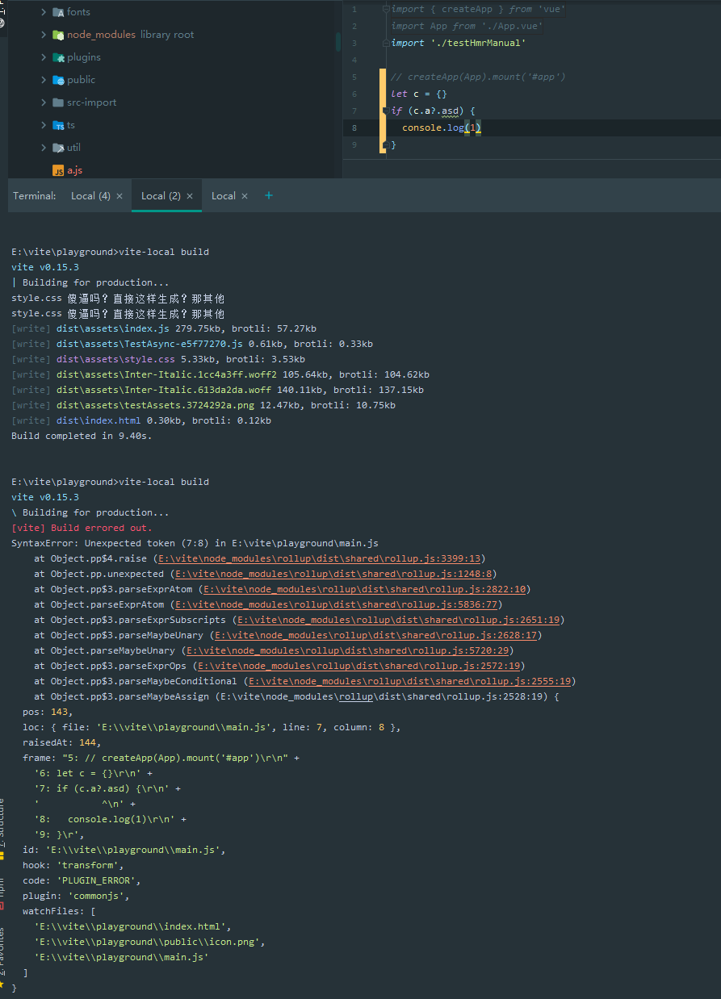
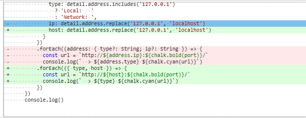

# 441 - 5769749 v0.15.3

release `vite` v0.15.3


# 442 - d1bdf5a `vite:resolve`插件，当alias不一样时才会调用resolve

msg: 修复`vite:resolve`与` node-resolve`插件公用的情况下出现的无限循环`resolve`问题。

**node-resolve源码分析：**

`vite:resolve`: 我处理不了这个id，交给其他人处理了。

` node-resolve`: 我找到了这个id的入口了，交给其他人去处理了，我会等待你们的结果，检测你们的`external`，再进行返回。

`vite:resolve`: 我处理不了这个id，交给其他人处理了。

....

重复下去... 一直没有人处理。

**改动后：**

`vite:resolve`: alias和原本id相同，其他插件按照原本流程处理吧。

` node-resolve`: 我找到了这个id的入口了，交给其他人去处理了，我会等待你们的结果，检测你们的`external`，再进行返回。

rollup表示没有人处理这个id，所以回归到` node-resolve`，返回id。

> rollup帮助我们避免了这个死循环，id本身并没有任何改变，所以我们没有察觉（然鹅速度非常慢）。

```typescript
export const createBuildResolvePlugin = (
  root: string,
  resolver: InternalResolver
): Plugin => {
  return {
    name: 'vite:resolve',
    async resolveId(id, importer) {
      const original = id
      id = resolver.alias(id) || id
        
      // ...
        
      // fallback to node-resolve becuase alias
      if (id !== original) {
        const resolved = this.resolve(id, importer, { skipSelf: true })
        return resolved || { id }
      }
    },
    load(id: string) {
    }
  }
}
```


# 443 - 84cff52 确保vue被安装

`node/utils/resolveVue.ts`: `isLocal`的判断仅仅是检测依赖上有没有vue包，并不是检测`node_modules`能否寻找到vue包，现在为了严谨性，调用`resolveFrom`看看是否能引入该包，否则`isLocal`为`false`


# 444 - bdc7e70 添加`shouldPreload`在可配置选项中，可预加载非主`chunk`资源 [#144](https://github.com/vitejs/vite/pull/144)

构建完毕后，调用renderIndex -> (非主chunk) ->  shouldPreload(chunk) 验证通过后，`<link red="modulepreload" href="${filename}" />`植入标签到html。

```typescript
# node/config.ts
export interface BuildConfig extends SharedConfig {
  // ...
  /**
   * 是否把link rel=modulepreload注入到index.html中
   */
  shouldPreload?: (chunk: OutputChunk) => boolean
}

# build/buildPluginHtml.ts
const injectPreload = (html: string, filename: string) => {
  filename = isExternalUrl(filename)
    ? filename
    : `${publicBasePath}${path.posix.join(assetsDir, filename)}`
  const tag = `<link rel="modulepreload" href="${filename}" />`
  if (/<\/head>/.test(html)) {
    return html.replace(/<\/head>/, `${tag}\n</head>`)
  } else {
    return tag + '\n' + html
  }
}

const renderIndex = (
    bundleOutput: RollupOutput['output'],
    cssFileName: string
  ) => {
    // inject css link
    processedHtml = injectCSS(processedHtml, cssFileName)
    // inject js entry chunks
    for (const chunk of bundleOutput) {
      if (chunk.type === 'chunk') {
        if (chunk.isEntry) {
          processedHtml = injectScript(processedHtml, chunk.fileName)
        } else if (shouldPreload && shouldPreload(chunk)) {
          processedHtml = injectPreload(processedHtml, chunk.fileName)
        }
      }
    }
    return processedHtml
  }
```

**sventschui**: 此PR添加了一个名为`shouldlpreload`的可选配置选项，该选项接收`rollup OutputChunk`作为function的参数，并返回一个布尔值，指示是否向`index.html`添加`<link rel=“modulerepload”href=“…”/>`。

欢迎反馈。也许更通用的解决方案是提供添加html处理插件的功能。

**sventschui**: Fixed typo & rebased.希望现在一切都好

**yyx**: 我想知道是否有方法可以自动执行此操作-例如，如果入口块需要一个公共块，那么它应该自动预加载。我想我也在试图弄清楚什么时候真的需要这个方法，或者我们应该提供一个更通用的HTML处理选项。目前Vite只支持单个入口（除非通过`rollupInputOptions`显式配置），因此只有在使用动`dynamic imports`分离代码时，才会出现单独的块，否则它们将始终位于主块中。您是否有更具体的案例计划使用此功能？

> 尤大目前意思是vite不会代码分割，除非自己通过rollup输出代码，所以输出的只会输出一个主chunk，sventschui提出的shouldPreload(chunk) ，将会是一个主`chunk` + `dynamicimported chunk`。

**sventschui**: 用例是预加载验证后所需的块 (i.e. [https://prelease.netlify.app](https://prelease.netlify.app/) 提供了一个 "Authenticate with GitHub"按钮作为未验证时的唯一入口点，认证后会加载`@urql/preact` + `graphql`，大约35KB)。

> **yyx**: 我想知道是否有方法可以自动执行此操作-例如，如果入口块需要一个公共块，那么它应该自动预加载。

这是个好主意。但有一件事是，这仅适用于一个级别（即`main chunk` -> `common chunk`）。在我的情况下，有两个级别（即`main chunk` -> `dynamicimported chunk` -> `common chunk`）我希望两者都被预加载。

> Chrome在50版中添加了对<link rel =“ preload”>的支持，这是一种在浏览器需要资源之前以声明方式提前请求资源的方法。
>
> isEntry chunk就是主chunk。
>
> common chunk公共模块。
>
> dynamicimported chunk异步块。
>
> 后续会详细讲解，因为我能看出尤大蠢蠢欲动。
>
> 支持`publicBasePath`


# 445 - 00f4a83 强制esbuild服务输出ES2019 [#155](https://github.com/vitejs/vite/pull/155)

**Dykam**: Rollup 似乎不支持可选链（foo?.bar）。通过将 esbuild 目标降低到 ES2019 来解决此问题。
这纯粹是一个建议，我知道可能会有意想不到的后果。我也可以想到你可能只想对rollup执行此操作。



rollup不支持可选链（Es2020）。

> The reason Acorn hasn't landed optional chaining is due to the estree block over how to implement the Node structure. RollupJS doesn't publicly expose the Node interface so I don't believe Rollup as a project should be slowed down by the lack of consensus building work being done here, if it doesn't actually affect Rollup.
>
> Acorn 没有上这个功能是因为estree相关规范还没有定下来。

esbuild是用来转ts，(在renderChunk的时候压缩代码，但是传递给esbuild的只有minify字段)，把目标输出为es2019就可以了。

[rollup-3582](https://github.com/rollup/rollup/pull/3582): 支持可选链。

[#525](https://github.com/vitejs/vite/pull/525/files)升级后，将支持可选链。

> 这个修复也是有缺陷的，不能在js里面用。
>
> 同时发现esbuild不支持转换async，https://esbuild.github.io/content-types/#es5，不支持转换es5，那就得交给rollup了。


# 446 - f6085fc 修复单词拼写错误 [#167](https://github.com/vitejs/vite/pull/167)

修复变量名称拼写错误


# 447 - 1f3a9b1 [#169](https://github.com/vitejs/vite/pull/169) 把`@tailwindcss/ui`在依赖优化名单中去除

**yyx**: 仅供参考，这也可以通过 `vite.config.js` 中的 `optimizeDeps.exclude` 手动添加。

**posva**: 是的，我正在使用它 ([#168 (comment)](https://github.com/vitejs/vite/issues/168#issuecomment-629768528)).。你认为有没有办法提前以某种方式通知用户？看来这个问题很容易发生，内存错误也很混乱，所以我认为围绕它改进真的很值得。


# 448 - 59da38c [#170](https://github.com/vitejs/vite/pull/170) 支持accept hmr api能被多次调用

该坑可以在[312](https://github.com/Kingbultsea/vite-analysis/blob/ca743cb71f4123201f705ca2c73e2d5483801beb/311-320/311-320.md#312---0708279-%E9%87%8D%E6%9E%8497%E4%B8%94%E5%85%A8%E5%B1%80%E6%B3%A8%E5%86%8Cimporter%E4%B8%8Eimportee%E5%85%B3%E7%B3%BB%E5%8D%B3%E8%AE%BE%E7%BD%AEimportermap)中查看，曾经提出过。

改动部分：

`client/client.ts`: `hot.accept`现在`key`为`id`，`value`存放了`{id: string, callbacks:{deps: string | string[], fn: (modules: object | object[]) => void}[] }`，解决覆盖问题；`js-update`触发`updateModule`（详 **改动一**）

> `js-update`能用到的就只有hmr api。

### 改动一 `updateModule`

现在A为引入了`hmr api`的模块，A调用`hot.accept(['./B.js', './C.js'], fn1)`。

B改动，触发`js-update`。

客户端`const newMod = await import('B和C.js路径')`。

调用`fn1(newMod)`。

#### 为什么自身引入要清空？

[动态import](https://developer.mozilla.org/zh-CN/docs/Web/JavaScript/Reference/Statements/import#%E5%8A%A8%E6%80%81import)，查看第三点，自身引入是有副作用的，也就是说在更新的A模块，会调用accept进行注册，旧的A模块需要让他不起作用。

> B改动，C也会跟着被引入调用callback。
>
> 这个PR可以说是去除了相当多的坑，感谢[underfin](https://github.com/underfin) 。

```typescript
interface HotModule {
  id: string
  callbacks: HotCallback[]
}

interface HotCallback {
  deps: string | string[]
  fn: (modules: object | object[]) => void
}

async function updateModule(
  id: string,
  changedPath: string,
  timestamp: string
) {
  const mod = jsHotModuleMap.get(id)
  if (!mod) {
    console.error(
      `[vite] got js update notification but no client callback was registered. Something is wrong.`
    )
    return
  }

  const moduleMap = new Map()
  const isSelfUpdate = id === changedPath

  // make sure we only import each dep once
  const modulesToUpdate = new Set<string>()
  if (isSelfUpdate) {
    // self update - only update self
    modulesToUpdate.add(id)
  } else {
    // dep update
    for (const { deps } of mod.callbacks) {
      if (Array.isArray(deps)) {
        deps.forEach((dep) => modulesToUpdate.add(dep))
      } else if (deps !== id) {
        // exclude self accept calls
        modulesToUpdate.add(deps)
      }
    }
  }

  // determine the qualified callbacks before we re-import the modules
  const callbacks = mod.callbacks.filter(({ deps }) => {
    return Array.isArray(deps)
      ? deps.some((dep) => modulesToUpdate.has(dep))
      : modulesToUpdate.has(deps)
  })
  // reset callbacks on self update since they are going to be registered again
  if (isSelfUpdate) {
    mod.callbacks = []
  }

  await Promise.all(
    Array.from(modulesToUpdate).map(async (dep) => {
      debugger
      const disposer = jsDisposeMap.get(dep)
      if (disposer) await disposer()
      const newMod = await import(dep + `?t=${timestamp}`)
      moduleMap.set(dep, newMod)
    })
  )

  for (const { deps, fn } of callbacks) {
    if (Array.isArray(deps)) {
      fn(deps.map((dep) => moduleMap.get(dep)))
    } else {
      fn(moduleMap.get(deps))
    }
  }

  console.log(`[vite]: js module hot updated: `, id)
}
```


# 449 - b8f6b5a cva 更新vue模板 [#151](https://github.com/vitejs/vite/pull/151)

添加icon，和vue-cli生成的模板保持一致。


# 450 - 9b0f742 chore 简化cli address log

没什么改动，就是把没必要声明的类型去掉了。



