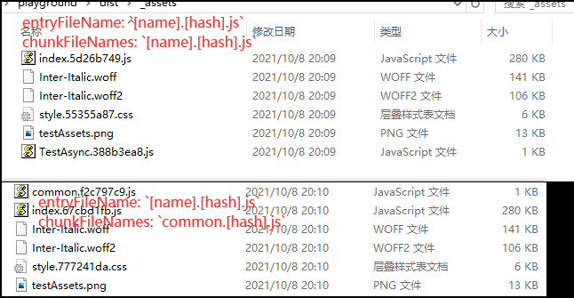
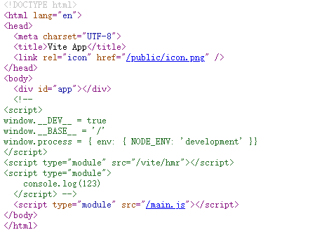
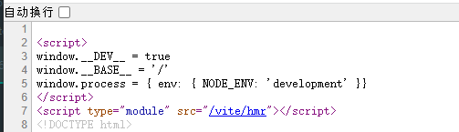

# 451 - d3e08d2 `bump vue` & 补上忘了添加进去的`mime-types`依赖

`mime-types`被`puppeteer`作为了依赖，可以正常使用，所以尤大并没有察觉。


# 452 - c40978f 简化`ws`代码 [#180](https://github.com/vitejs/vite/pull/180)

`ws`可以直接调用`clients`来获取正在连接的`ws`服务，同时可以通过`client.readyState`知道链接是否有效。

```typescript
const wss = new WebSocket.Server({ server })

wss.clients.forEach((client) => {
      if (client.readyState === WebSocket.OPEN) {
        client.send(stringified)
      }
    })
```


# 453 - 0cc57c8 为`css` & 主`chunk`添加hash

资源生成文件夹从`assets`更改为`_assets`。

现在为`css`、`dynamicimported chunk`和主`chunk`([444](https://github.com/Kingbultsea/vite-analysis/blob/b6617741425483652faf7447e5424fffa9d71b16/441-450/441-450.md#444---bdc7e70-%E6%B7%BB%E5%8A%A0shouldpreload%E5%9C%A8%E5%8F%AF%E9%85%8D%E7%BD%AE%E9%80%89%E9%A1%B9%E4%B8%AD%E5%8F%AF%E9%A2%84%E5%8A%A0%E8%BD%BD%E9%9D%9E%E4%B8%BBchunk%E8%B5%84%E6%BA%90-144) - 底部解释)添加名称hash。

[`output.chunkFileNames`](https://rollup.docschina.org/guide/en/#outputchunkfilenames): `dynamicimported chunk`，异步`chunk`。

[`output.entryFileNames`](https://rollup.docschina.org/guide/en/#outputentryfilenames): 入口chunk，主chunk。

```typescript
const { output } = await bundle.generate({
    format: 'es',
    sourcemap,
    entryFileNames: `[name].[hash].js`,
    chunkFileNames: `common.[hash].js`,
    ...rollupOutputOptions
  })

// 尤大是不是弄反了呢？认为异步chunk，以文件名称是最好的。
// 如下图的TestAsync.388b3ea8.js
```



>静态资源的文件hash已经在`buildPluginAssets.ts`被添加。
>
>`js`是`rollup`添加的`hash`，是内容`hash`。


# 454 - d16f567 fix [#160](https://github.com/vitejs/vite/issues/160) 支持`.html`路由跳转

不再写死`./index.html`。

> 构建的时候是写死... 我就看到时候谁反馈了。
>
> 现在只解决了server。
>
> [426](https://github.com/Kingbultsea/vite-analysis/blob/da8c66f4dd50db3014bb9d01d6e5210fa0848646/421-430/421-430.md#426---a6a76a7-indexhtml%E6%94%AF%E6%8C%81hmr%E8%B0%83%E7%94%A8%E8%A7%A6%E5%8F%91full-reload)有提到。
>
> （通过rollup修改入口是可以，但是`createBuildHtmlPlugin`会无法读取到文件，也是行不通的）


# 455 - 89ac245 fix [#161](https://github.com/vitejs/vite/issues/161) 用户有可能在`index.html`有注释

一开始我看这个问题也是懵逼... 构建和serve完全没有关系的，怎么161描述的情况就是说构建后，启动serve服务，会被注释掉`dev`的代码...

实际触发的原因是`vite`注入`dev`到`html`，他会在第一个匹配到的`<script>`标签上方添加`dev`代码。

```typescript
<body>
  <div id="app"></div>
  <!-- <script type="module">
    console.log(123)
  </script> -->
  <script type="module" src="/main.js"></script>
</body>
```




现在修改为在`html`顶部注入`dev`就可以解决了。




# 456 - f6a21b2 [#176](https://github.com/vitejs/vite/issues/176) 修复组件`onMounted`无法第一时间获取style的问题

原因是`css`是通过注入`<link/>`来达到样式修改，是一个异步的过程，而组件`onMounted`是同步的。

现在需要把样式改为同步的。

**注意了`style-update` & `vue-style-update` 变动了**，现在会同步等待内容再插入`<style/>`标签。

改动部分：

- `client/client.ts`: `updateStyle`传入参数从路径改为内容； 等待`import`获取style内容，`<link/>`标签更改为`<style/>`标签，其余不变
- `server/serverPluginCss.ts`: `updateStyle`传入参数从路径改为内容
- `server/serverPluginVue.ts`: 对待`css`注入，新增`import`获取内容，再调用`updateStyle`，和`client.ts`的改动是一致的
- `server/serverPluginHmr.ts`: `file.endsWidth('.module.css')`不再进行`handleJSReload`，优化性能，减少一次`HMR`，这是一个操作问题（详 **改动四**）

> 对于SFC组件的`src`资源`hmr`，仅由`serverPluginVue.ts`处理。
>
> 配置了`config,transforms`转换的`css`文件，`hmr`会触发`handleJSReload`（`serverPluginHmr.ts`） & `style-update`（`serverPluginCss.ts`）事件，仅经过`serverPluginHmr.ts` & `serverPluginCss.ts`处理。

### 改动四

假设你修改了`.module.css`，你新增了一个`class`，你会希望进行`handleJSReload`让你的SFC触发`vue-reload`吗？

**不会，这不合理**。

因为按照`module`的特性，你必然是会进行一次SFC的修改去引用你新增的`class`，这次改动有效减少一次`handleJSReload`，如果是SFC组件即`vue-reload`。


# 457 - 10a922d chore `css modules` hash调整

改动部分：

- `node/build/buildPluginCss.ts`:  `hash id`（**改动一**）
- `node/build/index.ts`: 配置`rollup-plugin-vue`，新增`cssModulesOptions`（**改动二**）
- `node/server/serverPluginVue.ts`: 新增`modulesOptions.generateScopedName`（**改动三**）

### 改动一

新增`generateScopedName`，`hash id`，即`import id` `requestId`

```typescript
require('postcss-modules')({
  generateScopedName: `[local]_${hash_sum(id)}`,
  getJSON(_: string, json: Record<string, string>) {
    modules = json
  }
})
```

### 改动二

即`postcss-modules`配置。

https://github.com/madyankin/postcss-modules#usage

```typescript
// vue
    require('rollup-plugin-vue')({
      cssModulesOptions: {
        generateScopedName: (local: string, filename: string) =>
          `${local}_${hash_sum(filename)}`
      }
    })
```

### 改动三

本质也是`postcss-modules`:

```typescript
function compileStyleAsync(options) {
    return doCompileStyle({ ...options, isAsync: true });
}
function doCompileStyle({ modulesOptions }) {
    plugins.push(require('postcss-modules')({
            ...modulesOptions,
            getJSON: (_cssFileName, json) => {
                cssModules = json;
            }
        })
}
```

> `id`为 `hash_sum(publicPath)`


# 458 - 580ace9 changelog

## [0.15.4](https://github.com/vuejs/vite/compare/v0.15.3...v0.15.4) (2020-05-19)

### Bug Fixes

- resolveVue 中会确保vue依赖被安装 ([84cff52](https://github.com/vuejs/vite/commit/84cff5282a56369eeea360cf001e398a2d25dd56))
- 支持`.html`路由跳转 ([d16f567](https://github.com/vuejs/vite/commit/d16f567ef2b6fb7b764b5be4402dd81ba7061596)), closes [#160](https://github.com/vuejs/vite/issues/160)
- 修复`vite:resolve`与` node-resolve`插件公用的情况下出现的无限循环`resolve`问题。 ([d1bdf5a](https://github.com/vuejs/vite/commit/d1bdf5a07fdae032a69987ac238bc0d68881b3f2))
- 强制`esbuild`输出ES2019 ([#155](https://github.com/vuejs/vite/issues/155)) ([00f4a83](https://github.com/vuejs/vite/commit/00f4a8319fcc79ebdf939ecb5aea990c46690fd8))
- `tailwindui`在依赖优化中被ignore ([#169](https://github.com/vuejs/vite/issues/169)) ([1f3a9b1](https://github.com/vuejs/vite/commit/1f3a9b1adc73e2569425e7ab4c129734d59bdfcd)), closes [#168](https://github.com/vuejs/vite/issues/168)
- 修复dev的代码在html中注入的位置问题 ([89ac245](https://github.com/vuejs/vite/commit/89ac24552f5cf644d416230058293d0d0d8eef5f)), closes [#161](https://github.com/vuejs/vite/issues/161)
- 修复组件`onMounted`无法第一时间获取style的问题 ([#176](https://github.com/vuejs/vite/issues/176)) ([f6a21b2](https://github.com/vuejs/vite/commit/f6a21b268b262ddbdd585288e599fed2b3a41ec6)), closes [#175](https://github.com/vuejs/vite/issues/175)
- 支持`accept hmr api`能被多次调用 ([#170](https://github.com/vuejs/vite/issues/170)) ([59da38c](https://github.com/vuejs/vite/commit/59da38c185b428a178d320b8bd5187b34bd942aa)), closes [#158](https://github.com/vuejs/vite/issues/158)

### Features

- 添加`shouldPreload`在可配置选项中，可预加载非主chunk资源 ([#144](https://github.com/vuejs/vite/issues/144)) ([bdc7e70](https://github.com/vuejs/vite/commit/bdc7e70499916d7668d40a84c3f726ab50fbce9a))
- 为`css` & 主`chunk`添加hash ([0cc57c8](https://github.com/vuejs/vite/commit/0cc57c80d92dabb024a18d81d92a1dabe8eda702))


# 459 - 0a4ed59 `vite v0.15.4`

release `vite v0.15.4`


# 460 - a0fb9fb `cva v1.5.1`

release `cva v1.5.1`

