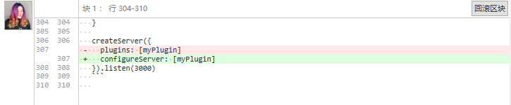

# 481 - 0498f73 cva将被分开为单独一个项目

vite不再内嵌`cva`，删除`cva`。


# 482 - d3a4793 chore 修正readme proxy的用法 [#192](https://github.com/vitejs/vite/pull/192)

```typescript
// vite.config.js
module.exports = {
  proxy: {
    // string shorthand
    '/foo': 'http://localhost:4567/foo',
    // with options
    '/api': {
      target: 'http://jsonplaceholder.typicode.com',
      changeOrigin: true,
      rewrite: path => path.replace(/^\/api/, '')
    }
  }
}
```

> 即删除一层`proxy`


# 483 - f452cf3 chore 修正readme vite插件调用方式 [#199](https://github.com/vitejs/vite/pull/199)




# 484 - c553de2 修正hmr accept self不会回调callBack问题

如果调用`hot.accept(['./自身路径.js', './A.js'], cb)`，包括自身和A文件，则只会import `A.js`回调cb。

修正后两者都能正常调用。

> 记住再次import自身，accept会自动删除旧的accept关系，之前有说，[传送门](https://github.com/Kingbultsea/vite-analysis/blob/8f69f883b9bbfc856a87259789ca350734a8a3b1/441-450/441-450.md#%E4%B8%BA%E4%BB%80%E4%B9%88%E8%87%AA%E8%BA%AB%E5%BC%95%E5%85%A5%E8%A6%81%E6%B8%85%E7%A9%BA)。


# 485 - 02e2d94 性能优化，当引入了`hot`才进行改写

`server/serverPluginModuleRewrite.ts`：即`import { hot } from 'vite/hmr'`才会调用`rewriteFileWithHMR`

> import { dispose } from 'vite/hmr'不会进行`rewriteFileWithHMR`的改写。


# 486 - feb3b6d hmr api 增强warning输出

vite调用hmr api需要添加`__DEV__`判断，否则警告构建后代码将不会被`Treeshaking`掉。

> 本次改动不仅仅是检测最外层`if (__DEV__)`，可以检测任意代码块下的`if (__DEV__)`


# 487 - 91c4517 修正测试`console.log`输出

修正测试logs。

> 之前hmr api可以多次使用的PR忘了vite的测试会检测`console.log`


# 488 - f1f5017 changelog

## [0.16.1](https://github.com/vuejs/vite/compare/v0.16.0...v0.16.1) (2020-05-20)

### Bug Fixes

- **hmr:** 修正hmr accept self不会回调`callBack`问题 ([c553de2](https://github.com/vuejs/vite/commit/c553de26234e64ed3cdccd216630a6b5cd49f8f8))

### Features

- 警告有条件的 `hot.accept()` 调用 ([feb3b6d](https://github.com/vuejs/vite/commit/feb3b6d29381c80e6e24a7f629941d1401401cf5))

### Performance Improvements

- 当引入了hmr api的hot才调用`rewriteFileWithHMR` ([02e2d94](https://github.com/vuejs/vite/commit/02e2d94bb77b93103987f6940ca3b11ae30d65b4))


# 489 - 65c4466 `vite v0.16.1`

release `vite v0.16.1`


# 490 - 2646e29 调整postpublish script

```json
// 前
{
    "postpublish": "git add CHANGELOG.md && git commit -m 'chore: changelog [ci skip]' && git push"
}

// 后 删除了 git push
{
    "postpublish": "git add CHANGELOG.md && git commit -m 'chore: changelog [ci skip]'"
}
```

> 不想`git push`自动触发。
>
> 尤大难道还有其他东西要add？目前没有看到。
>
> 推测：修改package.json也会有一个push操作，因为版本号是手动修改的，所以会重复push。

