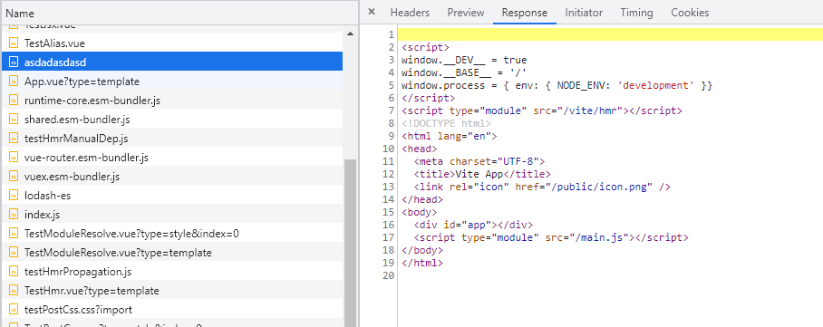
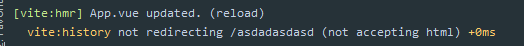

# 491 - fb86f0a 重构 [#185](https://github.com/vitejs/vite/pull/185) html逻辑代码被转移到新增的`htmlPlugin`插件当中 & `full-reload`事件准确刷新目标页面

改动部分：

- `client/client.ts`：`full-reload`事件，如果页面路径和当前在浏览器上的路径一致，才执行`location.reload()`（详 **改动一**）
- `node/server/index.ts`：新增`htmlPlugin`（详 **改动二**）
- `node/server/serverPluginHmr.ts`：处理`/index.html`的`hmr`代码被移除（转移）
- `node/server/serverPluginModuleRewrite.ts`：所有`.html`相关的逻辑都被移除（如 注入dev代码 | 缓存 | 提取`src`变为`import`语句 | `importMap`建立联系）
- `test/test.js`：新增html相关测试。（详 **改动五**）
- `node/server/serverPluginHtml.ts`：处理`.html`相关逻辑（详 **新增六**）

### 改动一

```typescript
case 'full-reload':
      if (path.endsWith('.html')) {
        // if html file is edited, only reload the page if the browser is
        // currently on that page.
        const pagePath = location.pathname
        if (
          pagePath === path ||
          (pagePath.endsWith('/') && pagePath + 'index.html' === path)
        ) {
          location.reload()
        }
        return
      } else {
        location.reload()
      }
```


如果我们打开了多个web页面，当收到`full-reload`事件，所有页面都会进行一个刷新。

这明显不合理，现在通过判断`full-reload`传递进来的路径来决定哪个页面进行刷新。

> 这只使用与后缀为.html的文件使用

### 改动二

洋葱模型新增`htmlPlugin`：[传送门](https://github.com/Kingbultsea/vite-analysis/blob/f32926641f27f5b7cfd77d4be596a82a2fd32d17/331-340/331-340.md#%E6%B4%8B%E8%91%B1%E6%A8%A1%E5%9E%8B%E6%89%A7%E8%A1%8C%E9%A1%BA%E5%BA%8F%E6%9B%B4%E6%96%B0-1)（改动不大，不重新整理，可以按照旧版查看）

```typescript
const resolvedPlugins = [
    ...(Array.isArray(configureServer) ? configureServer : [configureServer]),
    proxyPlugin,
    serviceWorkerPlugin,
    hmrPlugin,
    moduleRewritePlugin,
    moduleResolvePlugin,
    vuePlugin,
    cssPlugin,
    ...(transforms.length ? [createServerTransformPlugin(transforms)] : []),
    esbuildPlugin,
    jsonPlugin,
    htmlPlugin,
    assetPathPlugin,
    serveStaticPlugin
  ]
```

### 改动五

```typescript
// index.html hmr测试 单页面
test('hmr (index.html full-reload)', async () => {
  expect(await getText('title')).toMatch('Vite App')
  await updateFile('index.html', (content) =>
    content.replace('Vite App', 'Vite App Test')
  )
  await navigateFinish()
  await expectByPolling(() => getText('title'), 'Vite App Test')
})

// 特定页面的html文件 hmr测试
test('hmr (html full-reload)', async () => {
  await page.goto('http://localhost:3000/test.html')
  expect(await getText('title')).toMatch('Vite App')
  // hmr
  await updateFile('test.html', (content) =>
    content.replace('Vite App', 'Vite App Test')
  )
  await navigateFinish()
  await expectByPolling(() => getText('title'), 'Vite App Test')
})
```

### 新增六

没有任何变动，都是迁移过来的功能。

```typescript
import { rewriteImports, ServerPlugin } from './index'
import {
  debugHmr,
  ensureMapEntry,
  hmrClientPublicPath,
  importerMap
} from './serverPluginHmr'
import { init as initLexer } from 'es-module-lexer'
import { cleanUrl, readBody } from '../utils'
import LRUCache from 'lru-cache'
import path from 'path'
import slash from 'slash'
import chalk from 'chalk'

const debug = require('debug')('vite:rewrite')

const rewriteHtmlPluginCache = new LRUCache({ max: 20 })

export const htmlPlugin: ServerPlugin = ({
  root,
  app,
  watcher,
  resolver,
  config
}) => {
  // inject __DEV__ and process.env.NODE_ENV flags
  // since some ESM builds expect these to be replaced by the bundler
  const devInjectionCode =
    `\n<script>\n` +
    `window.__DEV__ = true\n` +
    `window.__BASE__ = '/'\n` +
    `window.process = { env: { NODE_ENV: 'development' }}\n` +
    `</script>` +
    `\n<script type="module" src="${hmrClientPublicPath}"></script>\n`

  const scriptRE = /(<script\b[^>]*>)([\s\S]*?)<\/script>/gm
  const srcRE = /\bsrc=(?:"([^"]+)"|'([^']+)'|([^'"\s]+)\b)/

  async function rewriteHtml(importer: string, html: string) {
    await initLexer
    return (
      devInjectionCode +
      html!.replace(scriptRE, (matched, openTag, script) => {
        if (script) {
          return `${openTag}${rewriteImports(
            root,
            script,
            importer,
            resolver
          )}</script>`
        } else {
          const srcAttr = openTag.match(srcRE)
          if (srcAttr) {
            // register script as a import dep for hmr
            const importee = cleanUrl(
              slash(path.resolve('/', srcAttr[1] || srcAttr[2]))
            )
            debugHmr(`        ${importer} imports ${importee}`)
            ensureMapEntry(importerMap, importee).add(importer)
          }
          return matched
        }
      })
    )
  }

  app.use(async (ctx, next) => {
    await next()

    if (ctx.status === 304) {
      return
    }

    const { path } = ctx

    if (isHtml(path)) {
      if (rewriteHtmlPluginCache.has(path)) {
        debug(`${path}: serving from cache`)
        ctx.body = rewriteHtmlPluginCache.get(path)
      } else {
        const html = await readBody(ctx.body)
        if (!html) return
        ctx.body = await rewriteHtml(path, html)
        rewriteHtmlPluginCache.set(path, ctx.body)
      }
      return
    }
  })

  watcher.on('change', (file) => {
    const path = resolver.fileToRequest(file)
    if (isHtml(path)) {
      rewriteHtmlPluginCache.del(path)
      debug(`${path}: cache busted`)
      watcher.send({
        type: 'full-reload',
        path,
        timestamp: Date.now()
      })
      console.log(chalk.green(`[vite] `) + ` ${path} page reloaded.`)
    }
  })
}

function isHtml(path: string): boolean {
  return path.endsWith('.html')
}
```


# 492 - ba614ef history API fallback调整

改动部分：

- `node/server/serverPluginHtml.ts`: `hmr`脚本被调整为`import '${hmrClientPublicPath}'`语句引入
- `node/server/serverPluginServeStatic.ts`：koa插件优先处理静态资源，放在`history API fallback`前方；`history API fallback`在检测到非`404`的状态，将不再进行处理。（详 **改动二**）

> history API fallback是尽量为了我们打开serve提示的页面，能顺利跳转到`.html`

### 改动二

当我们import一个不存在的文件，会导致触发`history API fallback`，跳转到`index.html`，发送`.html`文件内容。

```typescript
# App.vue
import '/asdasdasda'
```




`history api fallback`：检测到不是接受`test/html`将放弃跳转。



> 静态资源的提前检测，可以防止：假如我需要`http://localhost/a/b/c.html`，`history api fallback`检测到页面想要`index.html`，自动发送`index.html`资源，即用户等于访问`http://localhost/index.html`文件
>
> 所以静态资源的优先检测，`history api fallback`在知道不是404的情况下不会做跳转处理


# 493 - 25852fa [#206](https://github.com/vitejs/vite/pull/206) 允许用户设置`knowNameExports` & 修复依赖优化缓存的处理目录

改动部分：

`node/depOptimizer.ts`：新增`resolveOptimizedCacheDir`方法，用于缓存**依赖优化所在的目录路径**，意义在于`node/resolver.ts`对于每次的`resolveBareModule`都会去读取一下**依赖优化所在的目录路径**，缓存起来可以有效减少文件信息读取的时间。

> 这个 `knowNameExports` PR不重要，后续`@rollup/plugin-commonjs`会升级的。


# 494 - 3752874 fix 当有内容才改写`html`

`serverPluginHtml.ts`：检测到相应类型为`html`会进行`rewriteHtml`改写，现在需要检测上下文是否有内容，才改写，也是符合原本逻辑。


# 495 - 74f8f0b [#209](https://github.com/vitejs/vite/pull/209) chore 单词修改

`reoslved` -> `resolve`


# 496 - 51610af 去除未使用的参数

去除`node/server/serverPluginModuleRewrite.ts`中未使用的参数`config`。


# 497 - dcfc994 changelog

## [0.16.2](https://github.com/vuejs/vite/compare/v0.16.1...v0.16.2) (2020-05-20)

### Bug Fixes

- 调整history fallback ([ba614ef](https://github.com/vuejs/vite/commit/ba614ef59b576c2ea34baa580adb59d6d16625e8)), closes [#193](https://github.com/vuejs/vite/issues/193)
- 改写`html`文件，需要判断上下文是否有内容(body) ([3752874](https://github.com/vuejs/vite/commit/3752874481ceef6188d5783d21e1fbc5e150a932))

### Features

- 允许用户设置 known named exports ([#206](https://github.com/vuejs/vite/issues/206)) ([25852fa](https://github.com/vuejs/vite/commit/25852fa8f7087ed50764a4a955a9397b930c1f87))


# 498 - f74669a `vite v0.16.2`

release`vite v0.16.2`


# 499 - 0f41b06 readme

`react`和`preact`都有开箱即用的`hmr`。

但是基于`jsx`的`vue hmr`目前还不支持。

> `vue`里用不了`jsx`，需要手动添加插件支持或者使用`jsx`文件。
>
> 看不懂这个readme了，反正目前react preact的hmr都是页面重新加载（SFC的为vue-reload）。


# 500 - eedc985 fix [#210](https://github.com/vitejs/vite/issues/210) 修复依赖优化之间的交叉导入并避免重复

改动部分：

- `node/depOptimizer.ts`：添加`entryFileNames`，将输出和包一样的脚本名称，没有`.js`拓展名。
- `node/resolver.ts`：`resolveOptimizedModule`中，去除`if (!id.endsWith('.js')) id += '.js'`，[传送门（曾经觉得这将会是一个BUG）](https://github.com/Kingbultsea/vite-analysis/blob/da8c66f4dd50db3014bb9d01d6e5210fa0848646/401-410/401-410.md#resolveoptimizedmodule)
- `node/utils/fsUtils.ts`：`cachedRead`如果路径没有后缀名称，则默认`.js`作为`ctx.type`，即上下文类型

**留坑**

> 我没有感受到这个#210在描述一些什么... 不管怎么样都不会重复吧，比如你依赖A，`peerDev`了依赖B，依赖优化A不包含B代码（B为`cjs`）。如果依赖B是像`lodash-es`这样的，那么依赖A会包含依赖B的代码，同时依赖B也会在依赖优化中。

