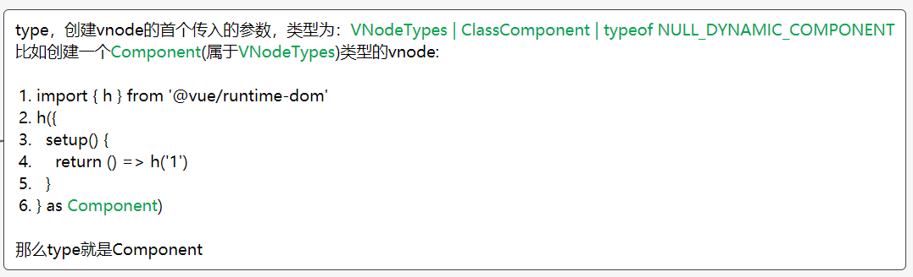

# 51 - 86147d1 重构server路径

```server```端，名称统一改成```node```端，即更改路径/文件夹名称

新增了两个文件:

- ```src/node/build.ts```：后续分析

- ```src/node/index.ts```: `export * from './server'`


# 52 - 0ea7970 ```rollup```与```postcss```，添加`vite build`打包功能

## ```package.json```

### ```postcss```

一个转换使用```js```来转换```css```的工具

### ```cssnano```

```postcss```插件，优化体积

### rollup

打包管理

## ```bin/vite.js```

错误处理，当端口被占用，抛出error，重新使用新的端口运行服务

## 新增```node/build.ts```

使用```rollup```进行打包。引入```rollup```的方式很特别，有效减少打包vite这个工具包的体积（如文字说，```import```的作用仅仅是当作```type```来使用，会被```treeShaking```掉，可以构建后查看```build.js```，```rollup```的引入会被去除）

``````typescri
function build() {
  // ...
  // lazy require rollup so that we don't load it when only using the dev server
  // importing it just for the types
  const rollup = require('rollup').rollup as typeof Rollup
}
``````

### 关于rollup

有兴趣的可以了解一下[代码分割](https://rollup.docschina.org/guide/zh/#%E4%BB%A3%E7%A0%81%E5%88%86%E5%89%B2)

#### vitePlugin (rollup的插件)

> resolveID这种就是解析文件地址的意思，我们可以返回我们想返回的文件id(也就是地址，相对路径、决定路径)来让rollup加载。
>
> resolveID属于hookFirst钩子类型，如果返回null或者undefinded，下一个plugins的resolveId将不会被运行。也就是说谁按照顺序，处理冲突。

```typescript
const vitePlugin: Plugin = {
    name: 'vite', // warning与error会被标识为该名称
    resolveId(id: string) { // 转换id名称，如果返回Null，则不做任何处理。
      if (id.startsWith('/')) {
        if (id === hmrClientPublicPath) {
          return hmrClientPublicPath
        } else {
          return id.startsWith(root) ? id : path.resolve(root, id.slice(1))
        }
      } else if (id === 'vue') {
        if (inlineVue) {
          return resolveVue(root, true).vue
        } else {
          return {
            id: cdnLink,
            external: true
              // 设置为true，将会被设置为相对路径
              // https://github.com/rollup/rollup/issues/3940
              // 比如转换为： import"https://unpkg.com/vue@3.0.0-beta.4/dist/vue.esm-browser.prod.js";
          }
        }
      }
    },
    // https://www.rollupjs.com/guide/plugin-development#load
    load(id: string) { // 返回sourcecode，同上，如果为Null，则不做处理
      if (id === hmrClientPublicPath) {
        return `export function hot() {}` // source code
      } else if (id === indexPath) {
        let script = ''
        let match
        
        // 收集index.html外部的js
        while ((match = scriptRE.exec(indexContent))) {
          // TODO handle <script type="module" src="..."/>
          // just add it as an import
          script += match[1]
        }
        return script
      }
    }
  }
```

目前没看出什么东西，对应的文件处理是```hmr```(本质就是```client/client.ts```)与```index.html```

### cssExtractPlugin

收集所有```styles code```，粘连所有```styles code```，生成一个```css```文件。

需要放在处理SFC的Plugins的后面。

```typescript
const cssExtractPlugin: Plugin = {
    name: 'vite-css',
    transform(code: string, id: string) {
      if (id.endsWith('.css')) {
        styles.set(id, code)
        return '/* css extracted by vite */'
      }
    }
  }
```

### rollup-plugin-vue

处理SFC（在```dev```环境，我们可以借助```@vue/compiler-sfc```，来处理）。

有兴趣的可以看这里：

https://github.com/vuejs/rollup-plugin-vue/blob/next/src/index.ts

和我们```dev```同一个作用。

### @rollup/plugin-node-resolve

处理Node的第三方包。

### @rollup/plugin-replace

打包的时候，修改字符串。

```typescript
require('@rollup/plugin-replace')({
        'process.env.NODE_ENV': '"production"'
})
```

### rollup-plugin-terser

压缩代码。

```typescript
// 类型
type Last<T extends any[]> = [never, ...T][T['length']]
```

### rollup配置options

```typescript
{
    // TODO
    // parse index.html
    // find entry file or script
    // if inline script, create a temp main file next to it before bundling
    input: path.resolve(root, 'index.html'), // rollup也可以处理html文件
    plugins: [
      vitePlugin,
      require('rollup-plugin-vue')(),
      require('@rollup/plugin-node-resolve')({
        rootDir: root
      }),
      require('@rollup/plugin-replace')({
        'process.env.NODE_ENV': '"production"'
      }),
      cssExtractPlugin,
      require('rollup-plugin-terser').terser()
    ]
  }
```

```typescript
const { output } = await bundle.generate({
    dir: outDir,
    format: 'es'
})
```

### 过程

```vitePlugin```中的```load```方法并未处理```src```资源，仅处理了标签内的内容
```<script src="main.js">console.log(1)</script>```

**但是我们可以把```console.log(1)```变成```import 'main.js'```，这样就可以完整打包vue程序了。**

```typescript
// vitePlugins中的load方法

let script = ''
et match
console.log(indexContent)
while ((match = scriptRE.exec(indexContent))) {
  // TODO handle <script type="module" src="..."/>
  // just add it as an import
  script += match[1]
}
return script
```

- 配置好```rollup```，删除旧的文件夹后，创建出新的空的文件夹(生成代码的位置)，这个步骤是，vite需要再对输出的文件改写。

- 植入```css```文件到```html文件模板```。


```typescript
`<link rel="stylesheet" href="/${filename}">`
// 注意是link
```

- ```rollup```打包出来的```css```，全部字符串堆起来，交给```postcss```与```postcss```的插件处理，并生成css文件（等于改写）。

- 检测有没有本地vue包，没有则cdn ```https://unpkg.com/vue@${vueVersion}/dist/vue.esm-browser.prod.js```，以```<script src="" >```的形式

- rollup打包出来的js，不改写，但是在```html```模板植入```<script/>```标签。

- 最后，根据```html模板```（注入```<link/> <script/>```），生成```html```文件。

## node/resolveVue.ts

根据打包环境，如果运行在浏览器，则使用```esm-browser```包，如果在node环境，则使用```esm-bundler```，**后者不带编译器**，减少体积。


# 53 - 7444c3e `--root src`

修改测试的命令，路径为`src`。

## 再细谈文件改动

```typescript
watcher.on('change', async (file) => {
    const timestamp = Date.now()
    const servedPath = '/' + path.relative(root, file)
    if (file.endsWith('.vue')) {
        // 处理vue文件
      handleVueSFCReload(file, servedPath, timestamp)
    } else {
        // 处理js文件
      handleJSReload(servedPath, timestamp)
    }
  })
```

### ```handleVueSFCReload```

1. 根据文件路径，询问```vueCache```这个```Set```是否有缓存，有则返回缓存```vue```文件（该文件正是```SFC组件```被```vuePlugins```处理好的```js```文件，如果不懂，可以理解为使用```vue-loader```转换```A.vue```组件为```js版本```的组件）。这里取缓存的作用是来分析```SFC```哪块标签变动，准确发送事件，性能优化。

2. 因为文件已经改动了，所以删除缓存结果```vueCache.del(file)```

3. ```parseSFC```，读取```vueCache```缓存(没有缓存了，被上一步删除了，在**文件改动中**无效，已验证)，```SFC```转换成```js```组件处理

4. ```parseSFC```对于一些有BUG的```SFC组件```，无法处理，那么就不会返回```descriptor```这个字段，就是说流程结束。

5. 如果```SFC组件```被成功转换成```js组件```：
   ```<script>```变动：发送```vue-reload事件```（**更新字段，通知父组件重新渲染vnode**，```instance.update```，如忘了这些事件，请查看**commit-6**的```reload事件```）

   ```typescript
   import { updateStyle } from "/@hmr"
   
   import { render as __render } from "/Child.vue?type=template&t=1627148468989&t=1627148468989"
   __script.render = __render
   __script.__scopeId = "data-v-92a6df80"
   __script.__hmrId = "/Child.vue"
   __script.__file = "E:\\vite\\test\\fixtures\\Child.vue"
   export default __script
   
   // 更新的字段就是render __hmrId __file
   ```

   ```<template>```变动：发送```vue-rerender```事件（**重新渲染自身组件vnode**，```instance.update```，[commit-6-rerender](https://github.com/Kingbultsea/vite-analysis/blob/a1a7c85a55909ac4457dc2fe40f3eebdccec2ad1/readme.md#%E5%85%B3%E4%BA%8Ererender%E4%BA%8B%E4%BB%B6)）

   ```<style>```变动：
     如果标签内的属性```scoped```变动，发送```vue-reload```事件，去除```js组件```的```__scopeId```;
     如果内容改变，则发送```vue-style-update```事件；

     ```typescript
     function updateStyle(id: string, url: string) {
       const linkId = `vite-css-${id}`
       let link = document.getElementById(linkId)
       if (!link) {
         link = document.createElement('link')
         link.id = linkId
         link.setAttribute('rel', 'stylesheet')
         link.setAttribute('type', 'text/css')
         document.head.appendChild(link)
       }
       link.setAttribute('href', url)
     }
     ```

   如果旧的```<styles/>```标签数量多于新的，则发送```vue-style-remove```事件；

   ```typescript
   case 'vue-style-remove':
         const link = document.getElementById(`vite-css-${id}`)
         if (link) {
           document.head.removeChild(link)
         }
         break
   ```

### ```handleJSReload```

1. 分析```importerMap```，取出所有```import```了**当前文件的文件路径**。
2. 如果引入方为```vue```文件，触发```vue-reload```
3. 如果非`vue`文件（就当是`js`文件），分析是谁引入该`js`文件（称它为`importer`），如果是`vue`组件引入了，则保存在一个数组中，后续遍历触发`vue-reload`事件。如果是`js`文件引入了，且分析`isHMRBoundary`是否有该文件，如果有，则保存在一个数组中，后续遍历触发`js-update`。以上都没有，则查看`importer`是否有`父importer`，有则重复调用一次该过程`importee`更改为`父importer`，没有则触发`full-reload`。

#### 什么是isHMRBoundary?

```typescript
# fc.js源文件
import { foo } from './foo.js'
import { hot } from '@hmr'

foo()

hot.accept('./foo.js', ({ foo }) => { // callBack
  // the callback receives the updated './foo.js' module
  foo()
})
```

`foo.js`，可以分析出`importer`为`fc.js`，`isHMRBoundary`会查找fc.js为键的值（一个Set）是否包含`foo.js`，包含则触发`callback`，不包含则（根据上面文件`import`语句）重复`3`的过程，`importee`从`foo.js`改为`fc.js`。

windows中存在BUG，需要修改:

```typescript
watcher.on('change', async (file) => {
    const timestamp = Date.now()
    console.log(root, file)
    const servedPath = '/' + path.relative(root, file)
    if (file.endsWith('.vue')) {
      handleVueSFCReload(file, servedPath, timestamp)
    } else {
        // savedPath 需要替换 '/' 为 '\'
      handleJSReload(servedPath, timestamp)
    }
  })
```


# 54 - e8f9175 chore

更新rollup-plugin-vue包

```json
{
-    "rollup-pkugin-vue": "6.0.0-alpha.1"
+    "rollup-pkugin-vue": "6.0.0-alpha.1"
}
```


# 55 - fbbdb19 `vue`组件支持`css module`

```vue
<style module>
    .foo {
        color: red;
    }
</style>
```

```typescript
export declare interface SFCStyleBlock extends SFCBlock {
    type: 'style';
    scoped?: boolean;
    module?: string | boolean;
}
```

```css-module```原理是生成一个js文件:

```typescript
export default {"foo":"_foo_dq1k9_3"}
```

使用的时候访问```$style.foo```，即返回```_foo_dq1k9_3```

```js
import { updateStyle } from "/@hmr"

import Child from './Child.vue'
import tool from './tool.js'

const __script = {
  components: { Child },
  setup() {
    return {
      count: 2
    }
  }
}

const __cssModules = __script.__cssModules = {}
import __style0 from "/Comp.vue?type=style&index=0&module"
__cssModules["$style"] = __style0
updateStyle("92a6df80-0", "/Comp.vue?type=style&index=0")
import { render as __render } from "/Comp.vue?type=template"
__script.render = __render
__script.__hmrId = "/Comp.vue"
__script.__file = "E:\\vite\\test\\fixtures\\Comp.vue"
export default __script
```

## `vue css module`知识

```typescript
const publicPropertiesMap: Record<
  string,
  (i: ComponentInternalInstance) => any
> = {
  $: i => i,
  $el: i => i.vnode.el,
  $data: i => i.data,
  $props: i => (__DEV__ ? shallowReadonly(i.props) : i.props),
  $attrs: i => (__DEV__ ? shallowReadonly(i.attrs) : i.attrs),
  $slots: i => (__DEV__ ? shallowReadonly(i.slots) : i.slots),
  $refs: i => (__DEV__ ? shallowReadonly(i.refs) : i.refs),
  $parent: i => i.parent && i.parent.proxy,
  $root: i => i.root && i.root.proxy,
  $emit: i => i.emit,
  $options: i => (__FEATURE_OPTIONS__ ? resolveMergedOptions(i) : i.type),
  $forceUpdate: i => () => queueJob(i.update),
  $nextTick: () => nextTick,
  $watch: __FEATURE_OPTIONS__ ? i => instanceWatch.bind(i) : NOOP
}
```

当我们访问属性```$style```的时候，即是访问```instance.proxy.$style```(vue-next的知识，和普通熟悉访问```data```是一样的，只不过做了一个特殊处理```$```开头命名的变量)，我们询问```publicPropertiesMap```中有没有```$style```这个东西，发现没有，则代表访问```type.__cssModules```:

``````typescript
// # vue-next源码 instance.proxy handle部分

const publicGetter = publicPropertiesMap[key]
    let cssModule, globalProperties
    // public $xxx properties
    if (publicGetter) {
      if (key === '$attrs') {
        track(instance, TrackOpTypes.GET, key)
        __DEV__ && markAttrsAccessed()
      }
      return publicGetter(instance)
    } else if (
      // css module (injected by vue-loader)
      (cssModule = type.__cssModules) &&
      (cssModule = cssModule[key])
    )
``````



## 关于这一块的HMR

处理SFC组件的时候，添加了

```typescript
const __cssModules = __script.__cssModules = {}
import __style0 from "/Comp.vue?type=style&index=0&module"
__cssModules["$style"] = __style0
updateStyle("92a6df80-0", "/Comp.vue?type=style&index=0")
```

如果我们在```<style>```标签上添加，或者删除属性，```client```端都会触发```vue-style-update```事件，这表示如果**删除**，并不会引起任何```js```上的改变，也就是说```__cssModules["$style"] = __style0```依旧存在，这与```scopedId```是同理的。

注：新增会触发```vue-reload```事件（```!isEqual(descriptor.script, prevDescriptor.script)```引起的）


# 55 - b6d1d06 错误提示 （不小心写到55了，实际是56）

在各种错误捕获中，增加提示。


# 56 - 5a7a4e2 在plugin-vue中使用css预处理器

```typescript
plugins:[
    // ...
    require('rollup-plugin-vue')({
        // TODO: for now we directly handle pre-processors in rollup-plugin-vue
        // so that we don't need to install dedicated rollup plugins.
        // In the future we probably want to still use rollup plugins so that
        // preprocessors are also supported by importing from js files.
        preprocessStyles: true,
        preprocessCustomRequire: (id: string) => require(resolve(root, id))
        // TODO proxy cssModules config
      })
    // ...
]
```

在处理```SFC组件```中使用预处理器，这样我们就不需要在```rollup```中使用```css预处理器```了

[rollup-plugin-vue配置传送门](https://github.com/vuejs/rollup-plugin-vue#options)


# 57 - 3ba7e8e 修改readme

从版本^0.5.0开始，你可以运行vite build打包应用程序并将其部署到生产环境中。

在内部，我们使用一个默认配置来生成构建。目前有意没有公开方法来配置构建——但我们可能会在稍后阶段解决这个问题。


# 58 - 300af62 发布v0.5.0

release v0.5.0


# 59 - 63e5e28 修改变量名称

把```inlineVue```**变量名称**修改为```cdn```，```inlineVue```字段代表是否有本地```node_modules```里的```vue```包，没有则使用```cdnLink```。

```typescript
let inlineVue = !resolveVue(root).hasLocalVue // inlineVue -> cdn
if (inlineVue) { // inlineVue -> cdn
  // 使用cdnLink
}
```

根据代码上看，更符合语义。


# 60 - b3d69b1 使`cdn`与`vite`环境下的`vue`版本保持一致

使```cdn```上的```vue```版本与使用`vite`开发的```vue```版本一致。

## 疑惑点：都已经有本地包了，不会使用```cdn```了，再引入version有何意义？

**不是这样的**，```version```字段，在没有本地`Vue`包的时候，会使用```require('vue/package.json').version```，**这样就可以寻找到`vite`开发所依赖的`vue`包的版本号**。

