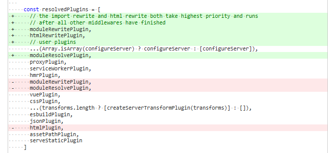
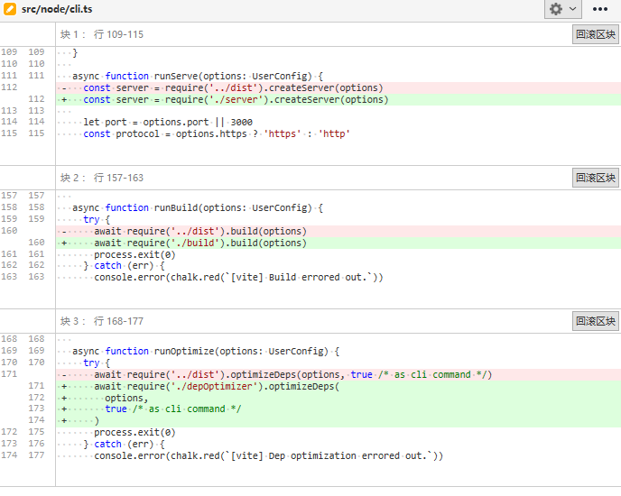

# 511 - 8a9710b 如果`index.html`不存在，则设置`ctx.url`为`/index.html`

- `node/server/serverPluginServerStatic.ts`：`history API fallback`中如果`index.html`不存在，则重定向`url`（详 **改动一**）

### 改动一

即`history API fallback`如果符合条件跳转，但是`index.html`不存在，则设置404，且重定向到`/index.html`。

```typescript
try {
    await send(ctx, `index.html`)
} catch(e) {
    ctx.url = '/index.html'
    ctx.status = 404
    return next()
}
```

> 这并不叫重定向，只是`ctx`洋葱模型中知道ctx.url被设置了，但是浏览器回收到404，不是浏览器重定向，如果想要浏览器重定向，要使用` ctx.redirect('/index.html')`;`ctx.status = 302`

tips: 301: 旧地址A的资源不可访问了(永久移除), 重定向到网址B，搜索引擎会抓取网址B的内容，同时将网址保存为B网址。 302: 旧地址A的资源仍可访问，这个重定向只是临时从旧地址A跳转到B地址，这时搜索引擎会抓取B网址内容，但是会将网址保存为A的。


# 512 - 4a0b6cc 配置参数`cssCodeSplit`

- 遗留`cssCodeSplit`在代码中参数传递，默认`true`。
- `node/build/index.ts`：`ssrBuild`中设置`rollupInputOptions.entryFileNames = '[name].js'`


# 513 - 0eb7c2f changelog

## [0.16.5](https://github.com/vuejs/vite/compare/v0.16.4...v0.16.5) (2020-05-21)

### Bug Fixes

- index.html不存在则设置`ctx.url = '/index.html'` ([df733d9](https://github.com/vuejs/vite/commit/df733d9cd93ad1d1d01c11b8b7a3a9659a7b9cbf))
- 完善`cssCodeSplit`选项([3751551](https://github.com/vuejs/vite/commit/375155164ec68c78f07fc57d34cdc477249dc3a2))


# 514 - 83697cc v0.16.5

release v0.16.5


# 515 - 03b0ce5 changelog

## [0.16.6](https://github.com/vuejs/vite/compare/v0.16.4...v0.16.6) (2020-05-21)

### Bug Fixes

- 依赖优化下，被标记为外部引入的包需要调用`resolver.alias`转换，修复开发环境引入所导致的问题([#218](https://github.com/vuejs/vite/issues/218)) ([a1f5488](https://github.com/vuejs/vite/commit/a1f54889a95a24f89804b0fbdfc876cde5615c98))
- index.html不存在则设置`ctx.url = '/index.html'`([8a9710b](https://github.com/vuejs/vite/commit/8a9710b1a90cadfa69889cf00c224ea41ca13a9f))
- 完善`cssCodeSplit`选项 ([4a0b6cc](https://github.com/vuejs/vite/commit/4a0b6cc573840f3f74ac4f1b59bc957f1c626a92))

> 还是第一次见尤打发版本遗漏了，即0.16.5的描述是不完善的，所以重新发一次，而不是删除v0.16.5，我之前发版会进行一个删除，免得难看。


# 516 - b0b0734 v0.16.6

release v0.16.5


# 517 - 457f1f2 `ssrBuild`的`cssCodeSplit`选项为`false`

不深入研究SSR。


# 518 - e741628 洋葱模型调整（更新-3）

本次提高可以把`import`路径重写的功能提高最高优先级（最后执行，洋葱模型第一层的外层为最后执行）。

`htmlPlugin`更名为`htmlRewritePlugin`，这个插件仅比`moduleRewritePlugin`第一级，它只处理改写`html`，资源在第13层中会配置，`await readBody(ctx.body)`可以获取到。




```typescript
const resolvedPlugins = [
    moduleRewritePlugin,      // 洋葱模型的第一层  （外层） --》》》
    htmlRewritePlugin,        // 洋葱模型的第二层  （外层）
    ...(Array.isArray(configureServer) 
        ? configureServer 
        : [configureServer]), // 洋葱模型的第三层  （自定）
    moduleResolvePlugin,      // 洋葱模型的第四层  （里层）
    proxyPlugin,              // 洋葱模型的第五层  （里层）
    serviceWorkerPlugin,      // 洋葱模型的第六层  （里层）
    hmrPlugin,                // 洋葱模型的第七层  （里层）
    vuePlugin,                // 洋葱模型的第八层  （里层）
    cssPlugin,                // 洋葱模型的第九层  （里层）
    ...(transforms.length 
        ? 
        [createServerTrans
         formPlugin(transforms)
        ] : []),              // 洋葱模型的第10层  （外层）--》》》
    esbuildPlugin,            // 洋葱模型的第11层  （外层）--》》》
    jsonPlugin,               // 洋葱模型的第12层  （里层）--》》》
    assetPathPlugin,          // 洋葱模型的第13层  （里层）--》》》
    serveStaticPlugin         // 洋葱模型的第14层  （里层）--》》》
  ]

// 旧的 第二版
const internalPlugins: Plugin[] = [
  ...config.plugins,     // 洋葱模型的第一层  （自定）
  hmrPlugin,             // 洋葱模型的第二层  （里层）  
  moduleRewritePlugin,   // 洋葱模型的第三层  （外层） --
  moduleResolvePlugin,   // 洋葱模型的第四层  （里层）
  vuePlugin,             // 洋葱模型的第五层  （里层）
  esbuildPlugin,         // 洋葱模型的第六层  （外层） --
  jsonPlugin,            // 洋葱模型的第七层  （外层） --
  cssPlugin,             // 洋葱模型的第八层  （外层） --
  assetPathPlugin        // 洋葱模型的第九层  （里层） 
  ServerTransformPlugin, // 洋葱模型的第十层  （外层） -- 
  serveStaticPlugin      // 洋葱模型的第十一层（里层）
]
```

> 根据重要性决定是里层还是外层，像一些资源获取，都是里层，放到最后，可以让资源到前面几层中没有击中目标后再处理


# 519 - 4637556 chore，调用脚本直接使用名称

`node`是支持默认寻找`index.js`的。




# 520 - 029de6b 不要改写Fragment类型的url资源

`node/utils/cssUtils.ts`：`url(#XXXX)`，不需要改写。

> `css`里有一个`filter: url(#svg)`，表示svg元素id。

