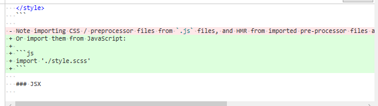
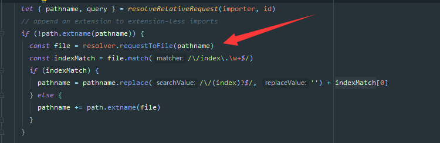
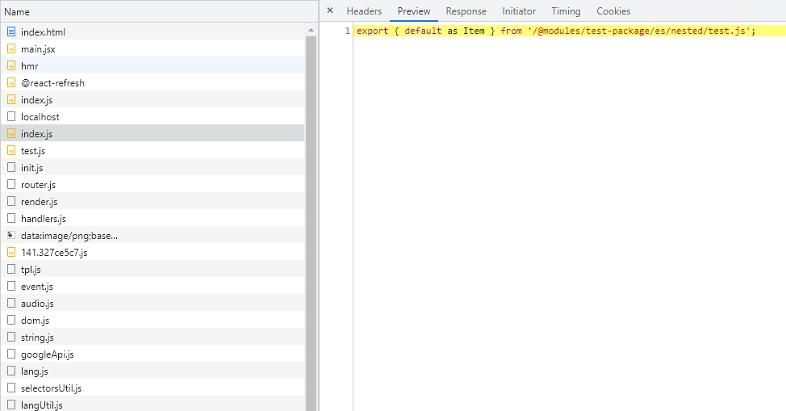

# 521 - 89fe0a9 支持从`.env`文件加载`env`属性 [#223](https://github.com/vitejs/vite/issues/223)

改动部分：

- `package.json`：新增`dotenv`包，`Dotenv `是一个零依赖模块，它将环境变量从` .env `文件加载到 `process.env` 中。
- `node/config.ts`：新增`env`，类型为`DotenvParseOutput`，可以直接通过`vite.config`配置，不需要`.env`文件；检测项目启动路径下的`.env`文件，有则直接调用`require('dotenv').config()`，同时覆盖`config.env`为`dotenv`配置后的对象字段。
- `node/build/index.ts`：与`NODE_ENV: 'production'`合并`config.env`，替换`process,env`。
- `node/server/serverPluginHtml.ts`：与`NODE_ENV: 'development'`合并`config.env`，替换`client`端的`window.process`。
- 添加serve的测试。


# 522 - 1be6121 修正build环境下的`env`替换

改动部分：

- `node/build/index.ts`：合并的代码更改（详 **改动一**）

### 改动一

```typescript
env.NODE_ENV = 'production'
const envReplacements = Object.keys(env).reduce((replacements, key) => {
    replacements[`process.env.${key}`] = JSON.stringify(env[key])
}, {} as Record<string, string>)

// rollup vite:replace插件
{
    ...envReplacements, // 优先替换
    'process.env.': `({}).`  // 默认空对象
}
```

> 构建是字符串的替换，serve下是一整个对象，所以方式不一样


# 523 - b96ed68 不应该更换依赖包内的字符串

改动部分：

- `node/build/index.ts`：在`createReplacement`中，判断id是不是带有`node_modules`，是则不进行替换。

> 外部调用是传递`callBack`，所以能获取到`rollup`的`id`。


# 524 - c493629 [#227](https://github.com/vitejs/vite/issues/227) 修复条件导出下无法引入package.json的BUG

改动部分：

- `node/resolver.ts`：方法名称更改`resolveNodeModuleEntry` -> `resolveNodeModule`，支持寻找不在`node_modules`或没有`package.json`的包（详 **改动一**）

> [conditional exports](https://nodejs.org/api/packages.html#conditional-exports)：条件导出。在windows下没有遇到这问题，node把`package.json`当成路径了，比如我们需要设置为`{ "package.json": { "default": "package.json" }  }`才能取得`package.json`
>
> [react-native #1168](https://github.com/react-native-community/cli/issues/1168#issuecomment-628034263)
>
> ```
> Uncaught:
> Error [ERR_PACKAGE_PATH_NOT_EXPORTED]: Package subpath './package.json' is not defined by "exports" in /Users/foobar/my-react-project/node_modules/utils-ts/package.json
> ```

### 改动一

通过`require.resolve`寻找`pkg1/package.json`，假如寻找不了，则寻找
`resuire.resolve('pkg1', { paths: [root] })`，
取得完整路径后，拼接出`XXXX/.node_modules/pkg1/package.json`。

```typescript
E:\vite\playground\node_modules\pkg1\index.js
E:\vite\playground\node_modules\pkg1\package.json
```


# 525 - daa2ddd 更新`circleci`状态，`url`

更新`circleci`状态。


# 526 - bef67f5 [#220](https://github.com/vitejs/vite/pull/220) 使用`vue`的内置预处理器

主要改动：

- 去除引入`postcss`预处理器，统一通过`@vue/compiler-sfc`下的`compileStyleAsync`进行处理。
- 用户定义的插件不再支持`css`的转换，所有`css`默认使用`postcss`。

> 实际也是`postcss`，只不过省掉了`vite`下再次`requrie`，把代码封装起来。

改动部分：

- `node/transform.ts`：as字段去除`css`，即用户不能再对`css`进行转换
- `node/build/buildPluginCss.ts`：默认转换`/(.+).(css|less|sass|scss|styl|stylus)$/`后缀`id`（详 **改动二**）
- `node/server/serverPluginCss.ts`：监听`/(.+).(css|less|sass|scss|styl|stylus)$/`后缀的文件变动，同build模式的转换。（详 **改动三**）
- `node/server/serverPluginHmr.ts`：去除`cssTransforms`，改由**非**`/(.+).(css|less|sass|scss|styl|stylus)$/`监听文件触发`hmr`。
- `server/serverPluginVue.ts`：改由`compilerCss`来处理SFC下的`<style>`，监听style的进行`hmr`的逻辑被丢到`node/server/serverPluginCss.ts`。
- `node/utils/cssUtils.ts`：新增`comiplerCss`方法，一个封装`compileStyleAsync`逻辑的`css`预处理器。（详 **改动六**）

> `compileCss`遇到`.css` | `非.module.css` | `没有postcss.config配置`，不会进行任何转换，直接返回本身作为结果

### 改动二

主要是去除了`transfrom`，统一使用被封装的`compileCss`

```typescript
async transform(css: string, id: string) {
  if (id.endsWith('.css') || cssPreprocessLangRE.test(id)) {
    const result = await compileCss(root, id, {
      id: '',
      source: css,
      filename: path.basename(id),
      scoped: false,
      modules: id.endsWith('.module.css'),
      preprocessLang: id.replace(cssPreprocessLangRE, '$2') as any
    })

    let modules: SFCStyleCompileResults['modules']
    if (typeof result === 'string') {
      css = result
    } else {
      if (result.errors.length) {
        console.error(`[vite] error applying css transforms: `)
        result.errors.forEach(console.error)
      }
      // css moduels
      css = result.code
      modules = result.modules
    }

    // process url() - register referenced files as assets
    // and rewrite the url to the resolved public path
    if (urlRE.test(css)) {
      const fileDir = path.dirname(id)
      css = await rewriteCssUrls(css, async (rawUrl) => {
        const file = path.posix.isAbsolute(rawUrl)
          ? path.join(root, rawUrl)
          : path.join(fileDir, rawUrl)
        const { fileName, content, url } = await resolveAsset(
          file,
          root,
          publicBase,
          assetsDir,
          inlineLimit
        )
        if (fileName && content) {
          assets.set(fileName, content)
        }
        debug(
          `url(${rawUrl}) -> ${
            url.startsWith('data:') ? `base64 inlined` : `url(${url})`
          }`
        )
        return url
      })
    }

    styles.set(id, css)
    return {
      code: modules
        ? `export default ${JSON.stringify(modules)}`
        : cssCodeSplit
        ? // If code-splitting CSS, inject a fake marker to avoid the module
          // from being tree-shaken. This preserves the .css file as a
          // module in the chunk's metadata so that we can retrive them in
          // renderChunk.
          `${cssInjectionMarker}()\n`
        : ``,
      map: null
    }
  }
},
```

### 改动三

```typescript
async function processCss(root: string, ctx: Context) {
  let css = (await readBody(ctx.body))!

  const result = await compileCss(root, ctx.path, {
    id: '',
    source: css,
    filename: resolver.requestToFile(ctx.path),
    scoped: false,
    modules: ctx.path.endsWith('.module.css'),
    preprocessLang: ctx.path.replace(cssPreprocessLangRE, '$2') as any
  })

  if (typeof result === 'string') {
    processedCSS.set(ctx.path, { css })
    return
  }

  if (result.errors.length) {
    console.error(`[vite] error applying css transforms: `)
    result.errors.forEach(console.error)
  }

  result.code = await rewriteCssUrls(result.code, ctx.path)

  processedCSS.set(ctx.path, {
    css: result.code,
    modules: result.modules
  })
}
```

### 改动六

```typescript
export const cssPreprocessLangRE = /(.+).(less|sass|scss|styl|stylus)$/

export async function compileCss(
  root: string,
  publicPath: string,
  {
    source,
    filename,
    scoped,
    modules,
    preprocessLang
  }: SFCAsyncStyleCompileOptions
): Promise<SFCStyleCompileResults | string> {
  const id = hash_sum(publicPath)
  const postcssConfig = await loadPostcssConfig(root)
  const { compileStyleAsync } = resolveCompiler(root)

  if (publicPath.endsWith('.css') && !modules && !postcssConfig) {
    // 纯css 
    return source
  }

  return await compileStyleAsync({
    source,
    filename,
    id: `data-v-${id}`,
    scoped,
    modules,
    modulesOptions: {
      generateScopedName: `[local]_${id}`
    },
    preprocessLang: preprocessLang,
    preprocessCustomRequire: (id: string) => require(resolveFrom(root, id)),
    ...(postcssConfig
      ? {
          postcssOptions: postcssConfig.options,
          postcssPlugins: postcssConfig.plugins
        }
      : {})
  })
}
```


# 527 - 33c6bc2 chore更新`readme`中可以直接使用`.scss`

开箱即用。


# 528 - 7a3e822 [#230](https://github.com/vitejs/vite/pull/230) `requestToFile`在包的入口被改写下，需要返回真正的路径（无效的PR，需要修复一下路径）

在改写路径的插件中`serverPluginModuleRewrite`，会根据`importer`，与`import`路径的合并，得出文件所在位置，即`resolveRelativeRequest`方法。

但是`resolveRelativeRequest`遇到没有后缀拓展名称的`importer`，会把最后一层路径给去除(即`path.dirname(importer)`)。

比如现在有一个包为`pkg`，入口为`./index.js`：

```typescript
# main.js 我们引入pkg
import 'pkg'

pkg |
    |- index.js
    |- A
       |- index.js
       |- index2.js
# pkg/index.js
import './A'

# pkg/A/index.js
import './index2.js'
```

会被改写为：

```typescript
# main.js 我们引入pkg
import '/@modules/pkg/index.js'

pkg |
    |- index.js
    |- A
       |- index.js
       |- index2.js

# pkg/index.js
// importer为'/@modules/pkg/index.js'，
// resolveRelativeRequest合并得 '/@modules/pkg/A'
// 拓展名检测resolver.requestToFile，
// 经defaultRequestToFile的path.join(root, publicPath.slice(1)) ‘你的项目/@modules/pkg/A'
// 经resolveExt得 ‘你的项目/@modules/pkg/A'
// ‘你的项目/@modules/pkg/A'没有拓展名称，不做任何处理
// 所以结果为resolveRelativeRequest得出的'@modules/pkg/A'
// _______后面会详细说________，defaultRequestToFile里本意是去除@modules,返回原本file路径
import '@modules/pkg/A'

# pkg/A/index.js
// importer为'@modules/pkg/A'
// resolveRelativeRequest合并得'@modules/pkg/index2.js’
import '@modules/pkg/index2.js’
```

`'@modules/pkg/index2.js’`根本就不存在，所以寻找不了，程序崩溃。

那我们是不是应该修复`resolveRelativeRequest`可以得出正确的import文件路径？

`vite`在检测到`resolveRelativeRequest`返回的路径没有后缀拓展名称(**修复后不会没有后缀，所以不会出现该情况**)，会进行以下代码，尝试添加后缀拓展名称：

```typescript
// append an extension to extension-less imports
    if (!path.extname(pathname)) {
      const file = resolver.requestToFile(pathname)
      const indexMatch = file.match(/\/index\.\w+$/)
      if (indexMatch) {
        pathname = pathname.replace(/\/(index)?$/, '') + indexMatch[0]
      } else {
        pathname += path.extname(file)
      }
    }
```

我们不能通过`resolveRelativeRequest`来修复(**修复后不会没有后缀，所以不会出现该情况**)，因为我们需要知道`import './A'`，想要引入的到底是哪个文件，就必须通过`resolver.requestToFile`来检测，在上述例子中，正确的检测为`A/index.js`。

`resolver.requestToFile`里又调用了`defaultRequestToFile`：

```typescript
const defaultRequestToFile = (publicPath: string, root: string): string => {
  // 遇到开头为@modules直接去除，idToFileMap寻找原本file路径
  if (moduleRE.test(publicPath)) {
    const moduleFilePath = idToFileMap.get(publicPath.replace(moduleRE, ''))
    if (moduleFilePath) {
      return moduleFilePath
    }
  }
    
  // 去除第一位，如 /@modules/ABC 去除 /ABC 中的 / 即得出ABC
  return path.join(root, publicPath.slice(1))
}
```

把`resolveRelativeRequest`得出的路径，比如上述例子`'/@modules/pkg/A'`，改造成为`你的项目位置/pkg/A`，我们想做的动作是：

寻找`'/@modules/pkg/A'`的真正入口是哪里，即

`idToFileMap.get(publicPath.replace(moduleRE, ''))`，但是`'/@modules/pkg/A'`还没有被`serverPluginModuleResolve`处理，建立`id`与文件入口的关系。

所以，我们在`idToFileMap`获取不到文件路径的情况下，去主动调用`serverPluginModuleResolve`的寻找包入口并建立id与文件路径的逻辑。

```typescript
const defaultRequestToFile = (publicPath: string, root: string): string => {
  if (moduleRE.test(publicPath)) {
    const id = publicPath.replace(moduleRE, '')
    const cachedModuleFilePath = idToFileMap.get(id)
    if (cachedModuleFilePath) {
      return cachedModuleFilePath
    }
    const resolved = resolveNodeModuleFile(root, id)
    if (resolved) {
      idToFileMap.set(id, resolved)
      return resolved
    }
  }
  return path.join(root, publicPath.slice(1))
}
```

当前还需要修改：



```typescript
if (moduleRE.test(pathname)) {
        pathname = file.replace(root, '/@modules').replace(/\\/g, '/')
      } else {
        const indexMatch = file.match(/\/index\.\w+$/)
        if (indexMatch) {
          pathname = pathname.replace(/\/(index)?$/, '') + indexMatch[0]
        } else {
          pathname += path.extname(file)
        }
      }
```

即检测到是模块，则直接替换文件路径，而不是添加后缀。



成功！想要自己修复的可以去玩一下：https://github.com/csr632/test-vite/tree/wrong-resolve


# 529 - 312faee 去除`css transform`类型

`css`的`transfrom`已废弃，需要在类型中去除。


# 530 - 5eea84d changelog

- ## [0.16.7](https://github.com/vuejs/vite/compare/v0.16.6...v0.16.7) (2020-05-22)

  ### Bug Fixes

  - defaultRequestToFile 需要返回真正的包入口file路径 ([#230](https://github.com/vuejs/vite/issues/230)) ([7a3e822](https://github.com/vuejs/vite/commit/7a3e822597b94f8440e7436e3cc54a2764fff4eb)), closes [#228](https://github.com/vuejs/vite/issues/228)
  - ssr build禁止cssCodeSplit  ([457f1f2](https://github.com/vuejs/vite/commit/457f1f2aca32f968f4ffe822633a2b4c49456fd4))
  - css urls 是 hash fragments的情况下不需要改写 ([029de6b](https://github.com/vuejs/vite/commit/029de6b30bfc307d4b02f28703cd8d73a706b1cd))
  - 修正build环境下的`env`替换 ([1be6121](https://github.com/vuejs/vite/commit/1be61219d1e253d6edec812ff7828b69d775c093))
  - 保证rewrite middlewares拥有最高改写权 ([e741628](https://github.com/vuejs/vite/commit/e74162857ad33788f6fa02a4dca863aa7354fc76))
  - 修复条件导出下无法引入package.json的BUG ([c493629](https://github.com/vuejs/vite/commit/c4936290380891353de0581e432389310147a8e0)), closes [#227](https://github.com/vuejs/vite/issues/227)
  - 不应该更换依赖包内的字符串 ([b96ed68](https://github.com/vuejs/vite/commit/b96ed689970a1c0ab87f21c7cdf7d72a12c493c2))
