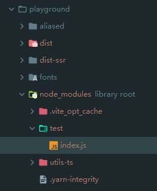

# 521 - 89fe0a9 支持从`.env`文件加载`env`属性 [#223](https://github.com/vitejs/vite/issues/223)

改动部分：

- `package.json`：新增`dotenv`包，`Dotenv `是一个零依赖模块，它将环境变量从` .env `文件加载到 `process.env` 中。
- `node/config.ts`：新增`env`，类型为`DotenvParseOutput`，可以直接通过`vite.config`配置，不需要`.env`文件；检测项目启动路径下的`.env`文件，有则直接调用`require('dotenv').config()`，同时覆盖`config.env`为`dotenv`配置后的对象字段。
- `node/build/index.ts`：与`NODE_ENV: 'production'`合并`config.env`，替换`process,env`。
- `node/server/serverPluginHtml.ts`：与`NODE_ENV: 'development'`合并`config.env`，替换`client`端的`window.process`。
- 添加serve的测试。


# 522 - 1be6121 修正build环境下的`env`替换

改动部分：

- `node/build/index.ts`：合并的代码更改（详 **改动一**）

### 改动一

```typescript
env.NODE_ENV = 'production'
const envReplacements = Object.keys(env).reduce((replacements, key) => {
    replacements[`process.env.${key}`] = JSON.stringify(env[key])
}, {} as Record<string, string>)

// rollup vite:replace插件
{
    ...envReplacements, // 优先替换
    'process.env.': `({}).`  // 默认空对象
}
```

> 构建是字符串的替换，serve下是一整个对象，所以方式不一样


# 523 - b96ed68 不应该更换依赖包内的字符串

改动部分：

- `node/build/index.ts`：在`createReplacement`中，判断id是不是带有`node_modules`，是则不进行替换。

> 外部调用是传递`callBack`，所以能获取到`rollup`的`id`。


# 524 - c493629 [#227](https://github.com/vitejs/vite/issues/227) 支持引入没有`package.json`的包

改动部分：

- `node/resolver.ts`：方法名称更改`resolveNodeModuleEntry` -> `resolveNodeModule`，支持寻找不在`node_modules`或没有`package.json`的包（详 **改动一**）
- `node/depOptimizer.ts`：

### 改动一 支持引入没有`package.json`的包



```typescript
# testTs.ts
// pkg1 
//   |-index.js
import * as from 'pkg1'
```

通过`require.resolve`寻找`pkg1/package.json`，假如没有，则寻找
`resuire.resolve('pkg1', { paths: [root] })`，
取得完整路径后，拼接出`XXXX/.node_modules/pkg1/package.json`。

```typescript
E:\vite\playground\node_modules\test\index.js
E:\vite\playground\node_modules\test\package.json
```

如果没有`package.json`，则默认返回`test`，即被改写为`@modules/test`，后续在`moduleResolve`下会调用`resolveNodeModuleFile`处理路径，即`require.resolve('test', { paths: [root] })`。


# 525 - daa2ddd 更新`circleci`状态，`url`

更新`circleci`状态。


# 526 - bef67f5 [#220](https://github.com/vitejs/vite/pull/220) 使用`vue`的内置预处理器

主要改动：

- 去除引入`postcss`预处理器，统一通过`@vue/compiler-sfc`下的`compileStyleAsync`进行处理。
- 用户定义的插件不再支持`css`的转换，所有`css`默认使用`postcss`。

> 实际也是`postcss`，只不过省掉了`vite`下再次`requrie`，把代码封装起来。

改动部分：

- `node/transform.ts`：as字段去除`css`，即用户不能再对`css`进行转换
- `node/build/buildPluginCss.ts`：默认转换`/(.+).(css|less|sass|scss|styl|stylus)$/`后缀`id`（详 **改动二**）
- `node/server/serverPluginCss.ts`：监听`/(.+).(css|less|sass|scss|styl|stylus)$/`后缀的文件变动，同build模式的转换。（详 **改动三**）
- `node/server/serverPluginHmr.ts`：去除`cssTransforms`，改由**非**`/(.+).(css|less|sass|scss|styl|stylus)$/`监听文件触发`hmr`。
- `server/serverPluginVue.ts`：改由`compilerCss`来处理SFC下的`<style>`，监听style的进行`hmr`的逻辑被丢到`node/server/serverPluginCss.ts`。
- `node/utils/cssUtils.ts`：新增`comiplerCss`方法，一个封装`compileStyleAsync`逻辑的`css`预处理器。（详 **改动六**）

> `compileCss`遇到`.css` | `非.module.css` | `没有postcss.config配置`，不会进行任何转换，直接返回本身作为结果

### 改动二

主要是去除了`transfrom`，统一使用被封装的`compileCss`

```typescript
async transform(css: string, id: string) {
  if (id.endsWith('.css') || cssPreprocessLangRE.test(id)) {
    const result = await compileCss(root, id, {
      id: '',
      source: css,
      filename: path.basename(id),
      scoped: false,
      modules: id.endsWith('.module.css'),
      preprocessLang: id.replace(cssPreprocessLangRE, '$2') as any
    })

    let modules: SFCStyleCompileResults['modules']
    if (typeof result === 'string') {
      css = result
    } else {
      if (result.errors.length) {
        console.error(`[vite] error applying css transforms: `)
        result.errors.forEach(console.error)
      }
      // css moduels
      css = result.code
      modules = result.modules
    }

    // process url() - register referenced files as assets
    // and rewrite the url to the resolved public path
    if (urlRE.test(css)) {
      const fileDir = path.dirname(id)
      css = await rewriteCssUrls(css, async (rawUrl) => {
        const file = path.posix.isAbsolute(rawUrl)
          ? path.join(root, rawUrl)
          : path.join(fileDir, rawUrl)
        const { fileName, content, url } = await resolveAsset(
          file,
          root,
          publicBase,
          assetsDir,
          inlineLimit
        )
        if (fileName && content) {
          assets.set(fileName, content)
        }
        debug(
          `url(${rawUrl}) -> ${
            url.startsWith('data:') ? `base64 inlined` : `url(${url})`
          }`
        )
        return url
      })
    }

    styles.set(id, css)
    return {
      code: modules
        ? `export default ${JSON.stringify(modules)}`
        : cssCodeSplit
        ? // If code-splitting CSS, inject a fake marker to avoid the module
          // from being tree-shaken. This preserves the .css file as a
          // module in the chunk's metadata so that we can retrive them in
          // renderChunk.
          `${cssInjectionMarker}()\n`
        : ``,
      map: null
    }
  }
},
```

### 改动三

```typescript
async function processCss(root: string, ctx: Context) {
  let css = (await readBody(ctx.body))!

  const result = await compileCss(root, ctx.path, {
    id: '',
    source: css,
    filename: resolver.requestToFile(ctx.path),
    scoped: false,
    modules: ctx.path.endsWith('.module.css'),
    preprocessLang: ctx.path.replace(cssPreprocessLangRE, '$2') as any
  })

  if (typeof result === 'string') {
    processedCSS.set(ctx.path, { css })
    return
  }

  if (result.errors.length) {
    console.error(`[vite] error applying css transforms: `)
    result.errors.forEach(console.error)
  }

  result.code = await rewriteCssUrls(result.code, ctx.path)

  processedCSS.set(ctx.path, {
    css: result.code,
    modules: result.modules
  })
}
```

### 改动六

```typescript
export const cssPreprocessLangRE = /(.+).(less|sass|scss|styl|stylus)$/

export async function compileCss(
  root: string,
  publicPath: string,
  {
    source,
    filename,
    scoped,
    modules,
    preprocessLang
  }: SFCAsyncStyleCompileOptions
): Promise<SFCStyleCompileResults | string> {
  const id = hash_sum(publicPath)
  const postcssConfig = await loadPostcssConfig(root)
  const { compileStyleAsync } = resolveCompiler(root)

  if (publicPath.endsWith('.css') && !modules && !postcssConfig) {
    // 纯css 
    return source
  }

  return await compileStyleAsync({
    source,
    filename,
    id: `data-v-${id}`,
    scoped,
    modules,
    modulesOptions: {
      generateScopedName: `[local]_${id}`
    },
    preprocessLang: preprocessLang,
    preprocessCustomRequire: (id: string) => require(resolveFrom(root, id)),
    ...(postcssConfig
      ? {
          postcssOptions: postcssConfig.options,
          postcssPlugins: postcssConfig.plugins
        }
      : {})
  })
}
```


# 527 - 33c6bc2 chore更新`readme`中可以直接使用`.scss`

开箱即用。


# 528 - 7a3e822 [#230](https://github.com/vitejs/vite/pull/230)

