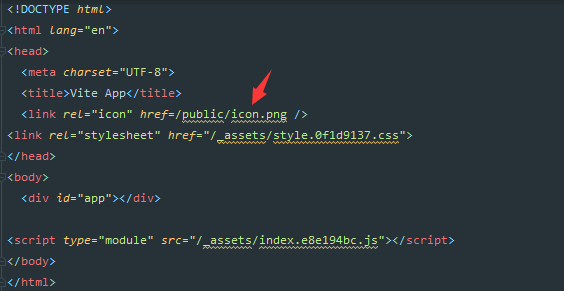
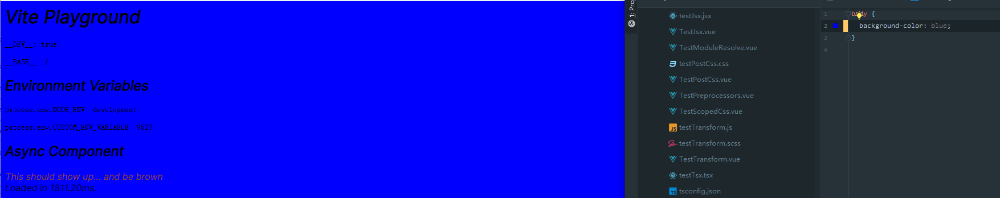

# 541 - bf2b2a9 public需要被复制到dist目录下，而不是dist/public

改动部分：

- `src/node/build/buildPluginAsset.ts`：`resolveAsset`生成的路径去除`/public`
- `src/node/build/index.ts`：复制`public`下的文件到输出的文件目录下，改动为去除`/public`这一层目录


# 542 - fd68ecf index.html资源路径改写后需要添加上双引号

改动部分：

- `src/nodr/build/buildPluginHtml.ts`：`compileHtml`为资源路径改写添加上双引号




# 543 - 72edbc0 changelog

## [0.16.9](https://github.com/vuejs/vite/compare/v0.16.8...v0.16.9) (2020-05-23)

### Bug Fixes

- public的资源需要复制到dist下作为根目录 ([bf2b2a9](https://github.com/vuejs/vite/commit/bf2b2a9c7d66b001260e60d825ae72e8c3e0c301))
- html的url改写需要添加上双引号 ([fd68ecf](https://github.com/vuejs/vite/commit/fd68ecfa5c5e74a1a463ed5c91b9fecba356f846))


# 544 - 3f0aff9 v0.16.9

release v0.16.9


# 545 - 1f4518b 构建遇到(j|t)sx需要加载`vueJsxCompat.js`脚本

改动部分：

- `src/node/build/buildPluginEsbuild.ts`：防止`vueJsxPublicPath`被改写 & 加载`vueJsxCompat.js`

```typescript
  return {
    name: 'vite:esbuild',

    resolveId(id) {
      // 防止被改写  
      if (id === vueJsxPublicPath) {
        return vueJsxPublicPath
      }
    },

    load(id) {
      if (id === vueJsxPublicPath) {
        return fs.readFileSync(vueJsxFilePath, 'utf-8')
      }
    },
  }
```

#### shim是什么？

Vue响应式原理中说道：Object.defineProperty是Es5中无法shim的特性，那么这里的shim是什么呢？
shim可以将新的API引入到旧的环境中，而且仅靠就环境中已有的手段实现。

文章中说的意思就是，Object.defineProperty这个特性是无法使用低级浏览器中的方法来实现的，所以Vue不支持IE8以及更低版本的浏览器。

es5-shim可以让一些低级的浏览器支持最新的ecmascript5的一些特性。支持浏览器或node.js，已经测试的功能见https://github.com/es-shims/es5-shim

> 优先级低于`vite:resolve`，有可能被用户的resolver.requestToFile或者resolver.alias改写到，从而触发不了。


# 546 - 7c4b64c 构建下需要对`/vite`下的文件改写字符串

改动部分：

- `src/node/build/index.ts`：`createReplacePlugin`的匹配规则中，新增`id.startsWith('/vite')`

> 现在vite下的特殊文件，就只有`vueJsxCompat.js`，通过特殊路径`'/vite/jsx'`即可引入


# 547 - 4cb0f76 changelog

## [0.16.10](https://github.com/vuejs/vite/compare/v0.16.9...v0.16.10) (2020-05-24)

### Bug Fixes

- `__DEV__`的字符串替换也需要应用到vite的模块中  ([7c4b64c](https://github.com/vuejs/vite/commit/7c4b64c47ae5271fe262796e1459ff02baf132e2))
- vue中为了可以使用react的vnode方法，需要引入`vueJsxCompat.js`脚本兼容 ([1f4518b](https://github.com/vuejs/vite/commit/1f4518b69b6d6d4afdb485570ed795fe4f557a77))


# 548 - 0eb66a8 0.16.10

release vite v0.16.10


# 549 - 528aad6 #256 为资源id删除hash fragment 和 参数

改动部分：

- `src/node/build/buildPluginAssets.vue`：`resolveAsset`中对`id`调用`cleanUrl`删除`hash`或者query

```typescript
export const resolveAsset = async (
  id: string,
  root: string,
  publicBase: string,
  assetsDir: string,
  inlineLimit: number
): Promise<AssetCacheEntry> => {
  id = cleanUrl(id)
  // ...
}

export const queryRE = /\?.*$/
export const hashRE = /\#.*$/

export const cleanUrl = (url: string) =>
  url.replace(hashRE, '').replace(queryRE, '')
```

>如果添加参数，rollup将会报错找不到该文件，构建失败。


# 550 - 8f7ee38 #253 修复没有使用的css会触发hmr的问题

改动部分：

- `src/node/server/serverPluginCss.ts`：不存在于`processedCSS`或`srcImportMap`的文件将不触发hmr（详 **改动一**）

### 改动一

只要是`.css`都会发送`style-update`，client端检测到反而会把没有使用的css脚本给添加上。



