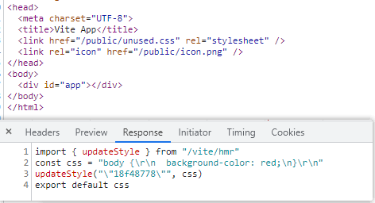
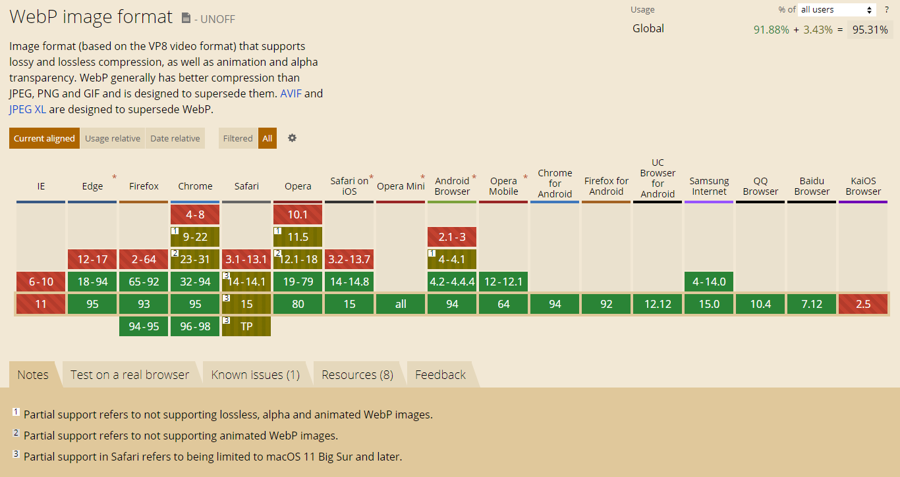

# 551 - db8b6b2 #235 支持自定义`NODE_ENV`，支持`--mode`

改动部分：

- `src/node/cli.ts`：新增`--mode | -m`，默认serve模式下`development`，build模式下`production`
- `src/node/config.ts`：新增`loadEnv`方法，加载`env.XXXX`，默认优先加载`.env`文件（详 **改动二**）

> 之前支持的仅仅是`.env`，这次PR主要是可以通过命令行配置mode，来加载`.env.${mode}`文件来动态配置

### 改动二

检测顺序：`.env` -> `.env.local` -> `.env.${mode}` -> `.env.${mode}.local`

```typescript
// load environment variables
    const env = loadEnv(mode, cwd)
    debug(`env: %O`, env)
    config.env = env

function loadEnv(mode: string, cwd: string): Record<string, string> {
  debug(`env mode: ${mode}`)
  const { resolve } = path
  
  // 检测的现后顺序
  const envFiles = [
    /** default file */ resolve(cwd, '.env'),
    /** local file */ resolve(cwd, `.env.local`),
    /** mode file */ resolve(cwd, `.env.${mode}`),
    /** mode local file */ resolve(cwd, `.env.${mode}.local`)
  ]

  const env: Record<string, string> = {}
  for (const file of envFiles) {
    if (fs.existsSync(file) && fs.statSync(file).isFile()) {
      const result = dotenv.config({
        debug: !!process.env.DEBUG,
        path: file
      })
      if (result.error) {
        throw result.error
      }
      Object.assign(env, result.parsed)
    }
  }

  return env
}
```


# 552 - cf5de5b #243 重构 vue hmr，使用hot.accept来替换

**underfin**: 我这样做是因为我认为让内置Vue进程的逻辑使用插件来实现是很有用的。我认为Vue模块的HMR应该由HMR API实现，而不是使用内部逻辑实现。

改动部分：

- `src/client/client.ts`：去除`vue-reload`、`vue-rerender`和`vue-style-update`事件，不再调用`updateStyle`，只做一个api输出。
- `src/node/server/serverPlginCss.ts`：转换import类型的css所植入的js代码被封装为`codegenCss`方法中。（详 **改动二**）
- `src/node/server/serverPluginHmr.ts`：添加`vueReload`（实际也是`js-update`）方法，`<script>`、`<style>`（`module`和`scope`）都会触发`vueReload`，`<style>`内容的不同会触发`style-update`（详 **改动三**）
- `src/node/server/serverPluginModuleRewrite.ts`：`rewriteFileWithHMR`包含`SFC VUE`。
- `src/node/server/serverPluginVue.ts`：`<style>`被转换为利用`codegenCss`注入; `SFC VUE`的主文件被注入`hot.accept(m) => __VUE_HMR_RUNTIME__.reload("${id}", m.default)`和`hot.accept(${JSON.stringify(templateRequest)}, (m) => __VUE_HMR_RUNTIME__.rerender("${id}", m.render)`; （详 **改动五**）

> “隐式位置” \b，匹配这样的位置：它的前一个“显式位置”字符和后一个“显式位置”字符不全是 \w。

### 改动二

科普一下如果单纯引入css会出现什么结果，统一转换为js代码，出现BUG，并没有正确引入：



### 改动三 `handleVueReload`

所有事件均变为触发`js-update`。

```typescript
async function handleVueReload(
  file: string,
  timestamp: number = Date.now(),
  content?: string
) {
  const publicPath = resolver.fileToRequest(file)
  const cacheEntry = vueCache.get(file)

  debugHmr(`busting Vue cache for ${file}`)
  vueCache.del(file)

  const descriptor = await parseSFC(root, file, content)
  if (!descriptor) {
    // read failed
    return
  }

  const prevDescriptor = cacheEntry && cacheEntry.descriptor
  if (!prevDescriptor) {
    // the file has never been accessed yet
    debugHmr(`no existing descriptor found for ${file}`)
    return
  }

  // check which part of the file changed
  let needRerender = false

  const vueReload = () => {
    send({
      type: 'js-update',
      path: publicPath,
      changeSrcPath: publicPath,
      timestamp
    })
    console.log(
      chalk.green(`[vite:hmr] `) +
        `${path.relative(root, file)} updated. (reload)`
    )
  }

  if (!isEqual(descriptor.script, prevDescriptor.script)) {
    vueReload()
    return
  }

  if (!isEqual(descriptor.template, prevDescriptor.template)) {
    needRerender = true
  }

  let didUpdateStyle = false
  const styleId = hash_sum(publicPath)
  const prevStyles = prevDescriptor.styles || []
  const nextStyles = descriptor.styles || []

  // css modules update causes a reload because the $style object is changed
  // and it may be used in JS. It also needs to trigger a vue-style-update
  // event so the client busts the sw cache.
  if (
    prevStyles.some((s) => s.module != null) ||
    nextStyles.some((s) => s.module != null)
  ) {
    vueReload()
    return
  }

  if (prevStyles.some((s) => s.scoped) !== nextStyles.some((s) => s.scoped)) {
    needRerender = true
  }

  // only need to update styles if not reloading, since reload forces
  // style updates as well.
  nextStyles.forEach((_, i) => {
    if (!prevStyles[i] || !isEqual(prevStyles[i], nextStyles[i])) {
      didUpdateStyle = true
      send({
        type: 'style-update',
        path: `${publicPath}?type=style&index=${i}`,
        timestamp
      })
    }
  })

  // stale styles always need to be removed
  prevStyles.slice(nextStyles.length).forEach((_, i) => {
    didUpdateStyle = true
    send({
      type: 'style-remove',
      path: publicPath,
      id: `${styleId}-${i + nextStyles.length}`,
      timestamp
    })
  })

  if (needRerender) {
    send({
      type: 'js-update',
      path: publicPath,
      changeSrcPath: `${publicPath}?type=template`,
      timestamp
    })
  }

  if (needRerender || didUpdateStyle) {
    let updateType = needRerender ? `template` : ``
    if (didUpdateStyle) {
      updateType += ` & style`
    }
    console.log(
      chalk.green(`[vite:hmr] `) +
        `${path.relative(root, file)} updated. (${updateType})`
    )
  }
}
```

### 改动五`SFCMAIN`

对于`SFC`主文件，注入：

```typescript
  code += `\n if (__DEV__) {
  hot.accept((m) => {
    __VUE_HMR_RUNTIME__.reload("${id}", m.default)
  })
}`
```

对于`<template>`，注入：

```typescript
  if (descriptor.template) {
    const templateRequest = publicPath + `?type=template`
    code += `\nimport { render as __render } from ${JSON.stringify(
      templateRequest
    )}`
    code += `\n__script.render = __render`
    code += `\n if (__DEV__) {
  hot.accept(${JSON.stringify(templateRequest)}, (m) => {
    __VUE_HMR_RUNTIME__.rerender("${id}", m.render)
  })
}`
  }
```

对于`<style>`的获取，注入：

```typescript
let code =
  `import { updateStyle } from "${hmrClientPublicPath}"\n` +
  `const css = ${JSON.stringify(css)}\n` +
  `updateStyle(${JSON.stringify(id)}, css)\n`
if (modules) {
  code += `export default ${JSON.stringify(modules)}`
} else {
  code += `export default css`
}
```

> 不做全部的详解，本质就是原本更新逻辑，但使用了hot监听文件改动的方式触发。


# 553 - 3486d21 修复css监听文件变动的过滤器在windows中无效的问题

`file -> slash(file)`，统一不同系统的路径符号。

```typescript
watcher.on('change', (file) => {
  /** filter unused files */
  if (
    !Array.from(processedCSS.keys()).some((processed) =>
      file.includes(processed)
    ) &&
    !srcImportMap.has(file)
  ) {
    return debugCSS(
      `${basename(file)} has changed, but it is not currently in use`
    )
  }
}
```


# 554 - 8816d3b 当包里的`package.json`没有明确入口将输出更多信息

改动部分：

- `src/node/depOptimizer.ts`：没有`pkgInfo.entryFilePath`或`entryFilePath`不存在，将不被纳入依赖优化中。
- `src/node/resolver.ts`：`resolveBareModuleRequest`，如没有`pkgInfo.entry`，则返回原本`id`。

> entry是什么有什么用？@module/模块id/入口路径，resolve包能直接识别返回路径。


# 555 - c239067 fix [#251](https://github.com/vitejs/vite/issues/251) history fallback

`await send(ctx, '/index.html')` -> `await send(ctx, 'index.html', { root })`

> [#251](https://github.com/vitejs/vite/issues/251)想要的是进入到src/index.html吧... 这个改动也没有改好

[HTML5 API——无刷新更新地址 history.pushState/replaceState 方法](https://www.cnblogs.com/maorongmaomao/archive/2012/02/20/2359341.html)


# 556 - 146a49d 修复`<link/> css`引入错误的问题 [#252](https://github.com/vitejs/vite/issues/252)

改动部分：

- `src/client/client.ts`：`style-update`只要触发都会带上`import`参数，带上import的会被`codegenCss`
- `src/node/server/serverPluginCss.ts`：纯引入`css`，不需要使用`codegenCss`。（小BUG，上次PR不小心改到了）


# 557 - 3fc05d5 changelog

## [0.16.11](https://github.com/vuejs/vite/compare/v0.16.10...v0.16.11) (2020-05-25)

### Bug Fixes

- 修复history fallback (fix [#251](https://github.com/vuejs/vite/issues/251)) ([c239067](https://github.com/vuejs/vite/commit/c239067969677bc09ad809baf02495072a38b2ff))
- 修复纯css引入的BUG (fix [#252](https://github.com/vuejs/vite/issues/252)) ([146a49d](https://github.com/vuejs/vite/commit/146a49d78bd8225f846db8baa4adfa604d4cbf4a))
- 兼容windows下css过滤器 ([3486d21](https://github.com/vuejs/vite/commit/3486d2117faac0d83bc093f0c8c21b783b8f9f2d))
- 对于依赖包存在的入口问题，将给予更多的提示，没有entry默认返回id ([8816d3b](https://github.com/vuejs/vite/commit/8816d3bca6aef8df11f70f934031178accde5163)), closes [#247](https://github.com/vuejs/vite/issues/247)
- 没有使用的css应该跳过hmr([#253](https://github.com/vuejs/vite/issues/253)) ([8f7ee38](https://github.com/vuejs/vite/commit/8f7ee38965327cf15dbb4f2d6f3db6e4b642b635))
- **build:** 应该对id删除hash和参数 ([#256](https://github.com/vuejs/vite/issues/256)) ([528aad6](https://github.com/vuejs/vite/commit/528aad6b66c407e70bab2012d24a5ca0df30edd5))

### Features

- 支持`--mode` ([#235](https://github.com/vuejs/vite/issues/235)) ([db8b6b2](https://github.com/vuejs/vite/commit/db8b6b23d6e230505b48890cc95e0d8642e98804))


# 558 - 987843e v0.16.11

release v0.16.11


# 559 - 5589fa3 图片静态资源支持webp格式

改动部分：

- `src/node/utils/pathUtils.ts`：`const imageRE = /\.(png|jpe?g|gif|svg|ico|webp)(\?.*)?$/`



> **WebP** is 是由 Google 公司开发的一种可提供有损和无损压缩的图片格式，支持透明度，目前已支持动图。


# 560 - 4fceaea lookupFile寻找`.env.XXX`

改动部分：

- `src/node/config.ts`：`loadEnv`使用`lookupFile`寻找`.env`文件路径。

```typescript
function loadEnv(mode: string, root: string): Record<string, string> {
  debug(`env mode: ${mode}`)
  const envFiles = [
    /** default file */ `.env`,
    /** local file */ `.env.local`,
    /** mode file */ `.env.${mode}`,
    /** mode local file */ `.env.${mode}.local`
  ]

  const env: Record<string, string> = {}
  for (const file of envFiles) {
    const path = lookupFile(root, [file], true)
    if (path) {
      const result = dotenv.config({
        debug: !!process.env.DEBUG,
        path
      })
      if (result.error) {
        throw result.error
      }
      Object.assign(env, result.parsed)
    }
  }

  return env
}
```

> [lookupFile](https://github.com/Kingbultsea/vite-analysis/blob/da52013f4bbb34b49fe4d80d250f4477bfc54a3e/411-420/411-420.md#%E6%94%B9%E5%8A%A8%E4%BA%8C-lookupfile%E6%96%B9%E6%B3%95)

