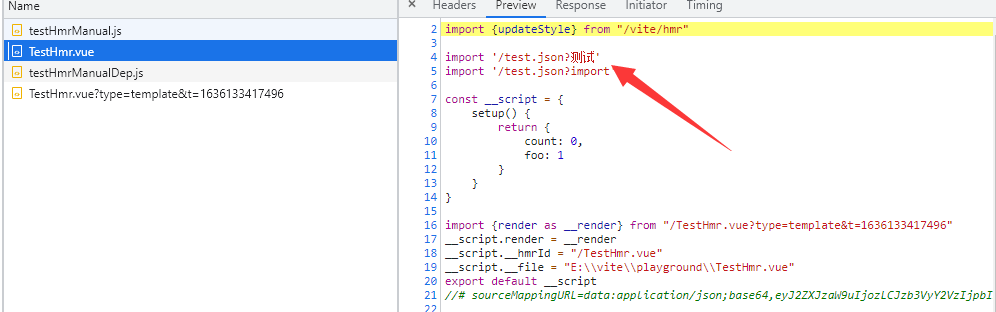

# 571 - dd0205f `esbuild`服务，如果停止，则设置`_service = undefined`

`src/nopde/esbuildService.ts`：`stopService`调用后，需要设置`_service`取消指引。


# 572 - df526b1 修复`resolveImport`中的添加参数`import`逻辑，即判断`query`不存在再添加`import`参数

- `src/node/server/serverPluginModuleRewrite.ts`：修复`resolveImport`中的添加参数`import`逻辑。

import句子经过`resolveRelativeRequest(importer, id)`处理后，会被拆分为路径和参数。更改后只有没有任何自定义的参数才会添加`import`。

```typescript
# 更改前
const ext = path.extname(pathname)
if (ext && !jsSrcRe.test(pathname)) {
    query += `${query ? '&' : '?'}import`
}

# 更改后
// 4. mark non-src imports
if (!query && path.extname(pathname) && !jsSrcRE.test(pathname)) {
  query += `?import`
}
```




# 573 - 43ccaf7 perf 重新设置回`vue hmr`，即恢复`vue-reload`、`vue-rerender`

改动部分：

- `src/client/client.ts`：恢复`vue-reload`和`vue-rerender`。
- `src/node/server/serverPluginHmr.ts`：`walkImportChain`检测到`importer`为`.vue`后缀，即添加到`dirtyFiles`中（详 **改动二**）
- `src/node/server/serverPluginModuleRewrite.ts`：存在于`dirtyFiles`或`SFC`下的`template` | `style`，才为`import`语句添加`timestamp`。
- `src/node/server/serverPluginVue.ts`：砍掉`<template>`&`<script>`的`import.meta.hot.accept`的代码注入，重新区分`vue-reload`和`vue-rerender`，**注意**，`<style>`依旧使用`HMR API`，即`codegenCss`会注入`import.meta.hot.accept`逻辑。

### 改动二 为什么`.vue`才添加到`dirtyFiles`？

`isHmrAccepted`的`js`也会添加到`dirtyFiles`中，但是普通的`js`脚本不需要时间戳达到删除缓存的效果，因为它会触发的是`reload`事件，使页面刷新。

**改动三**中`SFC`下的`template` | `style`，不会被丢进`dirtyFiles`中，所以要通过判断来添加`timestamp`。


# 574 - 197499a bump `esbuild`

依赖更新，`esbuild` -> `^0.4.1`


# 575 - 5435737 fix [#262](https://github.com/vitejs/vite/pull/262) 更好的判断逻辑 & 变量命名 

`src/node/server/serverPluginCss.ts`：`HMR watcher`更好的判断逻辑 & 变量命名 


# 576 - ca1b551 fix [#263](https://github.com/vitejs/vite/pull/263) `dotenv`假值传递`undefinded`

**yyx**：`dotenv`有些奇怪...


# 577 - d229a5b [#266](https://github.com/vitejs/vite/pull/266) 更清晰的变量命名

`filename` -> `filePath`

`file` -> `filePath`


# 578 - d71a06d [#267](https://github.com/vitejs/vite/pull/267) `vite:resolve` `resolveId`钩子等待resolve

**csr632**: `this.resolve` 返回一个`promise`。这个`promise`可能会解析为空。 没有等待这个`promise`，`resolve || { id }`将没有意义。

#### `resolveId`

Type: `(source: string, importer: string | undefined) => string | false | null | {id: string, external?: boolean, moduleSideEffects?: boolean | null, syntheticNamedExports?: boolean | null}`

#### `syntheticNamedExports`是什么？

设置后，可以使用`export default { a: 123, b: 123 }`这种形式，等于解释为

`export const a = 123; export const b = 123`

> 之前困扰了我很久的问题，我之前想的是莫非返回promise会自动等待结果？（看上面并没有返回promise的类型）即使就算是这样，那`|| { id }`就没有任何意义了。
>
> 这块如果不`await`的话，就当作null处理了。


# 579 - 610a004 [#269](https://github.com/vitejs/vite/pull/267) 修复`onRollupWarning`输出信息被`Ora`覆盖问题

改动部分：

- `src/node/build/index.ts`：为了让`onRollupWarning`能正常输出，需要暂停`Ora`再输出，完毕后再启动`Ora`。
- `src/node/depOptimizer.ts`：传递`Ora`（也就是`onRollupWarning(spiner)`）

> `(spiner) => () => { spiner }`，可以快速创建作用域。


# 580 - e67b698 fix [#270](https://github.com/vitejs/vite/pull/270) `isLocal`统一处理vue路径

`src/node/utils/resolveVue`：在`isLocal`的情况下，调用：

```typescript
vuePath = resolveFrom(
        root,
        '@vue/runtime-dom/dist/runtime-dom.esm-bundler.js'
      )
```

> 话说我clone了项目，构建后启动服务，完全没有问题... 
>
> 可能是因为他构建后，没有进入`dist`文件下，直接http-server架起服务？我就是这样触发到的，浏览器中不能使用`import 'ABC'`这种node中引入模块的方式。（但我相信他并不会有这种操作... 留坑）

