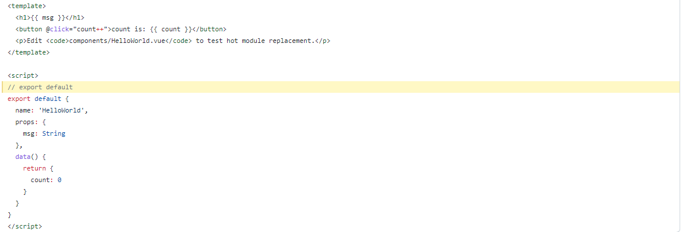
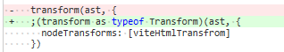
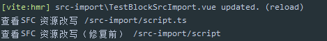
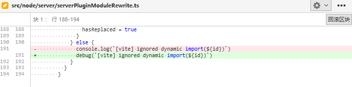

# 581 - 2e81e64 新增`babelParse.ts`，用于封装`parse`选项 & fix #271 `serverPluginVue`对于`export default`的错误替换

改动部分：

- `src/node/utils/babelParse.ts`：新增，封装`@babel/parser`的`parse`方法提供给`serverPluginHmr.ts`的`rewriteFileWithHMR`方法、`serverPluginVue.ts`的`rewriteDefaultExport`方法。（详 **新增一**）
- `src/node/server/serverPluginVue.ts`：新增`rewriteDefaultExport`方法，把以前的暴力（我指的暴力是考虑不会很全面，可能出现BUG）正则替换给修正。（详 **改动二**）

### 新增一

逻辑迁移，封装。

```typescript
import { parse as _parse } from '@babel/parser'
import { Statement } from '@babel/types'

export function parse(source: string): Statement[] {
  return _parse(source, {
    sourceType: 'module',
    plugins: [
      // required for import.meta.hot
      'importMeta',
      // by default we enable proposals slated for ES2020.
      // full list at https://babeljs.io/docs/en/next/babel-parser#plugins
      // this should be kept in async with @vue/compiler-core's support range
      'bigInt',
      'optionalChaining',
      'nullishCoalescingOperator'
    ]
  }).program.body
}
```

### 改动二

#### 关于正则，转自[ssruoyan - segmentfault](https://segmentfault.com/q/1010000006699973)

`?=`实际上应算是匹配预查。str(?=condition) 后面的应该只能算是匹配的条件。意思就是只有满足condition条件的str才能被匹配到。

`?=`还有一个兄弟叫做`!?`，作用相反，只有在不满足条件的str才能被匹配到。

`?:`就是直接匹配str + conidtion

以上三个都是非获取匹配，意思就是condition匹配到的内容并不会存储到Matches里。

例如：

```awk
var str = "dadiao 2333";
str.match(/dadiao (?:2222|2333|1211)/)  //['dadiao 2333'];
str.match(/dadiao (?=2222|2333|1211/) // ['dadiao '];

str.match(/dadiao (?!=2222)/) //['dadiao ']

str.match(/dadiao (2222|2333|1211)/) //['dadiao 2333', '2333'];
```

`content.replace('export default', const __script = )`直接替换，如果遇到的是注释，那就会出现错误：



现在更改为：

```typescript
const defaultExportRE = /((?:\n|;)\s*)export default/

// 改写export default
// 尝试直接通过正则改写，避免使用babel parse
let replaced = content.replace(defaultExportRE, '$1const __script =')
// 如果脚本以某种方式仍然包含“export default”，则它可能具有
// 多行注释或模板字符串。回退到完整解析
if (defaultExportRE.test(replaced)) {
  replaced = rewriteDefaultExport(content)
}
code += replaced

function rewriteDefaultExport(code: string): string {
  const s = new MagicString(code)
  const ast = parse(code)
  ast.forEach((node) => {
    // 检测node类型 达到替换  
    if (node.type === 'ExportDefaultDeclaration') {
      s.overwrite(node.start!, node.declaration.start!, `const __script = `)
    }
  })
  const ret = s.toString()
  return ret
}
```


# 582 - e86da9e 依赖`@types/lru-cache`提升至`dependencies`

`import { readBody } from 'vite'`，`fsUtils.ts`中引入了`lru-cache`，类型检测如果用户依赖没有安装`@types/lru-cache`将检测错误（未验证的结论）

> 我们的包要从这两个包里暴露出声明文件，因此`browserify-typescript-extension`的用户也需要这些依赖。 正因此，我们使用 `"dependencies"`而不是`"devDependencies"`，否则用户将需要手动安装那些包。 如果我们只是在写一个命令行应用，并且我们的包不会被当做一个库使用的话，那么我就可以使用 `devDependencies`。

https://www.tslang.cn/docs/handbook/declaration-files/publishing.html


# 583 - ea97bd1 changelog

# [0.17.0](https://github.com/vuejs/vite/compare/v0.16.12...v0.17.0) (2020-05-26)

### Bug Fixes

- rollup等待resolve结果 ([#267](https://github.com/vuejs/vite/issues/267)) ([d71a06d](https://github.com/vuejs/vite/commit/d71a06da04954282896e53e16692590101b82c2e))
- css cache check 更好的判断逻辑 & 变量命名 ([#262](https://github.com/vuejs/vite/issues/262)) ([5435737](https://github.com/vuejs/vite/commit/5435737d126a2d08e7e950dbf4952fc903574d19))
- 构建默认--mode为production ([86d2143](https://github.com/vuejs/vite/commit/86d2143e31cba594377da43116c161a87d2d1874))
- dotenv假值传递undefinded ([#263](https://github.com/vuejs/vite/issues/263)) ([ca1b551](https://github.com/vuejs/vite/commit/ca1b551c541ed3364374652b9b55e9f0e78b0c3c))
- 依赖`@types/lru-cache`提升至`dependencies` ([e86da9e](https://github.com/vuejs/vite/commit/e86da9e6b56aeaf985ecf590fd775582952279b0))
- 修复resolveImport中的添加参数import逻辑，即判断query不存在再添加import参数 ([df526b1](https://github.com/vuejs/vite/commit/df526b127e63ff2f52458ea796f9c813880a1a65))
- 修复onRollupWarning输出信息被Ora覆盖问题 ([#269](https://github.com/vuejs/vite/issues/269)) ([610a004](https://github.com/vuejs/vite/commit/610a00441f8c0faa2e048a0910cf04f9f3810eef))
- isLocal统一处理vuePath路径 ([e67b698](https://github.com/vuejs/vite/commit/e67b698a9ba18a99cb64f52df61fae176382f9ff)), closes [#270](https://github.com/vuejs/vite/issues/270)
- 遵循用户为 `rollup-plugin-vue` 配置的` css` 模块选项 ([0ce1eef](https://github.com/vuejs/vite/commit/0ce1eef7bd77eb8468c8b9e6878c2a78167efc4f))
- `esbuild`服务，如果停止，则设置`_service = undefined` ([dd0205f](https://github.com/vuejs/vite/commit/dd0205f321c57ad0b59813181591dafe1d8d3f90))
- log中，SFC更新了哪块的信息需要添加上` & `分割 ([#260](https://github.com/vuejs/vite/issues/260)) ([301d7a3](https://github.com/vuejs/vite/commit/301d7a3b151a8fdefd09db0d742c7b6d0ce206db))
- 新增`babelParse.ts`，用于封装`parse`选项 & fix #271 `serverPluginVue`对于`export default`的错误替换 ([2e81e64](https://github.com/vuejs/vite/commit/2e81e64929d9c2909ff5882b26933ea54a353aab)), closes [#271](https://github.com/vuejs/vite/issues/271)

### Features

- 破坏性改动，`__BASE__`转换为`process.env.BASE_URL` ([9503762](https://github.com/vuejs/vite/commit/9503762e103f304228ceb7d572b17c24ed008501))
- 支持从 root 直接引用public目录文件 ([319b37b](https://github.com/vuejs/vite/commit/319b37bbf4cef4804b56061ab5354d361c90dacb))
- **hmr:** 重新设计 HMR API ([a68bfc3](https://github.com/vuejs/vite/commit/a68bfc307dd636d5e1b5d42d6df248da1beea2ff))

### Performance Improvements

- 重新设置回`vue hmr`，即恢复`vue-reload`、`vue-rerender` ([43ccaf7](https://github.com/vuejs/vite/commit/43ccaf77e89ebf219c15aaf12b06a4632beb3968))

### BREAKING CHANGES

- `__BASE__` 作为全局变量，现在已经被移除。可以使用`process.env.BASE_URL` 代替。

- **hmr:** HMR API现在已经被重新设计。

  - 所有HMR API都被迁移至`import.meta.hot`中， HMR API 的代码需要在 `if (import.meta.hot) {}`使用.
  - `import.meta.hot.accept()` 被改为只接收自身更新
  - `import.meta.hot.acceptDeps()` 可以用于接收依赖更新
  - `import.meta.hot.data` todo 空对象，这部分尤大的注释目前还不理解，因为设置的都是`{}`，可以去查看`dataMap`逻辑。（大概猜测是调用栈之前的数据）
  - `import.meta.hot.dispose()` 调用栈被更新前的值，触发回调。
  - `import.meta.hot.decline()` 可用于拒绝更新，如果模块在 HMR 更新链中受到影响，可强制整页重新加载。
  - `import.meta.hot.invalidate()` 可以在接受回调中使用，以有条件地拒绝更新并强制重新加载整页。todo，也是没有看见相关代码，只是一个`location.reload`。

  可以查看`hmr.d.ts` 了解所有HMR API的类型


# 584 - 87f03a8 v0.17.0

release `vite` v0.17.0


# 585 - 286fb2f 为v0.17.0更新文档

> 直接英文版了，我们可以注意一下的是dispose可以用来删除全局的side effect（其他用法自己定义，反正调用栈是之前的，就是之前的import内调用dispose的回调）
>
> 另外一个是public的作用，可以保留文件名称不被hash化，如`robot.txt`这种搜索引擎设置的文件可以被完整保留下来，不需要特别的配置。

For manual HMR, an API is provided via `import.meta.hot`.

For a module to self-accept, use `import.meta.hot.accept`:

```js
export const count = 1

// the conditional check is required so that HMR related code can be
// dropped in production
if (import.meta.hot) {
  import.meta.hot.accept((newModule) => {
    console.log('updated: count is now ', newModule.count)
  })
}
```

A module can also accept updates from direct dependencies without reloading itself, using `import.meta.hot.acceptDeps`:

```js
import { foo } from './foo.js'

foo()

if (import.meta.hot) {
  import.meta.hot.acceptDeps('./foo.js', (newFoo) => {
    // the callback receives the updated './foo.js' module
    newFoo.foo()
  })

  // Can also accept an array of dep modules:
  import.meta.hot.acceptDeps(['./foo.js', './bar.js'], ([newFooModule, newBarModule]) => {
    // the callback receives the updated mdoules in an Array
  })
}
```

A self-accepting module, or a module that expects to be accepted by others can use `hot.dispose` to cleanup any persistent side effects created by its updated copy:

```js
function setupSideEffect() {}

setupSideEffect()

if (import.meta.hot) {
  import.meta.hot.dispose((data) => {
    // cleanup side effect
  })
}
```

For the full API, consult [hmr.d.ts](https://github.com/vitejs/vite/blob/master/hmr.d.ts).

All **static** path references, including absolute paths, should be based on your working directory structure.

#### The `public` Directory

The `public` directory under project root can be used as an escape hatch to provide static assets that either are never referenced in source code (e.g. `robots.txt`), or must retain the exact same file name (without hashing).

Assets placed in `public` will be copied to the root of the dist directory as-is.

Note that you should reference files placed in `public` using root absolute path - for example, `public/icon.png` should always be referenced in source code as `/icon.png`.

#### Public Base Path

If you are deploying your project under a nested public path, simply specify `--base=/your/public/path/` and all asset paths will be rewritten accordingly.

### How is This Different from [Snowpack](https://www.snowpack.dev/)?

Both Snowpack v2 and Vite offer native ES module import based dev servers. Vite's dependency pre-optimization is also heavily inspired by Snowpack v1. Both projects share similar performance characteristics when it comes to development feedback speed. Some notable differences are:

- Vite was created to tackle native ESM-based HMR. When Vite was first released with working ESM-based HMR, there was no other project actively trying to bring native ESM based HMR to production.

  Snowpack v2 initially did not offer HMR support but added it in a later release, making the scope of two projects much closer. Vite and Snowpack has collaborated on a common API spec for ESM HMR, but due to the constraints of different implementation strategies, the two projects still ship slightly different APIs.

- Vite is more opinionated and supports more opt-in features by default - for example, features listed above like TypeScript transpilation, CSS import, CSS modules and PostCSS support all work out of the box without the need for configuration.

- Both solutions can also bundle the app for production, but Vite uses Rollup while Snowpack delegates it to Parcel/webpack. This isn't a significant difference, but worth being aware of if you intend to customize the build.


# 586 - e2594df 延迟加载`'@vue/compiler-dom'`，因此可以拥有NODE_ENV变量

改动部分：

- `src/node/build/buildPluginHtml.ts`：利用`require('@vue/compiler-dom')`引入。

> import 的 '@vue/compiler-dom' 只是类型。
>
> 延迟加载可以提升性能。

#### 单独的语句可以使用`;`避免报错



#### `buildPluginHtml.ts`的todo

```typescript
// TODO: if there are multiple inline module scripts on the page,
// they should technically be turned into separate modules, but
// it's hard to imagine any reason for anyone to do that.
```

如果有多个`<script type="module">...</script>`，从技术上讲，它们应该变成单独的模块，但是很难想象任何人有什么理由这样做。


# 587 - 9a44248 `walkImportChain`去除`hasDeadEnd`，直接return结果

```typescript
const parentImpoters = importerMap.get(importer)
if (!parentImpoters) {
  return true
} else if (
  walkImportChain(
    importer,
    parentImpoters,
    hmrBoundaries,
    dirtyFiles,
    currentChain.concat(importer)
  )
) {
  return true
}
```


# 588 - ae6b49d `resolveRelativeRequest`改为`resolveImport`完整流程，修复后缀没有自动添加问题

`resolveRelativeRequest`只是单独转换相对路径，`resolveImport`还有一个处理后缀的流程。




# 589 - f94685a chore 修正`ignore dynamic import(XXX)`的控制台信息输出为条件输出




# 590 - 0330b2a 修复588因`resolveImport`带上了`?import`参数导致文件路径不正确的问题

直接使用`cleanUrl`去除参数。

```typescript
const importee = cleanUrl(
  resolveImport(process.cwd(), importer, block.src!, resolver)
)
```

