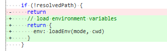

# 601 - 4ad4fea v0.17.2

release v0.17.2


# 602 - ed2be13 ci调试 判断import.meta.hot.data存在再输出`console.log`

#### 关于`import.meta.hot.data`的理解

之前对`import.meta.hot.data`有点不理解，实际上他用来传递信息给新的堆栈。

如A.js是一个使用了`import.meta.hot`的脚本，该脚本更新后，浏览器调用`import('A.js')`引入新的模块，`A.js`通过`import.meta.hot.data`可以共享旧的`A.js`内存，总的来说`import.meta.hot.data`只是指向同一个内存块而已。

尤大的目的为，`import.meta.hot.dispose`可以通过`import.meta.hot.data`传递信息给新的脚本。


# 603 - a4b8d4e chore

`esbuilPlugin` -> `esbuildPlugin`


# 604 - 24b75a1 ci调试后去除信息

ci调试后去除信息，对应于602。


# 605 - c8ee484 chore readme，阐述`Preact tsx`的用法

#### JSX with React/Preact

There are two other presets provided: `react` and `preact`. You can specify the preset by running Vite with `--jsx react` or `--jsx preact`.

If you need a custom JSX pragma, JSX can also be customized via `--jsx-factory` and `--jsx-fragment` flags from the CLI or `jsx: { factory, fragment }` from the API. For example, you can run `vite --jsx-factory=h` to use `h` for JSX element creation calls. In the config (see [Config File](#config-file) below), it can be specified as:

```js
// vite.config.js
module.exports = {
  jsx: {
    factory: 'h',
    fragment: 'Fragment'
  }
}
```

Note that for the Preact preset, `h` is also auto injected so you don't need to manually import it. However, this may cause issues if you are using `.tsx` with Preact since TS expects `h` to be explicitly imported for type inference. In that case, you can use the explicit factory config shown above which disables the auto `h` injection.


# 606 - 63b0e3c resolveExt仅在添加了拓展名称才返回id + 新增resolveRequest，提供给requestToFile和resolveExt使用

改动部分：

- `src/node/resolver.ts`：实际上把`requestToFile`原有的逻辑封装为resolveRequest，新增的`resolveExt`走`requestToFile`拿到`filePath`再调用`resolveExt`拿到带有后缀的`filePath`完整路径。（详 **改动一**）
- `src/node/server/serverPluginModuleRewrite.ts`：`resolveImport`路径处理中，步骤3添加拓展名改由直接调用`resolver.resolveExt`。（详 **改动二**）

> PR那次的更改考虑的是包内走vite的逻辑，现在完全分离开了，包内走`resolveFrom`，即`resolve.sync`（这里的resolve是一个工具包，`"resolve": "^1.17.0"`）

### 改动一 resolveExt走完整流程

`resolver.resolveExt`等同于`resolveRequest`，如果没有添加拓展名称则不做任何处理。

> 添加拓展名确实需要确定filePath，不然只是一个单纯在当前传递进的文件夹下寻找。

```typescript
export function createResolver(
  root: string,
  resolvers: Resolver[] = [],
  alias: Record<string, string> = {}
): InternalResolver {
  // 逻辑上，与旧的requestToFile没有任何改变  
  function resolveRequest(
    publicPath: string
  ): {
    filePath: string
    ext: string | undefined
  } {
    let resolved: string | undefined
    for (const r of resolvers) {
      const filepath = r.requestToFile && r.requestToFile(publicPath, root)
      if (filepath) {
        resolved = filepath
        break
      }
    }
    if (!resolved) {
      resolved = defaultRequestToFile(publicPath, root)
    }
    const ext = resolveExt(resolved)
    return {
      filePath: ext ? resolved + ext : resolved, // resolveExt在没有拓展为undefinded
      ext
    }
  }

  return {
    requestToFile(publicPath) {
      return resolveRequest(publicPath).filePath
    },

    resolveExt(publicPath) {
      return resolveRequest(publicPath).ext
    }
  }
}
```

### 改动二 添加后缀改由使用`resolver.resolveExt`

```typescript
export const resolveImport = (
  root: string,
  importer: string,
  id: string,
  resolver: InternalResolver,
  timestamp?: string
): string => {
  id = resolver.alias(id) || id
  if (bareImportRE.test(id)) {
  } else {
    // 3. resolve extensions.
    const ext = resolver.resolveExt(pathname)
    if (ext) {
      pathname += ext
    }
    return pathname + query
  }
}
```


# 607 - 2f071b3

feat: 改进 commonjs 依赖处理

- Bump `rollup`, `@rollup/plugin-commonjs` and `@rollup/plugin-node-resolve` versions
- Optimize CJS deps by default
- Handle package with `jsnext` or `browser` entries
- Add `rollupDedupe` option

BREAKING CHANGE: The following config options have been removed:

  - `rollupPluginCommonJSNamedExports`
  - `optimizeDeps.commonJSWhitelist`

  CommonJS deps are now optimized by default.

改动部分：

- `src/node/config.ts`：新增`rollupDedupe`选项，用于`@rollup/plugin-node-resolve`，[dedupe](https://github.com/rollup/plugins/tree/master/packages/node-resolve#dedupe)，去除`rollupPluginCommonJSNamedExports`。(详 **改动一**)
- `src/node/depOptimizer.ts`：去除`commonJSWhitelist`，检查到`cjs`类型的包也将被列入优化中。（详 **改动二**）
- `src/node/build/index.ts`：`@rollup/plugin-commonjs`升级，去除`knowNamedExports`相关逻辑。

### 改动一

### `dedupe`

Type: `Array[...String]`
Default: `[]`

一个`Array`类型的模块名称，表示去根`node_modules`中处理模块，如果包是从依赖项导入的，则有助于防止多次捆绑同一个包。

```
dedupe: ['my-package', '@namespace/my-package'];
```

这将对裸导入进行重复数据删除，例如：

```
import 'my-package';
import '@namespace/my-package';
```

它将对深导入进行重复数据删除，例如：

```
import 'my-package/foo.js';
import '@namespace/my-package/bar.js';
```

### 改动二 cjs列入优化中

类似`cjs`的都会被列入优化中（cjs的白名单被砍掉了，意味着所有的包都可以被依赖优化）

```typescript
if (!exports.length && !/export\s+\*\s+from/.test(content)) {
  debug(`optimizing ${id} (no exports, likely commonjs)`)
  return true
}
```

> 为什么现在可以，以前不可以？当然是rollup现在修复了BUG
>
> [feat(node-resolve): Export defaults by MichaelDeBoey · Pull Request #301 · rollup/plugins (github.com)](https://github.com/rollup/plugins/pull/301)


# 608 - 482bd34 fix #209 如果没有config文件，要从命令行`--mode`加载




# 609 - 8e41db2 hashRE正则修改

`#`在正则没有特殊含义，所以不需要`\`。


# 610 - 801951e feat alias支持文件夹方式

改动部分：

- `src/node/config.ts`：更新使用alias的方式。（详 **改动一**）
- `src/node/resolver.ts`：变量改名 + alias支持文件夹，本质也是`requestToFile` & `fileToRequest`做跳转（详 **改动二**）

### 改动一 alias用例

```typescript
# vite.config.js

module.exports = {
    alias: {
        'react': '@pika/react',
        'react-dom': '@pika/react-dom',
        // key需要‘/’开头并'/'结尾
        '/@foo/': path.resolve(__dirname, 'some-special-dir')
    }
}
```

### 改动二 

我看来有3个描述：

1. id为用户import句子写的最原始形态
2.  request为浏览器请求服务器即
3. vite根据id改写得来，file为文件在磁盘中的路径

`idToFileMap` -> `moduleIdToFileMap`

`fileToRequestMap` -> `moduleFileToIdMap`

> alias可以从config.resolvers配置，也可以从config.alias中配置。

```typescript
export interface Resolver {
    alias?: ((id: string) => string | undefined) | Record<string, string>
}

const resolveAlias = (alias: Record<string, string>) => {
  for (const key in alias) {
    let target = alias[key]
    // 符合/XXX/可以当作alias文件夹处理
    if (key.startsWith('/') && key.endsWith('/') && path.isAbsolute(target)) {
      // 检测是不是从root下alias的，不是的话不做任何处理
      const fromRoot = path.join(root, target)
      if (isDir(fromRoot)) {
        target = fromRoot
      } else if (!isDir(target)) {
        continue
      }
       
      // 本质也是requestToFile & fileToRequest做跳转
      resolvers.push({
        requestToFile(publicPath) {
          if (publicPath.startsWith(key)) {
            return path.join(target, publicPath.slice(key.length))
          }
        },
        fileToRequest(filePath) {
          if (filePath.startsWith(target)) {
            return slash(key + path.relative(target, filePath))
          }
        }
      })
    } else {
      // 当作字符转换处理  
      literalAlias[key] = target
    }
  }
}

// alias可以从config.resolvers配置，也可以从config.alias中配置。
resolvers.forEach((r) => {
  if (r.alias && typeof r.alias === 'object') {
    resolveAlias(r.alias)
  }
})
resolveAlias(userAlias)

// alias调用
alias(id) {
  let aliased: string | undefined = literalAlias[id]
  if (aliased) {
    return aliased
  }
  for (const r of resolvers) {
    aliased =
      r.alias && typeof r.alias === 'function' ? r.alias(id) : undefined
    if (aliased) {
      return aliased
    }
  }
}
```

