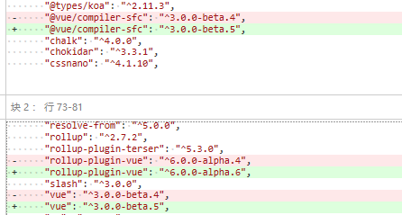

# commit-131 `hmr.accept`支持调用本身

输入：

```typescript
// # foo.js

import { hot } from '@hmr'

export const count = 1

hot.accept(newModule => {
  console.log('updated: count is now ', newModule.count)
})
```

输出：

```typescript
// foo.js

export const count = 1

hot.accept("/foo.js", "/foo.js", newModule => {
  console.log('updated: count is now ', newModule.count)
})
```

新增代码：

* `accept`的`callback`默认值`() =>  {}`，以防止`hot.accept('')`
* AST分析树，如果第一个参数类型是`FunctionExpression`，添加上`/foo.js`作为第二个参数。

> 对AST树有兴趣的，可以仔细研究一下。`mozila`有AST类型文档。使用的包`@babel/parser`，类型包`'@babel/types'`，最后使用`magic-string`替换。


# commit-132 v0.8.0

release v0.8.0


# commit-133 changelog

# [0.8.0](https://github.com/vuejs/vite/compare/v0.7.0...v0.8.0) (2020-04-30)

### Features

- 构建时，允许配置`rollupPluginVueOptions` ([a0053a0](https://github.com/vuejs/vite/commit/a0053a0eccd2659da685427ac3057cf5b436df80))
- `process.env.NODE_ENV` ([d4ccd15](https://github.com/vuejs/vite/commit/d4ccd154f54f71fb02e746924f9811d3a0e61a8f))
- `hmr.accept`支持调用本身 ([30ab444](https://github.com/vuejs/vite/commit/30ab444bd28b47eec1cf070a3c41116e8e9c64be))


# commit-134 [#24](https://github.com/vitejs/vite/pull/24) 语法调整

语法调整


# commit-135 [#26](https://github.com/vitejs/vite/pull/26) 修复错字

修复了在源代码中发现的一些错字


# commit-136 更新`rollup-plugin-vue` and `vue`包





# commit-137 fix `resolver ensurejs` check

`ensureJS`当有请求参数的时候尝试补充`.js`拓展名称，不存在则不做任何处理地返回。

```typescript
import { statSync } from 'fs'

requestToFile: (publicPath) => {
      let resolved: string | undefined
      for (const r of resolvers) {
        const filepath = r.requestToFile(publicPath, root)
        if (filepath) {
          resolved = filepath
          break
        }
      }
      if (!resolved) {
        resolved = defaultRequestToFile(publicPath, root)
      }
      resolved = ensureJs(resolved)
      return resolved
}

// 
const ensureJs = (id: string) => {
  // 去除所有参数  
  const cleanId = id.replace(queryRE, '')
  
  // 有参数的情况
  if (!/\.\w+$/.test(cleanId)) {
    // try to see if there is actually a corresponding .js file on disk.
    // if not, return the id as-is
    try {
      statSync(cleanId + '.js')
    } catch (e) {
      return id
    }
     
    // 添加js参数  
    const queryMatch = id.match(queryRE)
    const query = queryMatch ? queryMatch[0] : ''
    return cleanId + '.js' + query
  }
    
    
  return id
}
```

## statSync

同步版本的`fs.stat`，在此作用为查看`.js`文件是否存在，不存在则返回本身`id`。


# commit-138 v0.8.1

release v0.8.1


# commit-139 changelog

## [0.8.1](https://github.com/vuejs/vite/compare/v0.8.0...v0.8.1) (2020-04-30)

### Bug Fixes

- 解决`resolver` 里的 `ensurejs` 检测问题 ([3a3442f](https://github.com/vuejs/vite/commit/3a3442f0b95873dd2a6869b00d8ac19b74d650a3))


# commit-140 readme 接下来要做的事情

## TODOs

- 支持`import` `.css` 和 `.json`
- 公共路径处理（话说这个我不知道是什么... `Public path`我认为是请求路径，需要处理不同的类型，现在仅支持`js`）
- 支持`config`配置文件
- 自动引入`postcss config`文件
- Vue文件的`source map`

