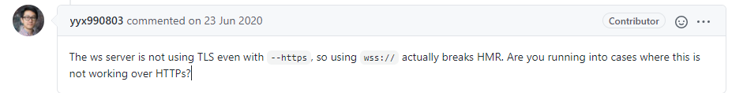
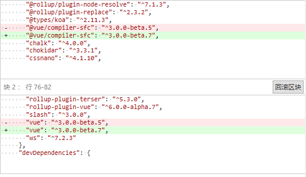

# commit-141 拼写错误[#27](https://github.com/vitejs/vite/pull/27)

[#27](https://github.com/vitejs/vite/pull/27)


# commit-142 拆分测试[#28](https://github.com/vitejs/vite/pull/28)

拆分测试功能，方便后续使用`test.skip`来进行TDD。

```typescript
describe('my suite', () => {
  test('my only true test', () => {
    expect(1 + 1).toEqual(2);
  });
  // Should fail, but isn't even run
  test.skip('my only true test', () => {
    expect(1 + 1).toEqual(1);
  });
});
```

> TDD是**测试驱动开发**（Test-Driven Development）的英文简称，是敏捷开发中的一项核心实践和技术，也是一种设计方法论。TDD的原理是在开发功能代码之前，先编写单元测试用例代码，测试代码确定需要编写什么产品代码。TDD虽是敏捷方法的核心实践，但不只适用于[XP](https://baike.baidu.com/item/XP/776028)（Extreme Programming），同样可以适用于其他开发方法和过程。


# commit-143 update rollup-plugin-vue


# commit-144 vite命令支持布尔值

支持使用`vite`配置` --flag=false`。

```typescript
// bin/vite.js

Object.keys(argv).forEach((key) => {
  if (argv[key] === 'false') {
    argv[key] = false
  }
})
```


# commit-145 关闭src转换

编译vue文件中的`<template>`，关闭` trasnformAssetUrls`选项。

https://vue-loader.vuejs.org/zh/options.html#transformasseturls

```typescript
// Transform asset urls found in the template into `require()` calls
  // This is off by default. If set to true, the default value is
  // {
  //   audio: 'src',
  //   video: ['src', 'poster'],
  //   source: 'src',
  //   img: 'src',
  //   image: ['xlink:href', 'href'],
  //   use: ['xlink:href', 'href']
  // }
transformAssetUrls?: AssetURLOptions | boolean
```

## 深入了解一下

我们查看关闭前的template转换成了什么？

```typescript
import { createVNode as _createVNode, toDisplayString as _toDisplayString, resolveComponent as _resolveComponent, Fragment as _Fragment, openBlock as _openBlock, createBlock as _createBlock } from "/@modules/vue"
import _imports_0 from './assest/pkg.png'


const _hoisted_1 = _createVNode("img", { src: _imports_0 }, null, -1 /* HOISTED */)

export function render(_ctx, _cache) {
  const _component_Child = _resolveComponent("Child")

  return (_openBlock(), _createBlock(_Fragment, null, [
    _hoisted_1,
    _createVNode("button", {
      class: "foo",
      onClick: _cache[1] || (_cache[1] = $event => (_ctx.count++))
    }, _toDisplayString(_ctx.count) + "123", 1 /* TEXT */),
    _createVNode(_component_Child)
  ], 64 /* STABLE_FRAGMENT */))
}
```

报错：

> pkg.png:1 Failed to load module script: Expected a JavaScript module script but the server responded with a MIME type of "image/png". Strict MIME type checking is enforced for module scripts per HTML spec.

意味着我们不能使用`import`一个`image/png`类型的文件。


我们查看关闭后：

```typescript
import { createVNode as _createVNode, toDisplayString as _toDisplayString, resolveComponent as _resolveComponent, Fragment as _Fragment, openBlock as _openBlock, createBlock as _createBlock } from "/@modules/vue"

const _hoisted_1 = _createVNode("img", { src: "./assest/pkg.png" }, null, -1 /* HOISTED */)

export function render(_ctx, _cache) {
  const _component_Child = _resolveComponent("Child")

  return (_openBlock(), _createBlock(_Fragment, null, [
    _hoisted_1,
    _createVNode("button", {
      class: "foo",
      onClick: _cache[1] || (_cache[1] = $event => (_ctx.count++))
    }, _toDisplayString(_ctx.count) + "123", 1 /* TEXT */),
    _createVNode(_component_Child)
  ], 64 /* STABLE_FRAGMENT */))
}
```

一切恢复正常，图片可以正常显示了。

为什么会有transformAssetUrls这个选项？是webpack需要使用到的，转换后webpack会再经过自身插件的转换。

> 啊哈，所以webpack就是没vite快！


# commit-146 调整todo 新增相对路径处理

## TODOs

- 相对路径和基本公共路径处理
- 自动加载`post css`配置
- 支持 `.css` 和 `.json`
- 配置文件支持 (custom import maps)
- Vue file source maps

是不是尤大看到资源处理还没处理，需要解决相对路径的处理？


# commit-147 客户端支持wss [#31](https://github.com/vitejs/vite/pull/31)

检测`location.protocol`是不是`https`，是则自动开启`wss`

> WS（WebSocket ）是不安全的 ，容易被窃听，因为任何人只要知道你的ip和端口，任何人都可以去连接通讯。
> WSS（Web Socket Secure）是WebSocket的加密版本。

[443端口和80端口](https://zhuanlan.zhihu.com/p/99950177)

> 网络端口：计算机与外界通讯交流的出口

# 为什么`node`服务不用任何设置就可以使用wss？


尤大说，目前还不支持`wss`。

[【NODE】用WS模块创建加密的WS服务(WSS)](https://luojia.me/2015/07/21/%E3%80%90node%E3%80%91%E7%94%A8ws%E6%A8%A1%E5%9D%97%E5%88%9B%E5%BB%BA%E5%8A%A0%E5%AF%86%E7%9A%84ws%E6%9C%8D%E5%8A%A1wss/)

> 和https设置是一样的

## 最后被回滚了



原因使用https也不会使用wss服务（？？htttps必须使用wss的）。

关于这个我十分懵逼... 等`--https`支持了，后续再看看吧。


# commit-148 处理相对资源路径

## package.json

```json
{
+    "koa-send": "^5.0.0"
}
```

新增静态文件服务中间件。

[koa-send是什么](https://www.cnblogs.com/jiasm/p/9527536.html)

## node/utils.ts

新增`isStaticAsset`检测是否属于（常见）静态文件的方法。

```typescript
export const scriptRE = /<script\b[^>]*>([\s\S]*?)<\/script>/gm

const imageRE = /\.(png|jpe?g|gif|svg)(\?.*)?$/
const mediaRE = /\.(mp4|webm|ogg|mp3|wav|flac|aac)(\?.*)?$/
const fontsRE = /\.(woff2?|eot|ttf|otf)(\?.*)?$/i

export const isStaticAsset = (file: string) => {
  return imageRE.test(file) || mediaRE.test(file) || fontsRE.test(file)
}
```

## node/resolveVue.ts

区分浏览器版本（browser）和构建版本（bundler）的`vue`。

> browser是一个完整性的vue包（单文件），bundler是一个带有import的包（就是不会把所有东西都打包成一个文件，但是会从import引入）。
>
> 两者都包含编译器。

```typescript
interface ResolvedVuePaths {
  browser: string // esm.browser路径
  bundler: string // esm.bundler路径
  version: string // require('vue/package.json').version
  hasLocalVue: boolean // 是否有本地vue，没有则表示其他的路径均从vite的依赖获取
  compiler: string
  cdnLink: string
}
```

## node/serverPluginServeStatic.ts

引入`resolver`，用于处理用户自定义路径(`resolver.requestToFile(ctx.path)`)。

```typescript
// 新增
app.use((ctx, next) => {
    const redirect = resolver.requestToFile(ctx.path)
    if (!redirect.startsWith(root)) {
      // resolver解析项目根目录之外的文件，
      // 手动发送到此处
      return send(ctx, redirect, { root: '/' })
    }
    return next()
})
```

### 为什么有了koa-static还要用send?

啊哈，主要是因为`send`好用。

在这里的作用是处理`koa-static`没有的服务，比如项目外的路径。

## node/serverPluginVue.ts

# [3.0.0-beta.9](https://github.com/vuejs/vue-next/compare/v3.0.0-beta.8...v3.0.0-beta.9) (2020-05-04)

把`transformAssetUrl: false`更改为`transformAssetUrlsBase: path.posix.dirname(publicPath)`。

然后我寻找`transformAssetUrlsBase`，`vue-next beta.9`的时候被合并到`transformAssetUrl`，也意味着后续`vite`会修改过来（雀氏没有了）。

**这块不是为了build的时候可以转换为Import资源，而是交给rollup-plugin-vue处理的，留坑MARK**。

### Bug Fixes

- **compiler:** bail strigification on runtime constant expressions ([f9a3766](https://github.com/vuejs/vue-next/commit/f9a3766fd68dc6996cdbda6475287c4005f55243))
- **transitionGroup:** fix transition children resolving condition ([f05aeea](https://github.com/vuejs/vue-next/commit/f05aeea7aec2e6cd859f40edc6236afd0ce2ea7d))

### Features

- **compiler-sfc:** support transforming absolute asset urls ([6a0be88](https://github.com/vuejs/vue-next/commit/6a0be882d4ce95eb8d8093f273ea0e868acfcd24))

### BREAKING CHANGES

- **compiler-sfc:** `@vue/compiler-sfc`'s `transformAssetUrlsBase` option has been removed. It is merged into `trasnformAssetUrls` which now also accepts the format of

  ```typescript
  {
    base?: string
    includeAbsolute?: string
    tags?: { [name: string]: string[] }
  }
  ```

## 关于构建的改动（新增资源处理、整理plugins）

#### 新增4个文件(`rollup-plugin`)：

* `node/buildPluginAsset.ts`: 修改符合`isStaticAsset`的文件为`hash`路径，并存入一个Map，后续使用`generateBundle`改写对应`hash`路径的`source`。

  ```typescript
  import a from 'a.png'
  
  // a.png 被转换为
  export default 'a.bf716c.png'
  
  // 后续a.bf716c.png，bundle修改为资源类型
  bundle['a.bf716c.png'] = {
      isAsset: true,
      type: 'asset',
      fileName,
      source: await fs.readFile('a.png')
  }
  ```

* `node/buildPluginCss.ts`:  对应`build`旧的`cssExtractPlugin`，`postcss`处理后输出`bundle`资源。

* `node/buildPluginHtml.ts`: 把旧的`vitePlugin`抽离处理`html`功能独立出来，分析`<script>`，返回标签内容，入口的处理。

* `buildPluginResolve.ts`: 旧的`vitePlugin`，处理vue包，`resolver`路径转换(在这里处理了，后续的`plugins`不用单独处理)。

#### 单一出口。

去除`MultiBuildOptions`，意味着之前封装成的`generator`方法又被回滚了，出口只能有一个。

```typescript
// 已被去除
interface MultiBuildOptions extends BuildOptionsBase {
  rollupOutputOptions?: OutputOptions[]
}
```


# commit-149 bump vue version




# commit-150 处理使用css，import css文件

注意哈，处理`css`是交给`rollup-plugin-vue`处理的，[使用`transform`处理`css`](https://github.com/vuejs/rollup-plugin-vue/blob/next/src/index.ts)，这个和我们`dev`环境下是一样的。

这里做的事情是**根据内容与文件名称生成一个`bundle`**，其次把公用的方法都给抽离出来了，属于整理代码。

```typescript
 // vite:css
 createBuildCssPlugin(assetsDir, cssFileName, minify)
```

> 所有vue组件里面的style，都会被丢进style.css这个bundle。

## rollup其实充当了什么？

**rollup分析路径**，通过**钩子**可以转换路径、更改路径下的内容，最后自己定义产出`bundle`。

`vite`再把`bundle`转换成文件。

