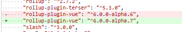
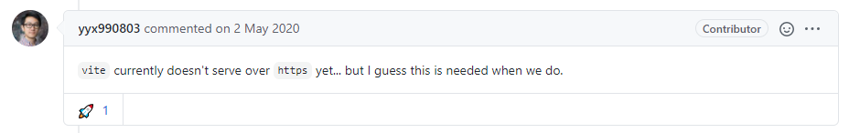

# commit-141 拼写错误[#27](https://github.com/vitejs/vite/pull/27)

[#27](https://github.com/vitejs/vite/pull/27)


# commit-142 拆分测试[#28](https://github.com/vitejs/vite/pull/28)

拆分测试功能，方便后续使用`test.skip`来进行TDD。

```typescript
describe('my suite', () => {
  test('my only true test', () => {
    expect(1 + 1).toEqual(2);
  });
  // Should fail, but isn't even run
  test.skip('my only true test', () => {
    expect(1 + 1).toEqual(1);
  });
});
```

> TDD是**测试驱动开发**（Test-Driven Development）的英文简称，是敏捷开发中的一项核心实践和技术，也是一种设计方法论。TDD的原理是在开发功能代码之前，先编写单元测试用例代码，测试代码确定需要编写什么产品代码。TDD虽是敏捷方法的核心实践，但不只适用于[XP](https://baike.baidu.com/item/XP/776028)（Extreme Programming），同样可以适用于其他开发方法和过程。


# commit-143 update rollup-plugin-vue




# commit-144 vite命令支持布尔值

支持使用`vite`配置` --flag=false`。

```typescript
// bin/vite.js

Object.keys(argv).forEach((key) => {
  if (argv[key] === 'false') {
    argv[key] = false
  }
})
```


# commit-145 关闭src转换

编译vue文件中的`<template>`，关闭` trasnformAssetUrls`选项。

https://vue-loader.vuejs.org/zh/options.html#transformasseturls

```typescript
// Transform asset urls found in the template into `require()` calls
  // This is off by default. If set to true, the default value is
  // {
  //   audio: 'src',
  //   video: ['src', 'poster'],
  //   source: 'src',
  //   img: 'src',
  //   image: ['xlink:href', 'href'],
  //   use: ['xlink:href', 'href']
  // }
transformAssetUrls?: AssetURLOptions | boolean
```

## 深入了解一下

我们查看关闭前的template转换成了什么？

```typescript
import { createVNode as _createVNode, toDisplayString as _toDisplayString, resolveComponent as _resolveComponent, Fragment as _Fragment, openBlock as _openBlock, createBlock as _createBlock } from "/@modules/vue"
import _imports_0 from './assest/pkg.png'


const _hoisted_1 = _createVNode("img", { src: _imports_0 }, null, -1 /* HOISTED */)

export function render(_ctx, _cache) {
  const _component_Child = _resolveComponent("Child")

  return (_openBlock(), _createBlock(_Fragment, null, [
    _hoisted_1,
    _createVNode("button", {
      class: "foo",
      onClick: _cache[1] || (_cache[1] = $event => (_ctx.count++))
    }, _toDisplayString(_ctx.count) + "123", 1 /* TEXT */),
    _createVNode(_component_Child)
  ], 64 /* STABLE_FRAGMENT */))
}
```

报错：

> pkg.png:1 Failed to load module script: Expected a JavaScript module script but the server responded with a MIME type of "image/png". Strict MIME type checking is enforced for module scripts per HTML spec.

意味着我们不能使用`import`一个`image/png`类型的文件。


我们查看关闭后：

```typescript
import { createVNode as _createVNode, toDisplayString as _toDisplayString, resolveComponent as _resolveComponent, Fragment as _Fragment, openBlock as _openBlock, createBlock as _createBlock } from "/@modules/vue"

const _hoisted_1 = _createVNode("img", { src: "./assest/pkg.png" }, null, -1 /* HOISTED */)

export function render(_ctx, _cache) {
  const _component_Child = _resolveComponent("Child")

  return (_openBlock(), _createBlock(_Fragment, null, [
    _hoisted_1,
    _createVNode("button", {
      class: "foo",
      onClick: _cache[1] || (_cache[1] = $event => (_ctx.count++))
    }, _toDisplayString(_ctx.count) + "123", 1 /* TEXT */),
    _createVNode(_component_Child)
  ], 64 /* STABLE_FRAGMENT */))
}
```

一切恢复正常，图片可以正常显示了。

为什么会有transformAssetUrls这个选项？是webpack需要使用到的，转换后webpack会再经过自身插件的转换。

> 啊哈，所以webpack就是没vite快！


# commit-146 调整todo 新增相对路径处理

## TODOs

- 相对路径和基本公共路径处理
- 自动加载`post css`配置
- 支持 `.css` 和 `.json`
- 配置文件支持 (custom import maps)
- Vue file source maps

是不是尤大看到资源处理还没处理，需要解决相对路径的处理？


# commit-147 客户端支持wss [#31](https://github.com/vitejs/vite/pull/31)

检测`location.protocol`是不是`https`，是则自动开启`wss`

> WS（WebSocket ）是不安全的 ，容易被窃听，因为任何人只要知道你的ip和端口，任何人都可以去连接通讯。
> WSS（Web Socket Secure）是WebSocket的加密版本。

[443端口和80端口](https://zhuanlan.zhihu.com/p/99950177)

> 网络端口：计算机与外界通讯交流的出口

# 为什么`node`服务不用任何设置就可以使用wss？



尤大说，目前还不支持`wss`。

[【NODE】用WS模块创建加密的WS服务(WSS)](https://luojia.me/2015/07/21/%E3%80%90node%E3%80%91%E7%94%A8ws%E6%A8%A1%E5%9D%97%E5%88%9B%E5%BB%BA%E5%8A%A0%E5%AF%86%E7%9A%84ws%E6%9C%8D%E5%8A%A1wss/)

> 和https设置是一样的


# commit-148 处理相对资源路径

