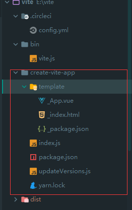

# commit-71 模板

新增```create-vite-app```文件夹，可以通过命令`npx create-vite-app <project-name>`来创建。



# commit-72 vite`为什么如此快？

## Getting Started

```bash
$ npx create-vite-app <project-name>
$ cd <project-name>
$ npm install
$ npm run dev
```

If using Yarn:

```bash
$ yarn create vite-app <project-name>
$ cd <project-name>
$ yarn
$ yarn dev
```

## 这与基于捆绑程序的设置有何不同?

主要区别在于，对于`vite`，在**开发过程中**没有捆绑。源代码中的**ES导入语法**直接提供给浏览器，浏览器通过`<script module>`支持和解析它们，为每次`import`发出HTTP请求。dev服务器拦截请求，并在必要时执行代码转换。例如，对`*.vue`文件的`import`，在发送给浏览器之前立即编译。

这种方法有几个优点:

- 由于没有捆绑工作要做，服务器冷启动极快
- 代码是按需编译的，所以只编译当前屏幕上实际导入的代码。你不必等到整个应用程序被捆绑后才能开始开发。这对于具有数十个屏幕的应用程序来说可能是一个巨大的差异
- 热模块更换 (HMR) 性能与模块总数分离。无论你的应用程序有多大，HMR 都始终快速

整页重新加载可能比基于捆绑器的设置稍慢，因为原生 ES `import`会导致一系列**深度`import`的网络请求**。然而，由于这是本地开发，与实际编译时间相比，差异应该是微不足道的。 （页面重新加载没有编译成本，因为已经编译的文件缓存在内存中。）

最后，因为编译在 `Node`环境 中完成，**它在技术上可以支持任何捆绑器进行代码转换**。事实上，`vite` 提供了一个 `vite build` 命令来做到这一点，因此应用程序在生产中不会受到**深度`import`的网络请求**的影响。

`vite` 在这个阶段是高度实验性的，不适合生产使用，但我们希望有一天能做到。

# commit-73 v0.5.2

release v0.5.2

