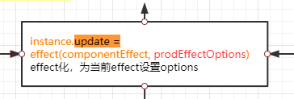
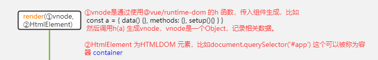

# commit-1 根基

### npm bin的知识点

我们写包的时候，可以在package.json中添加bin字段。

```json
{
  "bin": {
    "vds": "bin/vds.js"
  }
}

```

当用户安装我们写的包，用户可以使用vds来执行 ```bin/vds.js```

npm为我们在```./bin```目录下面放了一个叫做```vds```的软连接，所以在目录下面执行命令行```vds```，就会执行```bin/vds.js```文件

### Upgrade-Insecure-Requests请求头

HTTP ```Upgrade-Insecure-Requests``` 请求头向服务器发送一个客户端对HTTPS加密和认证响应良好，并且可以成功处理的信号，可以请求所属网站所有的HTTPS资源。
在https页面中，如果调用了http资源，那么浏览器就会抛出一些错误。为了改变成这一状况，chrome(谷歌浏览器)会在http请求中加入 ```Upgrade-Insecure-Requests: 1``` ，服务器收到请求后会返回 ```Content-Security-Policy: upgrade-insecure-requests``` 头，告诉浏览器，可以把所属本站的所有 http 连接升级为 https 连接。

### 是如何监听文件变动的

利用工具```chokidar```，文件改动保存，即可触发（其实按下```ctrl + s```就已经触发了）

```javascript
const chokidar = require('chokidar')
const fileWatcher = chokidar.watch(process.cwd(), {
    ignored: [/node_modules/]
  })

fileWatcher.on('change', (file) => {
    if (file.endsWith('.vue')) {
        // do something
    }
})
```

### 流程

1. 浏览器请求文件，服务端发送经过```@vue/compiler-sfc```处理，转换成Vue版本的AST。

2. 服务器把AST整理成```js```，其中把```template```转换成```render```函数

   ```javascript
   // http://localhost:3000/file-vue/test.vue
   
       const script = {
         name: "123",
         data() {
           return {
             a: 123
           }
         }
       }
   
   export default script
   import { render } from "/file-vue/test.vue?type=template"
   script.render = render
   script.__hmrId = "/file-vue/test.vue"
   ```

### 准备工作

1. hmrProxy.js文件：
   目的是给浏览器运行```ws```，与服务器进行双向交流，使用```esm```的```import```，请求本地```vue```文件，进行上面说的流程。

   比如，文件变动（变动也分类型，比如现在是对比出旧文件和新文件的AST语法树中的```script.content```内容字符串有变动，事件名称```reload```，```template```的改动事件名称为```rerender```），通知前端事件  ```reload```，使用```import```异步引入```parse```后的内容（如上面的代码），再重新运行（这块还没写，预备位置）。

2.对于```vue```文件的```style```还未处理，停留在```vue```的```AST```上。

3.准备前端事件```update-style```与```full-reload```

```javascript
// 这个文件运行在客户端上

const socket = new WebSocket(`ws://${location.host}`)

// 监听服务器发送的事件
socket.addEventListener('message', ({ data }) => {
  const { type, path, index } = JSON.parse(data)
  switch (type) {
    case 'connected':
      console.log(`[vds] connected.`)
      break
    case 'reload':
      import(`${path}?t=${Date.now()}`).then(m => {
        __VUE_HMR_RUNTIME__.reload(path, m.default) // m为AST转换成的js文件内容
        console.log(`[vds][hmr] ${path} reloaded.`)
      })
      break
    case 'rerender':
      import(`${path}?type=template&t=${Date.now()}`).then(m => {
        __VUE_HMR_RUNTIME__.rerender(path, m.render)
        console.log(`[vds][hmr] ${path} template updated.`)
      })
      break
    case 'update-style':
      import(`${path}?type=style&index=${index}&t=${Date.now()}`).then(m => {
        // TODO style hmr  留坑
      })
      break
    case 'full-reload':
      location.reload() // 刷新浏览器
  }
})

// ping server 如果服务器ws连接中断，进行每秒的重新链接
socket.addEventListener('close', () => {
  console.log(`[vds] server connection lost. polling for restart...`)
  setInterval(() => {
    new WebSocket(`ws://${location.host}`).addEventListener('open', () => {
      location.reload() // 这里有BUG 需要把setInterval给删除
    })
  }, 1000)
})
```


# commit-2 

### server.js 新增serve-handler

利用这个包，改写除了__hmrClient和.vue后缀的文件的路径，比如访问```localhost:3000/a```会自动修正为```localhost:3030/index.html```

### parseSFC.js 处理SFC文件时，增加可以配置的缓存

```javascript
if (saveCache) { // 新增是否保存缓存
    cache.set(filename, descriptor)
}
```

### server.js 修复BUG

```javascript
// 提升 以下这段代码上一个层级
const fileWatcher = chokidar.watch(process.cwd(), {
    ignored: [/node_modules/]
})
```


# commit-3 新增+优化

### moduleRewriter.js

使用```magic-string```重写AST语法树输出script中的```export script```

### server.js新增访问__modules与.js文件

```javascript
if (pathname.startsWith('/__modules/')) {
    return moduleMiddleware(pathname.replace('/__modules/', ''), res)
  } else if (pathname.endsWith('.vue')) {
    return vue(req, res)  // 发送vue文件 需要vue中间件 （@vue/compiler-sfc）
  } else if (pathname.endsWith('.js')) { // 发送JS
    const filename = path.join(process.cwd(), pathname.slice(1))
    if (fs.existsSync(filename)) {
      const content = rewrite(fs.readFileSync(filename, 'utf-8'))
      return sendJS(res, content)
    }
 }
```

### moduleMiddleware.js

当访问localhost:3000/__modules/abc，通过```require.resolve('abc')```拿到绝对路径，把文件内容放进```response```响应体中。关于```require.resolve```：

[require.resolve是如何寻找文件的](https://juejin.cn/post/6844904055806885895)

### 处理好的文件中的变量增加下划线标识

```___script``` ```__render```

引入```hmrClient.js```

```javascript
import "/__hmrClient" // 新增，这是一个客户端client ws 文件，在commit-1中就存在
// __hmrClient 会自动访问 hmrClient.js

    let __script; export default (__script = {
      name: "123",
      data() {
        return {
          a: 123
        }
      }
    })

import { render as __render } from "/file-vue/test.vue?type=template"
__script.render = __render
__script.__hmrId = "/file-vue/test.vue"
```


# commit-4 重构

### parseSFC.js阅读文件，修改成promise的方法

曾经是同步读取文件，会阻塞线程，现在改用promises，去除需要等待IO处理的时间。

```javascript
// ./lib/hmrWatcher.js
const [descriptor, prevDescriptor] = await parseSFC(file)
```

### moduleMiddleware.js

1. 处理```__modules```的```moduleMiddleware.js```曾经使用```require.resolve('abc')```确定路径，现在改为使用```resolve-cwd```模块。不同之处在于```resolve-cwd```仅会在当前工作目录中（命令行当前的路径）寻找。
   ```http://localhost:3000/__modules/vue``` -->```命令行当前目录/node_modules/vue/index.js```
   如果是用```require.resolve```，且当前工作目录下没有vue模块（当然更没有当前vue包，详情看文章），则会在当前命令行目录的上级路径查找模块，直到没有为止。

   ```javascript
   require.resolve('diff')
   // 寻找的路径["Users/当前工作目录/node_modules", "/Users/node_modules", "/node_modules"]
   ```

   可以看到是往上寻找的。

```javascript
const resolve = require('resolve-cwd')
modulePath = resolve(id)
```

2. 曾经使用```sendJS```改为```sendJSStream```，在发送文件的时候，新增```Transfer-Encoding: chunked```response header。

   > 数据以一系列分块的形式进行发送。 [`Content-Length`](https://developer.mozilla.org/zh-CN/docs/Web/HTTP/Headers/Content-Length) 首部在这种情况下不被发送。在每一个分块的开头需要添加当前分块的长度，以十六进制的形式表示，后面紧跟着 '`\r\n`' ，之后是分块本身，后面也是'`\r\n`' 。终止块是一个常规的分块，不同之处在于其长度为0。终止块后面是一个挂载（trailer），由一系列（或者为空）的实体消息首部构成。

```javascript
function send(res, source, mime) {
  res.setHeader('Content-Type', mime)
  res.end(source)
}

function sendJS(res, source) {
  send(res, source, 'application/javascript')
}

function sendJSStream(res, file) {
  res.setHeader('Content-Type', 'application/javascript')
  const stream = fs.createReadStream(file)
  stream.on('open', () => {
    stream.pipe(res)
  })
  stream.on('error', (err) => {
    res.end(err)
  })
}
```

### server.js expose createAPI

封装```server```。

```javascript
#!/usr/bin/env node
const { createServer } = require('../lib/server')

// TODO pass cli args
createServer()
// 封装后 就不直接像之前 require('')文件直接使用了，而且可以配置port，默认3000
```

### package.json添加main字段，指向./lib/server.js

```javascript
  "main": "lib/server.js"
```


# commit-5 使用TS重构内容

### lint-staged

```json
{
    "gitHooks": { // yorkie 不知道的 去搜索下git仓库 yorkie
      "pre-commit": "lint-staged"
     },
     "lint-staged": {
       "*.js": [
         "prettier --write",
         "git add"
       ],
       "*.ts": [
         "prettier --parser=typescript --write",
         "git add"
       ]
     }
}
```

假如你改动了```index.ts```文件，并且git add 把文件丢进暂存区。

```typescript
// ./src/server/index.ts
export { createServer, ServerConfig } from "./server"
+ let a = 'a'
```

改动.prettierrc，把单括号模式关闭（这个改动加不加都没所谓，执行的是你现在本身的文件内容）

```
semi: false
- singleQuote: true
+ singleQuote: false
printWidth: 80
trailingComma: none
```

```git commit```，识别到是commit行为，通过钩子执行```lint-staged```命令，改动的是js文件，执行```prettier --parser=typescript --write```，你会发现你的代码从单括号变成双括号了，并且提交到本地仓库的也是双括号。

```javascript
// ./src/server/index.ts
export { createServer, ServerConfig } from "./server"
let a = "a"
```

### TS相关

客户端运行的代码在```src/client```，服务端运行的代码在```src/server```。

关于从js ---> ts的重构文件源与目标

- ```./lib/hmrClient.js```  ---> ```./src/client/client.ts```
- ```./lib/hmrWatcher.js```  ---> ```./src/server/hmrWatcher.ts```
- ```./bin/vds.js```  ---> ```./src/server/index.ts``` // "main": "dist/server/index.js"
- ```./lib/moduleMiddleware.js```  ---> ```./src/server/moduleMiddleware.ts```
- ```./lib/moduleRewriter.js```  ---> ```./src/server/moduleRewriter.ts```
- ```./lib/parseSFC.js```  ---> ```./src/server/parseSFC.ts```
- ```./lib/server.js```  ---> ```./src/server/server.ts```
- ```./lib/util.js```  ---> ```./src/server/util.ts```
- ```./lib/vueMiddleware.js```  ---> ```./src/server/vueMiddleware.ts```####

#### tsconfig.base.json

server与client公用（使用extends: "../../tsconfig.base.json"）。

```json
{
  "compilerOptions": {
    "sourceMap": false,
    "target": "esnext",
    "moduleResolution": "node",
    "esModuleInterop": true,
    "declaration": true,
    "allowJs": false,
    "allowSyntheticDefaultImports": true,
    "noUnusedLocals": true,
    "strictNullChecks": true,
    "noImplicitAny": true,
    "removeComments": false,
    "lib": [
      "esnext",
      "DOM"
    ]
  }
}

```


#### ./src/client/tsconfig.json

```json
{
  "extends": "../../tsconfig.base.json",
  "compilerOptions": {
    "baseUrl": ".",
    "outDir": "../../dist/client", // 输出位置
    "module": "esnext", // 生成输出支持esnext的代码
    "lib": ["ESNext", "DOM"] // 需要注入的库 DOM 与 esnext(就是语法啦)
  },
  "include": ["./"]
}
```

#### ./src/client/tsconfig,json

```json
{
  "extends": "../../tsconfig.base.json",
  "compilerOptions": {
    "baseUrl": ".",
    "outDir": "../../dist/server",
    "module": "commonjs", // 生成cjs的语法 可以说是es5了
    "lib": ["ESNext"]
  },
  "include": ["./"]
}

```

与```client```的区别是，```server```不需要使用```esm```/```node```，客户端必须使用```esm```，因为那是灵魂。

### 命令

```jso
"scripts": {
    "dev": "run-p dev-client dev-server",
    "dev-client": "tsc -w --p src/client",
    "dev-server": "tsc -w --p src/server",
    "build": "tsc -p src/client && tsc -p src/server",
    "lint": "prettier --write --parser typescript \"src/**/*.ts\"",
    "prepublishOnly": "tsc"
  }
```

- **dev**：run-p为npm-run-all包的命令（前面有介绍过package.json中的main字段），利用这个工具，可以同时运行两个命令，并非顺序运行。
- **dev-client**: typescript的编译命令tsc，--w 监听文件变动，使得文件自动编译。--p 后接文件路径。
- **dev-server**: 同上。
- **build**: server and client编译(采用-p src/client 的tsconfig / -p src/server 的 tsconfig)。
- **lint**: 格式```src/**/*.ts```路径下的ts文件, ```--parser```表示需要格式的文件是typescript文件。
- **prepublishOnly**: 无效的命令... 不知道为什么而准备

### 更新cli文件

```javascript
- const { createServer } = require('../lib/server')
+ const { createServer } = reuqire('../dist/server')
```


# commit-6 添加测试

### server/server.ts

给promise，返回ws（如果已连接）本身。

```typescript
async function  createServer({ port = 3000 }: ServerConfig = {}): Promise<Server> {
    // do something
}
```

### 添加新命令test

```json
{
    "script": {
+        "test": "yarn build && jest"
    },
+   "jest": {
+        "watchPathIgnorePatterns": ["<rootDir>/test/temp"] // 告诉jest不需要运行这个目录下的.test
+   }
}
```

### 观察测试得出的结论

```execa```包: 创建子进程运行```./bin/vds.js```，并且等待进程在控制台打印输出```Running```后，进行测试，在所有测试完成后终止其进程。

```puppeteer```: 可以通过API来控制Chrome/Chromium，很多操作浏览器的行为都可以通过```puppeteer```来实现。

#### 流程查看（后续再画出流程图指）

这里的流程查看，可以使用单元测试运行，但是还有一种形式。

1.进入 ```USER/test/fixtures```目录，运行```USER/bin/vds.js```。
2.打开```localhost:3000```。
3.可以观察流程，修改```fixtures```文件夹下的组件（注意要恢复，因为该文件会影响测试结果，导致后续jest测试失败），查看```ws```发送的通知。

#### HMR文件是何时植入的(就是client.ts是什么时候给到浏览器进行ws的建立的)？

``````javascript
#index.html
<div id="app"></div>
<script type="module" src="/main.js"></script>

#main.js http://localhost:3000/main.js
// 经过server/server.ts
// 识别到请求的是（注意哈，当前工作目录在fixtures目录下）main.js，js文件不进行分块发送（commit-4中有提到）
// 直接发送main.js
import { createApp } from 'vue' // 等待加载完毕文件
import Comp from './Comp.vue' // 才会运行js，别忘了esm的特性是静态的（除了import.resolve()）
createApp(Comp).mount('#app')

#server/moduleMiddleware.ts的拦截（http://localhost:3000/__modules/vue）
// 拦截后这里直接发送一整个 'dist/vue.runtime.esm-browser.js'(怎么寻找的？看commit-4)

# server/vueMiddleware.ts (http://localhost:3000/Comp.vue)
if (!query.type) { // 并没有type参数，什么参数都没
    // inject hmr client 植入hmr
    let code = `import "/__hmrClient"\n`
    if (descriptor.script) {
      code += rewrite(
        descriptor.script.content,
        true /* rewrite default export to `script` */
      )
    } else {
      code += `const __script = {}; export default __script`
    }
    if (descriptor.template) {
      code += `\nimport { render as __render } from ${JSON.stringify(
        parsed.pathname + `?type=template${query.t ? `&t=${query.t}` : ``}`
      )}`
      code += `\n__script.render = __render`
    }
    if (descriptor.style) { // 还没做
      // TODO
    }
    code += `\n__script.__hmrId = ${JSON.stringify(parsed.pathname)}`
    return sendJS(res, code)
}

# http://localhost:3000/Comp.vue
import "/__hmrClient"
import Child from './Child.vue'
let __script; export default (__script = {
  components: { Child },
  setup() {
    return {
      count: 0
    }
  }
})
import { render as __render } from "/Comp.vue?type=template"
__script.render = __render
__script.__hmrId = "/Comp.vue"
// （这块其实就是你写的vue组件，帮你设置好输出罢了）

# http://localhost:3000/Child.vue
import "/__hmrClient" // 二次导入为什么不会进行两次ws的连接？（因为import只进行一次的，esm它不同amd cmd cjs）
const __script = {}; export default __script
import { render as __render } from "/Child.vue?type=template"
__script.render = __render
__script.__hmrId = "/Child.vue"
// 与Comp一样
``````

#### 为什么render要分开引入?

```import "/Child.vue?type=template"```的好处分析：

##### 关于```reload```事件

这里如果你的vue组件改变，```server/hmrWatcher```中会对比新旧AST语法树中的```script```字符，如果是script改变，那么发送```reload```事件，给用户端。客户端识别到```reload```事件，他将使用```esm```的异步引入模块```import().then()```。

```javascript
# client/client.ts (我看的是未经编译的ts，实际是js,这里涉及到的其实都是js，为了方便我用了ts)
case 'reload':
      import(`${path}?t=${Date.now()}`).then((m) => {
        __VUE_HMR_RUNTIME__.reload(path, m.default) // path资源路径
        console.log(`[vds] ${path} reloaded.`)
      })
      break
```

```__VUE_HMR_RUNTIME__```: 

先介绍一下vue-next的知识点。

```javascript
# vue-next/runtime-core/mountComponent: Function
// 这个在vue组件开始渲染的时候触发，在mountComponent Component类型组件才会有
if (__DEV__ && instance.type.__hmrId) { // 可以看到需要有__hmrId这个文件路径才会帮你注册
      registerHMR(instance) // 注册hmrID 其实就是路径
}

# vue-next/runtime-core/unmountComponent: Function
// 删除注册
if (__DEV__ && instance.type.__hmrId) {
      unregisterHMR(instance)
}

# vue-next/runtime-core/hmr.ts
export function registerHMR(instance: ComponentInternalInstance) {
  const id = instance.type.__hmrId!
  let record = map.get(id)
  if (!record) {
    createRecord(id) // map中存放set, key: hmrId, value: new Set()
    record = map.get(id)!
  }
  record.add(instance) // 把instance 存进set 一个组件可能会被多处地方使用，所以会存在多个instance
}
    
export function unregisterHMR(instance: ComponentInternalInstance) {
  map.get(instance.type.__hmrId!)!.delete(instance)
}
```

这里使用到了的功能是```reload```:

```typescript
export const hmrDirtyComponents = new Set<Component>()

function reload(id: string, newComp: ComponentOptions) {
  const record = map.get(id)
  if (!record) return
  Array.from(record).forEach(instance => {
    const comp = instance.type // instance.type是旧的newComp
    if (!hmrDirtyComponents.has(comp)) {
      // 1. Update existing comp definition to match new one
      extend(comp, newComp)
      for (const key in comp) {
        if (!(key in newComp)) {
          delete (comp as any)[key]
        }
      }
        
      // 2. Mark component dirty. This forces the renderer to replace the component
      // on patch.
      hmrDirtyComponents.add(comp)
      // 3. Make sure to unmark the component after the reload.
      queuePostFlushCb(() => {
        hmrDirtyComponents.delete(comp)
      })
    }

    if (instance.parent) {
      // 4. Force the parent instance to re-render. This will cause all updated
      // components to be unmounted and re-mounted. Queue the update so that we
      // don't end up forcing the same parent to re-render multiple times.
      queueJob(instance.parent.update)
    } else if (instance.appContext.reload) {
      // root instance mounted via createApp() has a reload method
      instance.appContext.reload()
    } else if (typeof window !== 'undefined') {
      // root instance inside tree created via raw render(). Force reload.
      window.location.reload() //
    } else {
      console.warn(
        '[HMR] Root or manually mounted instance modified. Full reload required.'
      )
    }
  })
}
```

这块检测了组件字段的改变。如果当前组件拥有父组件，调用父组件的```instance.update```方法:

(这里真心建议大家看一下vue-next的渲染流程，不然我也表达不出它原本意思)

[vue-next组件渲染流程图](https://www.processon.com/view/link/5f85c9321e085307a0892f7e)

调用这个方法，目标就是让子组件重新走一次流程，可以让render重新更新，让视图重新抓取effect，大体意思就是渲染子组件。

调用这个方法，目标就是让子组件重新走一次流程，可以让render重新更新，让视图重新抓取effect，大体意思就是渲染子组件。

如果没有子组件，那么调用```instance.appContext.reload```：

```typescript
export interface AppContext {
  config: AppConfig
  mixins: ComponentOptions[]
  components: Record<string, PublicAPIComponent>
  directives: Record<string, Directive>
  provides: Record<string | symbol, any>
  reload?: () => void // HMR only
}

// main.js（我们vue项目的入口文件） 中的 createApp(Comp).mount('#app')
function mount(rootContainer: HostElement, isHydrate?: boolean): any {
        if (!isMounted) {
          const vnode = createVNode(Comp as Component, rootProps)
          vnode.appContext = context
          // HMR root reload for reload
          if (__DEV__) {
            context.reload = () => {
              render(cloneVNode(vnode), rootContainer)
            }
          }
}
```

所以看到，本质上就是调用render，这和一整个vue渲染流程是一样的。



[^vue-next组件渲染流程图]: [链接](https://www.processon.com/view/link/5f85c9321e085307a0892f7e)

如果也没有```reload```，执行```window.loaction.reload()```（没有分析出什么环境才会触发，毕竟dev环境下，必有reload，留个坑，暂时认为是```vue-next```的保守行为）

##### 关于```rerender事件```：

文件改动到的仅仅是模板（```template```），像对比```script```那样，如果有变动```server```端则发送一个```rerender```事件到```client```客户端。```client```客户端收到```rerender```，触发```__VUE_HMR_RUNTIME__.rerender```。

```javascript
# client/client.ts    
case 'rerender':
      import(`${path}?type=template&t=${Date.now()}`).then((m) => {
        __VUE_HMR_RUNTIME__.rerender(path, m.render)
        console.log(`[vds] ${path} template updated.`)
      })
      break
```

接着查看```vue-next```的```rerender```方法:

```javascript
# vue-next/runtime-core/hmr.ts
function rerender(id: string, newRender?: Function) { // id为path路径
  const record = map.get(id)
  if (!record) return
  // Array.from creates a snapshot which avoids the set being mutated during
  // updates
  Array.from(record).forEach(instance => {
    if (newRender) {
      instance.render = newRender as InternalRenderFunction // 更新vnode
    }
    instance.renderCache = []
    // this flag forces child components with slot content to update
    isHmrUpdating = true
    instance.update() // 调用自身update
    isHmrUpdating = false
  })
}
```

#### 结论

```rerender```用在```template```，使用```instance.update```。

```reload```用在```script```，使用```instance.parent.update```/```render```。

```script```包含了```template```的更新，分开的做法，好处在```template```更新的时候，只更新组件自身的树，```script```是从父树开始的。

##### 为什么```script```需要从```parent```更新？

查看组件渲染的三大块:

1.```createComponentInstance``` 创建```instance```，一个组件相关的```Object```。

2.```setupComponent```，对attrs的一些处理 还有```setup```的处理```instance.type```中的所有关键词字段的处理。

3.```setupRenderEffect```，2xOptionsAPI与```render```的处理。

因为```script```的改变，会有可能变动到功能点```2```，但是调用父组件的更新？不是只会走```updateComponent```的参数更新功能？

```javascript
# vue-next/runtime-core/vnode.ts
export function isSameVNodeType(n1: VNode, n2: VNode): boolean {
  if (
    __DEV__ &&
    n2.shapeFlag & ShapeFlags.COMPONENT &&
    hmrDirtyComponents.has(n2.type as Component) // reload: 已经在渲染前运行
  ) {
    // HMR only: if the component has been hot-updated, force a reload.
    return false
  }
  return n1.type === n2.type && n1.key === n2.key
}
```

可以看到不走```updateComponent```，强行走渲染```1```，```2```，```3```的流程。

所以可以得出：这是为了优化```template```，不需要走上级的更新。

##### 为什么要走重新渲染呢？不是万物皆render?

不是这样说的，```template```的改变，只会影响到你的参数，而实际上render又是script变动的一部分，在手写```render```的情况下，是走重新渲染的（不探讨为什么手写render也要走重新渲染，我目前觉得不需要重新渲染，vite可以优化一下）。

假如你的```setup```的内容改变，需要重新运行，那么就要经过```2```的处理，所以就需要重新渲染。

# commit-7 去除git add

### 更新package.json

```json
{
  "lint-staged": {
    "*.js": [
-     "git add", 
      "prettier --write"
    ],
    "*.ts": [
-     "git add", 
      "prettier --parser=typescript --write"
    ]
  }
}
```

去除```git add```，现在把改动文件丢进暂存区，将不会把你的文件格式化了。在```commit```后，你会发现进行了格式化。
可以自己尝试一下把某个单括号改成双括号，你会发现```commit```提交后自动变成单括号了。

# commit-8 优化cwd

### 优化process.cwd(）

提取成为一个参数，作为输入。

### 更改名称与整合功能

处理模块中间件的文件```moduleMiddleware.ts```修改名称为```moduleResolve.ts```，并且新增寻找```module```路径与模块名称的键值对。为```source map```做准备。

```typescript
// TODO support custom imports map e.g. for snowpack web_modules
const fileToIdMap = new Map()

  if (id.endsWith('.map')) {
    sourceMapPath = id
    id = fileToIdMap.get(id.replace(/\.map$/, ''))
    if (!id) {
      res.statusCode = 404
      res.end()
      return
    }
  }

try {
    modulePath = resolve(cwd, `${id}/package.json`)
    if (id === 'vue') {
    } else {
      fileToIdMap.set(path.basename(modulePath), id)
    }
    sendJSStream(res, modulePath)
  } catch (e) {
  }
```

更改带有处理vue文件并生成语法树功能的```parseSFC.ts```名称为```vueCompiler.ts```

修改监听功能```hmrWatcher.ts```文件名称为```watcher.ts```

# commit-9 整合优化

### 整理```vueCompiler.ts```

把处理```template```与```script```的代码，提取出来。

```function compileSFCTemplate``` and ```function compileSFCMain```

### watcher.ts

如果没有AST语法树，则不做任何处理。

```typescript
if (file.endsWith('.vue')) {
      // check which part of the file changed
      const [descriptor, prevDescriptor] = await parseSFC(file)
-      if (!prevDescriptor) {
+      if (!descriptor || !prevDescriptor) {
        // the file has never been accessed yet
        return
      }
}
```


# commit-10 style HMR

### 新增事件

原有事件：
```reload```：```<script>```的更新，会触发此事件（拥有```scoped```的样式也会触发，这里只留下坑位）
```rerender```：```<template>```的更新，会触发此事件。

新增：
```style-update```：发送给```client```更新```css```的消息。

```typescript
nextStyles.forEach((_, i) => {
        if (!prevStyles[i] || !isEqual(prevStyles[i], nextStyles[i])) {
          send({
            type: 'style-update',
            path: resourcePath,
            index: i
          })
        }
})
```

```style-remove```：发送给```client```删除```css```的消息

### ```hash-sum```包

生成hash，例如```hash_sum(resourcePath)```，```style-remove```事件需要用到，识别对应```vue```组件的```id```。

### ```watcher.ts```

整合代码，包括前面说的新增两个事件。

### ```client.ts```

新增事件，同上。

### ```vueCompiler.ts```

新增对```style```的处理：

```typescript
if (descriptor.styles) {
    descriptor.styles.forEach((s, i) => {
      if (s.scoped) hasScoped = true
      code += `\nimport ${JSON.stringify(
        pathname + `?type=style&index=${i}${timestamp}`
      )}`
    })
    if (hasScoped) {
      code += `\n__script.__scopeId = "data-v-${hash(pathname)}"`
    }
}


function compileSFCStyle(
  res: ServerResponse,
  style: SFCStyleBlock,
  index: string,
  filename: string,
  pathname: string
) {
  const id = hash(pathname)
  const { code, errors } = compileStyle({
    source: style.content,
    filename,
    id: `data-v-${id}`,
    scoped: style.scoped != null
  })
  // TODO css modules

  if (errors) {
    // TODO
  }
  sendJS(
    res,
    `
const id = "vue-style-${id}-${index}"
let style = document.getElementById(id)
if (!style) {
  style = document.createElement('style')
  style.id = id
  document.head.appendChild(style)
}
style.textContent = ${JSON.stringify(code)}
  `.trim()
  )
}
```

遇到vue的```AST```的```style```，检测```<style>```是否添加了```scoped```（因为一个组件可以写多个```<style>```，所以用了```forEach```），如果有则：

```typescript
import hash from 'hash-sum'
if (hasScoped) {
      code += `\n__script.__scopeId = "data-v-${hash(pathname)}"`
}
```

以上```style```功能还没有测试用例完善。